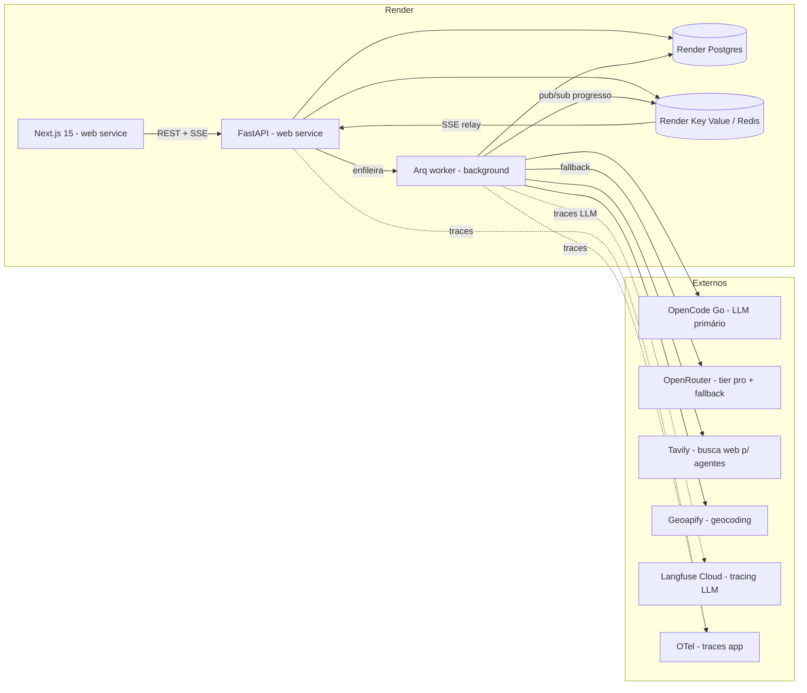

# PRD — Voyager AI (Modernização do agencia\_viagens\_ia)

> **Documento de Requisitos de Produto (PRD)** — consolida a revisão estratégica do
> projeto, as decisões tomadas e o plano de modernização da arquitetura.
>
> **Versão:** 1.26 · **Status:** ✅ Fases 0, 1 e 2 concluídas · ✨ [Demo](https://voyager-web-b2607fcece65.herokuapp.com) · 🌐 [API](https://voyager-ia-d97e5ffe11f1.herokuapp.com/health) · 📚 [Documentação](https://henriquebotelhogomes.github.io/agencia_viagens_ia/) · **Complementa:** [`specs/`](./specs/README.md)

***

## 1. Visão geral

Transformar o `agencia_viagens_ia` — hoje um monolito Streamlit + CrewAI — em um
**produto de portfólio de elite**: uma aplicação de planejamento de viagens com IA
multiagente, construída com arquitetura, práticas e stack de nível enterprise,
demonstrando maturidade de decisão técnica de ponta a ponta.

### 1.1 Objetivo (horizonte 6-12 meses)

**Portfólio de elite** — o produto existe para demonstrar excelência de engenharia
(arquitetura desacoplada, observabilidade, FinOps real, testes, segurança) a
recrutadores técnicos e clientes. Não há meta de receita nesta fase.

### 1.2 O que este PRD NÃO cobre (non-goals)

| Fora de escopo                        | Motivo                                            |
| ------------------------------------- | ------------------------------------------------- |
| Billing / Stripe / planos pagos       | Sem meta de monetização nesta fase                |
| Multi-tenancy real (workspaces, RBAC) | Desenhado nos `specs/`, não implementado          |
| Autenticação de usuários              | **Adiada** — MVP público com rate limiting por IP |
| White-label e API pública             | Baixa razão valor/esforço para portfólio          |
| Integrações reais de reserva (OTA)    | Roteiros são sugestões, não transações            |

***

## 2. Decisões estratégicas (registro)

| #   | Decisão                | Escolha                                                                 | Alternativas descartadas                                     |
| --- | ---------------------- | ----------------------------------------------------------------------- | ------------------------------------------------------------ |
| D1  | Posicionamento         | **Portfólio de elite**                                                  | SaaS real; híbrido evolutivo                                 |
| D2  | Estratégia de LLM      | **OpenCode Go primário + OpenRouter fallback/pro** (rev. v1.1)          | OpenRouter único; só Go; chaves diretas                      |
| D3  | Hospedagem             | **Heroku** com crédito GitHub Student — rev. ADR-0015                   | Render free (sem worker; Postgres expira); Azure; DigitalOcean |
| D4  | Autenticação           | **Adiada** (rate limiting por IP no MVP)                                | Clerk; Auth.js v5                                            |
| D5  | Frontend               | **Next.js 15 (App Router) + TypeScript** substitui Streamlit            | Remix, SvelteKit, Angular                                    |
| D6  | Backend                | **FastAPI + Pydantic v2**, reaproveitando `src/` como núcleo de domínio | Reescrita em Node/Go                                         |
| D7  | Fila/worker            | **SAQ** (async, Redis) — rev. ADR-0014                                  | Arq (exige `redis<6`); Celery (sync); Temporal (overhead)    |
| D8  | Persistência           | **PostgreSQL** (+ pgvector futuro) + Redis como cache/fila              | Redis como único storage (atual)                             |
| D9  | Mapas                  | **MapLibre GL JS** no frontend                                          | folium/streamlit-folium (server-side)                        |
| D10 | Geocoding              | **Geoapify** (3.000 req/dia) + cache Redis com TTL longo                | Nominatim público (ToS/lentidão); LocationIQ; Mapbox; Google |
| D11 | Busca web (agentes)    | **Tavily** (`TavilySearchTool` do CrewAI) + cache Redis                 | Serper (atual); Exa                                          |
| D12 | Observabilidade de LLM | **Langfuse Cloud** (Hobby free — 50k observações/mês)                   | Self-host no Render; adiar                                   |
| D13 | Documentação viva      | **MkDocs Material** + mkdocstrings + ADRs versionados (docs-as-code)    | Sphinx; Docusaurus; wiki externa (Notion/GitBook); só README |

### 2.1 Racional da D2 — OpenCode Go primário + OpenRouter fallback (rev. v1.1)

O usuário já assina o **OpenCode Go** (US$ 10/mês) e já possui **≥ US$ 10 em créditos
no OpenRouter** — a estratégia usa os dois ativos com papéis definidos:

* **OpenCode Go como primário** dos tiers baratos: endpoint OpenAI-compatible
  (`https://opencode.ai/zen/go/v1/chat/completions`), \~US$ 60/mês de uso incluídos na
  assinatura, modelos open de alta qualidade (DeepSeek V4, Kimi K2.7, GLM-5.2,
  Qwen3.7) com capacidade reservada, **zero-retention** (providers não treinam com os
  dados) e tool calling consistente. Custo marginal \~$0 (assinatura já paga).

* **OpenRouter como tier `pro` + fallback universal**: Gemini 2.5 Flash pago
  (créditos existentes) para o output final; cadeia de fallback quando o Go atingir
  tetos (US$ 12/5h, US$ 30/semana, US$ 60/mês — **compartilhados com o uso de coding
  do usuário**). Créditos ≥ US$ 10 já destravam 1.000 req/dia nos modelos `:free`.

* **FinOps real**: OpenRouter retorna custo em USD por request; no Go o custo é
  calculado de `usage` (tokens) × tabela de preços pública — ambos via Langfuse.

* O **litellm é mantido** como camada de abstração única (Go via `openai/<model>` +
  `api_base`; OpenRouter via `openrouter/<provider>/<model>`) — trocar de gateway é
  só configuração.

* Restrição técnica do Go: usar apenas os modelos servidos em `chat/completions`
  (DeepSeek, Kimi, GLM, Grok 4.5, MiMo, Hy3); os servidos em `/v1/messages`
  (Qwen/MiniMax) exigem formato Anthropic — evitar no MVP.

### 2.2 Tiers de modelo (configuráveis, não hardcoded)

| Tier         | Uso                                           | Primário (OpenCode Go)                                                  | Fallback (OpenRouter)                                                       |
| ------------ | --------------------------------------------- | ----------------------------------------------------------------------- | --------------------------------------------------------------------------- |
| `fast`       | Guia Local, extração de locais                | `deepseek-v4-flash` (\~$0,14/M tokens; \~31k req/5h no orçamento)       | `openrouter/free` → `google/gemini-3.5-flash` (pago)                        |
| `fast-tools` | Logística (tool calling p/ Tavily)            | `kimi-k2.7-code`                                                        | `nvidia/nemotron-3-super-120b-a12b:free` → `google/gemini-3.5-flash` (pago) |
| `pro`        | Arquiteto de Roteiros (qualidade consistente) | `google/gemini-3.5-flash` pago via **OpenRouter** (créditos existentes) | `glm-5.2` (Go) → `x-ai/grok-4-fast`                                         |

> Modelos revisados em 2026-07-29 contra os catálogos reais das APIs
> (`scripts/check_env.py`): Gemini **3.5** Flash substituiu o 2.5 do plano
> original; o `llama-3.3-70b:free` saiu do catálogo do OpenRouter e foi
> substituído pelo Nemotron 3 Super (único `:free` de grande porte com
> function calling confiável).

> **Nota de implementação do failover.** O CrewAI 1.x usa **providers nativos**
> (SDK do próprio provedor) para prefixos conhecidos como `openai/`, e esse
> caminho **não aceita** o parâmetro `fallbacks` do litellm — passar isso
> resulta em `Completions.create() got an unexpected keyword argument`.
> O failover, portanto, é **explícito na camada da aplicação**:
> `TravelAgents(use_fallback=True)` reaponta os tiers para o OpenRouter e o
> `CrewBuilder.run()` faz **um** retry ao capturar falha do gateway primário.
> Vantagem colateral: o ponto de decisão é nosso (permite aplicar o teto de
> requests do Go, Q2) e é testável sem rede.

Regras da estratégia:

* **Fallback automático Go → OpenRouter** em `429`/teto de orçamento — a demo nunca
  bloqueia e nunca esgota a cota de coding do usuário além do teto de 5h.

* **Nunca** usar `openrouter/free` (router automático) em agentes com ferramentas —
  pode selecionar modelo sem function calling; variantes fixas apenas.

* Retry com backoff em toda a cadeia (litellm).

* Painel FinOps exibe tokens reais + custo real + **custo evitado** (comparativo com
  preços de modelos proprietary equivalentes).

* Custo alvo: **< US$ 0,01/roteiro** de gasto novo (Go coberto pela assinatura; só o
  tier `pro` consome créditos OpenRouter).

> Os identificadores exatos são **configuração** (env/YAML), nunca código — corrige o
> hardcode atual de `gemini/gemini-1.5-flash` (modelo descontinuado) em `agents.py`.

### 2.3 Racional das D10-D13 — serviços de apoio e documentação

**D10 · Geocoding (Geoapify).** Converte nomes de lugares em coordenadas para os pins
do mapa. O Nominatim público atual limita 1 req/s (origem do `time.sleep(1.1)` que
bloqueia a thread) e **proíbe uso produtivo com volume**. Geoapify: 3.000 req/dia
grátis, sem cartão, base OSM, batch API. Com **cache Redis de TTL longo** (atrações
turísticas não mudam de lugar → hit ratio esperado > 80%), a cota é folgada.

**D11 · Busca web (Tavily).** O Serper devolve SERP crua do Google (links + snippets),
obrigando o agente a gastar tokens interpretando e, às vezes, a repetir buscas. O
Tavily foi desenhado para agentes: extrai e limpa o conteúdo das páginas, ranqueia por
relevância e opcionalmente sintetiza — menos tokens, menos iterações, menos
alucinação. Free tier de 1.000 créditos/**mês renováveis** (o do Serper são 2.500
créditos únicos, que viram custo fixo ao esgotar) e `TavilySearchTool` nativo no
CrewAI. Resultados também cacheados em Redis (TTL de horas).

**D12 · Observabilidade de LLM (Langfuse Cloud).** Hoje não há como saber por que um
roteiro saiu ruim ou caro. O Langfuse grava um **trace por execução**: cada chamada
LLM com prompt/resposta, tokens, custo, latência, erros e qual fallback disparou, numa
timeline navegável. Habilita (a) debug real dos agentes, (b) o FinOps de custo real do
S4, (c) os evals comparativos entre modelos (Q1). Integração via callback nativo do
litellm (`success_callback=["langfuse"]`). Cloud Hobby: 50k observações/mês grátis —
cobre milhares de roteiros; self-host exigiria Postgres + ClickHouse (\~US$ 15-25/mês),
infra desproporcional para portfólio.

**D13 · Documentação viva (MkDocs Material).** Documentação que não mora no
repositório apodrece. A estratégia é **docs-as-code**: a documentação vive em
`docs/` (Markdown), é revisada no mesmo PR que altera o código e é publicada
automaticamente pelo CI. Escolhas e trade-offs:

* **MkDocs + tema Material**: padrão de fato do ecossistema Python (usado por
  FastAPI, Pydantic, uv/Ruff), Markdown puro, busca embutida, visual profissional
  sem esforço — exatamente o sinal que um recrutador reconhece.

* **mkdocstrings\[python]**: gera a referência de API **a partir dos docstrings do
  código** — é o mecanismo que torna a documentação "viva": docstring atualizado
  no PR = docs atualizadas no deploy. Cria pressão positiva por docstrings de
  qualidade (padrão Google, §8.6).

* **ADRs versionados** (`docs/adr/`): as decisões D1-D13 deste PRD migram para
  Architecture Decision Records individuais no formato MADR — histórico de
  decisão navegável, outro forte sinal de senioridade.

* **Deploy**: GitHub Pages via `mkdocs gh-deploy` no CI (job separado, apenas em
  `main`). Custo zero.

* **Descartados**: Sphinx (rST, curva maior, visual datado sem esforço);
  Docusaurus (stack Node paralela só p/ docs); wikis externas (Notion/GitBook)
  violam o princípio de docs no mesmo PR do código.

### 2.4 Racional da D3 — Heroku com crédito de estudante (rev. ADR-0015)

A decisão original era “tudo no Render”, pela simplicidade de um provedor único com
Blueprint versionado. Ao preparar o deploy da Fase 1, três limites do free tier
invalidaram a premissa de custo zero:

* Free instances existem **só** para web services, Postgres e Key Value — **não
  para background workers**. O worker da D7 não teria onde rodar.
* *“Free Render Postgres databases expire 30 days after creation”*, com exclusão
  dos dados após 14 dias de carência.
* `preDeployCommand` (migrations) é recurso de plano pago.

Manter o Render exigiria acoplar o worker à API e conviver com um banco temporário
— duas concessões incompatíveis com a D1. A aprovação no **GitHub Student
Developer Pack** abriu a alternativa: **US$ 13/mês de crédito no Heroku por 24
meses**, que cobre com precisão o custo da arquitetura completa:

| Componente | Plano | Custo |
| ---------- | ----- | ----- |
| web + worker dynos | Eco (pool de 1.000 h) | US$ 5 |
| PostgreSQL | Essential-0 | US$ 5 |
| Redis | Key-Value Mini | US$ 3 |
| | **Total** | **US$ 13/mês** |

* `heroku.yml` versionado mantém a infraestrutura como código, agora com **release
  phase**: se a migration falhar, o deploy é abortado e a versão anterior segue no ar.
* Trade-off aceito: sem cache de layers (deploy mais lento) e crédito com prazo —
  **revisitar até julho de 2028**.
* A portabilidade está preservada onde importa: a aplicação é um container
  12-Factor sem uma linha de código específica de provedor.

***

## 3. Público e proposta de valor

| Persona                        | O que avalia                                 | O que o produto demonstra                       |
| ------------------------------ | -------------------------------------------- | ----------------------------------------------- |
| Recrutador técnico (Staff+/EM) | Maturidade de decisão, trade-offs explícitos | Arquitetura desacoplada, ADRs, observabilidade  |
| Fundador/cliente técnico       | Capacidade de entregar produto real          | UX polida, streaming de agentes, FinOps visível |
| Usuário final (demo)           | Utilidade e experiência                      | Roteiro de qualidade em < 90s, mapa interativo  |

***

## 4. Requisitos funcionais (MVP)

### 4.1 Fluxo principal

```
Briefing → POST /v1/executions (202) → SSE de progresso dos agentes
        → Roteiro renderizado → Mapa interativo → Export MD/PDF → Painel FinOps real
```

| ID    | Requisito                                                                  | Critério de aceite                                                                   |
| ----- | -------------------------------------------------------------------------- | ------------------------------------------------------------------------------------ |
| FR-01 | Briefing de viagem (origem, destino, dias, interesses, **idioma e moeda**) | Formulário validado (Zod no front, Pydantic na API)                                  |
| FR-02 | Geração assíncrona de roteiro                                              | `POST /v1/executions` retorna `202` + `id`; nunca bloqueia > 2s                      |
| FR-03 | Streaming do progresso dos agentes                                         | SSE (`GET /v1/executions/{id}/stream`) com eventos por etapa/agente                  |
| FR-04 | Roteiro persistido e recuperável                                           | Postgres; `GET /v1/executions/{id}` retorna estado + resultado                       |
| FR-05 | Mapa interativo dos locais do roteiro                                      | MapLibre GL; backend entrega GeoJSON com proveniência                                |
| FR-06 | Export Markdown (PDF em fase posterior)                                    | Download direto do roteiro                                                           |
| FR-07 | Painel FinOps com **custo real** por execução                              | Tokens e USD por chamada (via Langfuse/OpenRouter), não heurística                   |
| FR-08 | Cache exato de roteiros                                                    | Hash do briefing → Redis (mecanismo atual, atrás da API)                             |
| FR-09 | Rate limiting por IP                                                       | N execuções/hora/IP (Redis); erro RFC 9457 quando excedido                           |
| FR-10 | Conteúdo i18n e moeda parametrizada                                       | Roteiro gerado no idioma do briefing (pt-BR/en-US/es-ES) e custos na moeda escolhida; interface somente em PT-BR (ADR-0016) |

### 4.2 Streamlit

✅ **Removido do repositório** ao final da Fase 2: o `app.py` virou playground
interno durante a transição e foi aposentado quando o frontend Next.js passou a
cobrir 100% do fluxo em produção — junto com as dependências (`streamlit`,
`folium`, `streamlit-folium`, `langchain-groq`, `langchain-google-genai`,
`google-generativeai`) e as chaves legadas (`GROQ_API_KEY`, `GOOGLE_API_KEY`,
`SERPER_API_KEY`).

***

## 5. Arquitetura alvo



### 5.1 Componentes

| Componente        | Tecnologia                                                                                      | Responsabilidade                                         |
| ----------------- | ----------------------------------------------------------------------------------------------- | -------------------------------------------------------- |
| Frontend          | Next.js 16, TypeScript, Tailwind 4, TanStack Query, MapLibre, Zod                               | UX, briefing, streaming, mapa, contrato tipado           |
| API               | FastAPI, Pydantic v2, SQLAlchemy 2.0 async, Alembic                                             | Contratos REST/OpenAPI, validação, SSE relay, rate limit |
| Worker            | SAQ + CrewAI + litellm (OpenCode Go → OpenRouter)                                               | Orquestração dos agentes, publicação de progresso        |
| Núcleo de domínio | `src/` refatorado (agents, tasks, crew\_builder, services)                                      | Lógica de negócio reaproveitada, sem efeitos colaterais  |
| Dados             | PostgreSQL (`Execution`, `Itinerary`, `UsageRecord`) + Redis (cache, fila, pub/sub, rate limit) | Persistência e coordenação                               |

### 5.2 Contratos de API (MVP)

| Método | Rota                           | Descrição                                            |
| ------ | ------------------------------ | ---------------------------------------------------- |
| `POST` | `/v1/executions`               | Cria execução (idempotente via `Idempotency-Key`)    |
| `GET`  | `/v1/executions/{id}`          | Estado + resultado + custo real                      |
| `GET`  | `/v1/executions/{id}/stream`   | SSE de progresso                                     |
| `GET`  | `/v1/itineraries/{id}/geojson` | Locais geocodificados para o mapa                    |
| `GET`  | `/v1/finops/summary`           | Agregado de custo (demo pública, dados anonimizados) |

Erros no padrão **RFC 9457** (`application/problem+json`); API versionada em `/v1`.

***

## 6. Saneamento da base atual (pré-requisito)

Dívidas identificadas na revisão de código que **devem ser corrigidas antes** da
extração da API (Fase 0). O status é controlado no checklist da §15.

| #   | Problema                                                                                                                   | Ação                                                                | Status     |
| --- | -------------------------------------------------------------------------------------------------------------------------- | ------------------------------------------------------------------- | ---------- |
| S1  | Efeitos colaterais em import (mutação de `os.environ`, config global litellm) em `agents.py`, `app.py`, `cache_service.py` | Mover para inicialização explícita; nunca mutar ambiente em runtime | ✅          |
| S2  | Singletons em import (`settings`, `cache_service`)                                                                         | Injeção de dependência (FastAPI `Depends` + `lifespan`)             | ✅          |
| S3  | Bug: `trip_crew` possivelmente indefinido no retry (`app.py`)                                                              | Corrigir escopo do retry                                            | ✅          |
| S4  | FinOps por heurística de tamanho de log                                                                                    | Usar `usage` real por chamada (Langfuse) + `CrewOutput.token_usage` | ✅          |
| S5  | `exchangeratesapi.io` sem `access_key` (sempre falha em silêncio)                                                          | Substituir por **frankfurter.app** (sem chave)                      | ✅          |
| S6  | Geocoding bloqueante (`time.sleep(1.1)` por local)                                                                         | Migrar p/ **Geoapify** async + cache Redis (D10)                    | ✅          |
| S7  | Modelos LLM descontinuados hardcoded (`gemini-1.5-flash`)                                                                  | Tiers/fallbacks em configuração (ver §2.2)                          | ✅          |
| S8  | `requirements.txt` (3.782 linhas, `uv export`) duplicando `uv.lock`                                                        | **Deletar**; `uv.lock` é a única fonte de verdade                   | ✅          |
| S9  | Logs em disco local (anti-12-factor)                                                                                       | stdout JSON estruturado em produção (structlog na Fase 1)           | ✅          |
| S10 | Docker single-stage rodando como root                                                                                      | Multi-stage + usuário non-root + COPY seletivo                      | ✅          |
| S11 | CI usa chaves reais em testes unitários; Black + Ruff redundantes                                                          | Chaves fake/`SecretStr` nos testes; remover Black                   | ✅          |
| S12 | Lixo na raiz (`test_out.txt`, `test_output.txt`, `test_fallback.py`, `list_models.py`)                                     | Remover ou mover para `scripts/`                                    | ✅          |
| S13 | Dependências sem pin de versão no `pyproject.toml`                                                                         | Ranges explícitos (`crewai>=x.y,<x+1`)                              | ✅          |
| S14 | Moeda "R$" e idioma pt hardcoded nos prompts                                                                               | Parametrizar via briefing (FR-10)                                   | ✅          |
| S15 | Exceções silenciosas (`except: pass`) em geocoding/finance                                                                 | Log estruturado + métricas de erro                                  | ✅          |
| S16 | `LocationList` (Pydantic) existe mas não é usado na extração LLM                                                           | Structured output na extração de locais (mitiga prompt injection)   | ✅          |
| S17 | 4 testes de `test_geocoding_service.py` falham sem `.env` (construção eager de `ChatGroq` no `__init__`)                   | Lazy init + injeção de LLM no serviço (decorre de S1/S2)            | ✅          |

***

## 7. Substituições de dependências

| Atual                                     | Destino                                                                   | Justificativa                                                    |
| ----------------------------------------- | ------------------------------------------------------------------------- | ---------------------------------------------------------------- |
| `streamlit`, `streamlit-folium`, `folium` | Next.js + MapLibre GL                                                     | UI de produto; mapa client-side interativo                       |
| `loguru`                                  | `structlog` (JSON → stdout)                                               | Pipeline de observabilidade estruturada                          |
| `geopy`/Nominatim público                 | **Geoapify** (3.000 req/dia) + cache Redis                                | Nominatim proíbe uso produtivo e força 1 req/s                   |
| `crewai-tools` `SerperDevTool`            | **`TavilySearchTool`** + cache Redis                                      | Resultados otimizados p/ LLM; free tier renovável                |
| `exchangeratesapi.io`                     | `frankfurter.app`                                                         | Atual está quebrado (exige chave)                                |
| `black`                                   | — (remover)                                                               | `ruff format` já cobre                                           |
| Chaves Groq/Gemini diretas                | **OpenCode Go** (primário) + **OpenRouter** (fallback/pro) via litellm    | Decisão D2                                                       |
| `uv` (Python)                             | **Única** fonte de verdade de dependências (`pyproject.toml` + `uv.lock`) | `requirements.txt` removido (S8); reprodutibilidade e velocidade |
| `crewai`, `litellm`                       | Mantidos, com pin de versão                                               | Núcleo do projeto; API muda entre minors                         |
| `mypy`                                    | Mantido (strict)                                                          | Migração p/ pyright é prioridade baixa                           |

***

## 8. Práticas de engenharia (Definition of Done)

### 8.1 Testes

**Pirâmide de testes** (da base ao topo):

| Camada | Ferramenta | Escopo | Status |
| ------ | ---------- | ------ | ------ |
| Unitários | pytest + pytest-mock | Núcleo de domínio, 100% mockado (sem rede, sem chaves) | ✅ 52 testes |
| Integração | pytest (marcados `integration`) | Serviços contra APIs reais sem chave (ex.: frankfurter) | Fase 0/1 |
| Contrato | schemathesis | OpenAPI gerada pela FastAPI | Fase 1 |
| E2E | Playwright | Briefing → roteiro no frontend (backend mockado no CI) | Fase 2 |
| LLM evals | promptfoo/deepeval | Dataset dourado de roteiros; regressão de prompt | Fase 3 |

**Regras (obrigatórias, verificadas em code review):**

* Padrão **AAA** (Arrange-Act-Assert) com blocos separados por linha em branco.

* Nomes descritivos de comportamento: `test_<unidade>_<cenário>_<resultado>`
  (ex.: `test_cache_disabled_when_redis_unreachable`) — nunca `test_1`, `test_ok`.

* Todo caminho de erro tem teste (timeout, HTTP 5xx, resposta vazia, `None`).

* Todo bug corrigido ganha **teste de regressão** com comentário citando o bug
  (ex.: o `{dias}` literal em `compile_itinerary`).

* Fixtures compartilhadas em `conftest.py`; sem chave real em teste, nunca.

* **Gate de cobertura: ≥ 90% em `src/`** — ativo em `[tool.coverage.report]`
  (`fail_under = 90`; atual: \~96%). Cobertura é piso, não alvo: teste é escrito
  pelo comportamento, não pela métrica.

### 8.2 Segurança

* Segredos como `SecretStr` no Pydantic; nunca em repr/log; env groups do Render.

* Rate limiting por IP (Redis) + CORS estrito + headers de segurança.

* Sanitização da saída de busca web antes de reinjetar em prompts
  (defesa de prompt injection) + structured output (S16).

* CI: `gitleaks` (segredos), `trivy` (imagem), `osv-scanner`/`uv pip audit` (deps),
  Dependabot/Renovate.

* LGPD/GDPR: MVP sem auth não armazena dados pessoais identificados; briefings
  anonimizados com retenção de 30 dias; política documentada.

### 8.3 Observabilidade

* **OpenTelemetry** em API e worker (traces correlacionados por `request_id`).

* **Langfuse Cloud** para tracing de LLM (prompts, tokens, custo, latência por agente,
  fallback disparado) — callback nativo do litellm.

* Logs JSON em stdout → Render logs (agregador externo opcional).

* Métricas mínimas: latência p95 por rota, profundidade de fila, taxa de erro por
  provider LLM, **consumo do orçamento do OpenCode Go** (alerta antes do teto de 5h),
  custo por execução.

### 8.4 CI/CD

* Pipeline: lint (ruff) → type-check (mypy strict) → testes + cobertura →
  scans de segurança → build Docker → deploy no Heroku (release phase aplica as migrations).

* Ambientes: `local` (docker-compose) → `production` (Heroku). Staging opcional.

### 8.5 Documentação viva (D13)

* **Stack**: MkDocs + Material + mkdocstrings\[python] + plugin de ADRs.

* **Estrutura de `docs/`**:
  `index.md` (visão) · `architecture/` (C4 + diagramas Mermaid) ·
  `adr/` (decisões D1-D13 em formato MADR) · `reference/` (API gerada dos
  docstrings) · `guides/` (setup local, deploy, contribuição) ·
  `operations/` (runbook, observabilidade, FinOps).

* **Vivacidade garantida por processo, não por disciplina**:
  1. Referência de API gerada dos docstrings — atualiza sozinha;
  2. `mkdocs build --strict` no CI — link quebrado ou referência órfã = build
     vermelho;
  3. Definition of Done (§10) inclui "documentação atualizada no mesmo PR";
  4. Deploy automático no GitHub Pages a cada merge em `main`.

* `PRD.md` e `specs/` permanecem como artefatos de produto; o `docs/` é a visão
  técnica navegável — os ADRs fazem a ponte entre os dois.

### 8.6 Padrões de código (clean code)

**Ferramentas com gate no CI (já ativos):**

| Gate | Configuração | O que pega |
| ---- | ------------ | ---------- |
| `ruff check` | 12 famílias: E, W, F, I, B, UP, SIM, C4, N, RUF, PTH, ARG | bugs latentes (bugbear), sintaxe legada, código simplificável, naming PEP 8, argumentos mortos |
| `ruff format` | line-length 88 | formatação única, sem debate |
| `mypy --strict` | `src/` completo | tipagem forte obrigatória |
| coverage | `fail_under = 90` | regressão de cobertura |
| pre-commit | ruff + mypy + hooks básicos | feedback antes do push |

**Convenções (obrigatórias em code review):**

* **Nomenclatura**: código em inglês técnico ou português consistente por módulo;
  `snake_case` funções/variáveis, `PascalCase` classes, `UPPER_SNAKE` constantes
  de módulo; nomes revelam intenção (`itinerary_text`, nunca `data`/`tmp`/`x`).

* **Tipagem**: 100% das assinaturas públicas anotadas (mypy strict garante);
  sintaxe moderna `X | None` (não `Optional[X]`), `list[str]` (não `List[str]`);
  reduzir os `Any` remanescentes (hoje restritos às fronteiras com CrewAI/loguru).

* **Docstrings**: padrão **Google** em tudo que é público; primeira linha é um
  resumo imperativo; decisões não óbvias citam o item do PRD (padrão já em uso:
  "item S16 do PRD"). Docstrings alimentam o mkdocstrings (D13).

* **Funções e módulos**: funções curtas e de responsabilidade única; máximo \~3
  níveis de indentação (early return em vez de aninhamento); sem números/strings
  mágicos — constantes nomeadas (`MAX_EXTRACTED_LOCATIONS`) ou `Settings`.

* **Code smells banidos** (todos já erradicados na Fase 0 — manter assim):
  `except: pass` silencioso · efeito colateral em import · singleton de módulo ·
  mutação de `os.environ` fora do runtime · segredo em `str` puro · valor de
  negócio hardcoded (moeda/idioma/modelo) · parsing de LLM por regex sem schema.

* **Fronteiras explícitas**: dependências sempre injetadas (parâmetro `settings`),
  inicialização de recursos caros sempre lazy, degradação graciosa com log em
  toda integração externa.

* **Commits**: **Conventional Commits** (`feat:`, `fix:`, `refactor:`, `docs:`,
  `test:`, `chore:`) — habilita changelog automático e leitura rápida do histórico.

***

## 9. Requisitos não funcionais (SLOs de portfólio)

| NFR                               | Alvo                                                                             |
| --------------------------------- | -------------------------------------------------------------------------------- |
| Latência da API (rotas síncronas) | p95 < 300ms                                                                      |
| Tempo total de geração de roteiro | p95 < 90s (com streaming de progresso desde < 2s)                                |
| Disponibilidade da demo           | 99% (free/starter tier do Render aceito)                                         |
| Custo LLM por roteiro             | < US$ 0,01 de gasto **novo** (Go coberto pela assinatura) — medido, não estimado |
| Cache hit (briefings repetidos)   | > 30% na demo                                                                    |
| Lighthouse (frontend)             | > 90 em Performance/A11y/Best Practices                                          |

***

## 10. Roadmap de execução

> Substitui o cronograma do `specs/10-roadmap.md` no que conflitar (billing e API
> pública saem do plano — decisão D1).

### Fase 0 — Saneamento (1 semana)

* Executar S1–S16 (§6). Migrar LLMs para **OpenCode Go + OpenRouter** (D2) com tiers em
  config; trocar Serper → **Tavily** (D11) e Nominatim → **Geoapify** (D10).

* Plugar **Langfuse Cloud** (D12) via callback do litellm — desbloqueia FinOps real (S4).

* **DoD:** Streamlit atual funcionando sobre a base limpa; trace de execução visível no
  Langfuse com tokens e custo reais.

### Fase 1 — API + Worker (2 semanas)

* FastAPI (`POST /v1/executions`, SSE), Arq worker, Postgres (Alembic), Redis pub/sub.

* Observabilidade base (structlog JSON, OTel, Langfuse).

* **DoD:** roteiro gerado ponta a ponta via API, com trace completo e custo real gravado.

### Fase 2 — Frontend Next.js (concluída)

* ✅ Briefing → streaming de agentes (SSE) → roteiro em Markdown → mapa MapLibre
  sincronizado → painel FinOps público.

* ✅ Design system próprio (tokens terracota/stone, tema claro/escuro), sem
  lock-in de biblioteca de componentes.

* ✅ Testes: Vitest (80, cobertura 98%) + Playwright (desktop e mobile); tudo no
  CI. Contrato tipado com Zod espelhando o Pydantic.

* ✅ i18n de **conteúdo** (roteiro + moeda) entregue; interface **somente em
  PT-BR por decisão de produto** ([ADR-0016](docs/adr/0016-i18n.md)).

* ✅ Export Markdown do roteiro (FR-06): download 100% no cliente (Blob), com
  bloco de proveniência no cabeçalho — **fase 100% concluída**.

* **DoD:** ✅ demo pública no ar; ✅ Lighthouse > 90 (todas as categorias);
  ✅ Streamlit aposentado.

### Fase 3 — Excelência operacional (contínuo)

* LLM evals no CI, testes de carga (k6), cache semântico (pgvector),
  paralelização dos agentes Guia Local ∥ Logística, badges no README (cobertura,
  scans, SLO), diagramas C4 atualizados.

***

## 11. Métricas de sucesso do projeto

| Métrica                         | Como medir                                                        |
| ------------------------------- | ----------------------------------------------------------------- |
| Demo pública estável            | Uptime + geração < 90s p95                                        |
| FinOps demonstrável             | Painel com custo real por execução (tokens × preço, via Langfuse) |
| Qualidade de engenharia visível | Cobertura ≥ 80%, scans verdes, trace público de exemplo           |
| Narrativa de arquitetura        | README com C4 + ADRs + link para specs/ e este PRD                |

***

## 12. Riscos e mitigações

| Risco                                                                 | Prob. | Impacto | Mitigação                                                                                         |
| --------------------------------------------------------------------- | ----- | ------- | ------------------------------------------------------------------------------------------------- |
| Breaking changes do CrewAI/litellm                                    | Alta  | Médio   | Pin de versão + testes de contrato do núcleo                                                      |
| Indisponibilidade de um gateway de LLM                                | Baixa | Alto    | Dois gateways independentes (Go + OpenRouter) via litellm; rollback p/ chaves diretas é só config |
| **Orçamento do OpenCode Go compartilhado com o uso de coding** do dev | Média | Médio   | Teto próprio de requests na app + failover automático p/ OpenRouter + alerta antes do teto de 5h  |
| Crédito do GitHub Student no Heroku expira em 24 meses (jul/2028)     | Alta  | Médio   | Custo real é baixo (US$ 13/mês); app é container 12-Factor, portável a qualquer provedor |
| Cold start do plano Eco (dynos dormem sem tráfego)                    | Alta  | Baixo   | Aceito para portfólio; documentado no runbook — a primeira visita acorda os dynos       |
| Abuso da demo pública (sem auth)                                      | Média | Médio   | Rate limit por IP + teto diário de custo LLM + kill switch                                        |
| Custo de LLM fora de controle                                         | Baixa | Médio   | Modelos baratos do Go como default + limites por execução + alerta de budget                      |
| Cotas dos free tiers de apoio (Tavily 1k/mês, Geoapify 3k/dia)        | Média | Baixo   | Cache Redis agressivo (hit > 80% em geocoding) + degradação graciosa sem a ferramenta             |
| Modelos `:free` do OpenRouter instáveis (429, tool calling fraco)     | Alta  | Baixo   | Usados apenas como fallback intermediário; nunca `openrouter/free` em agente com tools            |
| Escopo crescer para SaaS sem decisão                                  | Média | Médio   | Non-goals explícitos (§1.2); mudança exige revisão deste PRD                                      |

***

## 13. Questões em aberto

| #  | Questão                                                                                                                       | Dono | Prazo sugerido |
| -- | ----------------------------------------------------------------------------------------------------------------------------- | ---- | -------------- |
| Q1 | Validar via eval quais modelos do Go (DeepSeek V4 Flash vs. Kimi K2.7 vs. GLM-5.2) têm melhor qualidade/tool calling em pt-BR | Eng. | Fase 0         |
| Q2 | Definir tetos de orçamento da app no Go (req/dia) para preservar a cota de coding                                             | Eng. | Fase 0         |
| Q3 | Avaliar se o Tavily substitui 100% o Serper ou se vale mantê-lo como fallback                                                 | Eng. | Fase 0         |
| Q4 | Região do Langfuse Cloud (EU vs. US) frente à política de dados documentada                                                   | Eng. | Fase 1         |
| Q5 | PDF export: WeasyPrint no worker vs. geração client-side                                                                      | Eng. | Fase 2         |

***

## 14. Histórico de versões

| Versão | Mudanças                                                                                                                                       |
| ------ | ---------------------------------------------------------------------------------------------------------------------------------------------- |
| 1.0    | Versão inicial: D1-D9, saneamento S1-S16, roadmap em 3 fases                                                                                   |
| 1.1    | D2 revisada (OpenCode Go primário + OpenRouter fallback); D10 Geoapify, D11 Tavily, D12 Langfuse Cloud adicionadas; riscos e Q1-Q4 atualizados |
| 1.2    | Checklist de execução (§15) adicionado; S17 registrado; `uv` como única fonte de dependências                                                  |
| 1.3    | S1, S2, S3 e S17 concluídos: `src/runtime.py` criado, serviços com injeção de dependência e inicialização lazy; suite de 34 testes verde       |
| 1.4    | S11, S12 e S13 concluídos: Black removido (pyproject/CI/pre-commit), CI sem chaves reais, raiz limpa, pins de versão e `requires-python>=3.12` |
| 1.5    | S16 concluído: extração de locais com structured output (`LocationList`), prompt endurecido contra injection; 37 testes verdes                 |
| 1.6    | S5 e S15 concluídos: câmbio migrado para frankfurter.app (validado com chamada real) e exceções silenciosas eliminadas; 44 testes verdes       |
| 1.7    | S14 concluído: moeda e idioma parametrizados de ponta a ponta (prompts, agente, UI e chave de cache); 51 testes verdes                         |
| 1.8    | S9 e S10 concluídos: logs JSON em stdout em produção e Dockerfile multi-stage non-root (validado com build + testes no container). **Fase 0 sem chaves: completa** |
| 1.9    | D13 (MkDocs Material — documentação viva) adicionada; §8.1 expandida (pirâmide + regras de teste), §8.5 (docs viva) e §8.6 (padrões de código) criadas; gates ruff 12 famílias + cobertura `fail_under=90` **ativados e verdes**; checklist §15.5 |
| 1.10   | Pré-requisitos (§15.0) concluídos: todas as chaves validadas via `scripts/check_env.py`; tiers atualizados (Gemini 3.5 Flash; Nemotron 3 Super `:free` p/ tools); Langfuse na região US |
| 1.11   | **Migrações finais da Fase 0**: S4, S6, S7 concluídos + D2/D10/D11/D12 implementados e validados com chamadas reais (crew completa em 50,7s, 8.430 tokens, trace no Langfuse, 4 locais via Geoapify, Tavily ativo). Failover de gateway movido para a camada da aplicação. 67 testes verdes, cobertura 94% |
| 1.12   | **Fase 0 concluída (17/17)**: frontend validado pelo usuário com todas as funcionalidades operando. Próxima etapa: Fase 1 (API + worker) ou scaffold da documentação viva (§15.5) |
| 1.13   | **D13 implementada**: documentação viva com MkDocs Material — 31 páginas (C4, 13 ADRs, referência de API via mkdocstrings, runbook), gate `mkdocs build --strict` no CI, `CONTRIBUTING.md` e README atualizado |
| 1.14   | Fase 0 e D13 **publicadas**: commit `6897eab` na `master` (revisão de segurança L3 sem achados) e documentação no ar no GitHub Pages |
| 1.15   | **Fase 1 concluída**: FastAPI (7 rotas, RFC 9457, SSE, idempotência, rate limit), worker SAQ, PostgreSQL + Alembic. Validada E2E na stack real (110s, 20k tokens, 8 locais). D7 revisada para SAQ (ADR-0014). 131 testes, cobertura 92% |
| 1.16   | **D3 revisada → Heroku (ADR-0015)**: o free tier do Render não cobre background workers e apaga o Postgres em 30 dias; crédito GitHub Student (US$ 13/mês × 24 meses) sustenta a arquitetura completa. `heroku.yml` com release phase, fábrica central de clientes Redis (TLS self-signed) e normalização da `DATABASE_URL`. 147 testes, cobertura 92% |
| 1.17   | **Testes de contrato (schemathesis)** sobre as 7 rotas da OpenAPI — encontraram e corrigiram 3 bugs reais: 405 sem header `Allow` (RFC 9110), spec do 422 divergente do envelope RFC 9457 servido, e `Idempotency-Key` vazia gerando 500 por colisão UNIQUE (+ corrida check-then-insert tratada pela constraint). 148 testes |
| 1.18   | **OpenTelemetry na API e no worker** (última pendência técnica da Fase 1): `src/telemetry.py` com inicialização explícita e no-op sem endpoint; FastAPI/SQLAlchemy/Redis instrumentados; span raiz por job com `execution_id`. Versões alinhadas ao OTel que o CrewAI já traz (SDK 1.34.x), sem upgrade em cascata. 162 testes |
| 1.19   | **4º bug de contrato + teste determinístico**: corpo JSON malformado produzia **400 não documentado** (o Starlette responde antes do Pydantic); a OpenAPI agora documenta 400 em toda operação com `requestBody`. O teste passou a usar `derandomize=True` com 60 exemplos/rota — sem isso a falha aparecia só às vezes, o que tornaria o CI intermitente. Estabilidade verificada em 3 execuções completas |
| 1.20   | **🌐 Fase 1 EM PRODUÇÃO no Heroku**: geração completa validada (93s, 18.711 tokens, 8 locais, EUR), migrations via release phase, dynos Eco dentro do crédito. Três obstáculos reais superados: `git push heroku` travado pelo Git Credential Manager (→ Container Registry), `error from registry: unsupported` do containerd image store (→ `oci-mediatypes=false`) e **CrewAI lendo `REDIS_URL` no import** e conectando sem TLS (→ `src/bootstrap.py`). 168 testes |
| 1.21   | **Fase 2 (frontend) concluída em dev**: Next.js 16 + React 19, design system próprio, briefing validado, execução ao vivo via SSE, roteiro + mapa MapLibre sincronizado, painel FinOps (novo endpoint `/v1/finops`). Bug real de produto corrigido (geocoding sem contexto do destino punha pinos no país errado). i18n de conteúdo entregue, interface adiada com decisão registrada (ADR-0016). Backend 182 testes; frontend 67 unit + 16 E2E, cobertura 98% |
| 1.22   | **Decisão de produto: interface somente em português** — ADR-0016 atualizado (i18n de interface deixa de ser pendência e vira não-meta), FR-10 e specs/09 §9 alinhados. Checklist da Fase 2 sincronizado com o entregue (falta: export MD, deploy do frontend, Lighthouse, aposentar Streamlit). Corrigido "Arq"→"SAQ" na tabela de arquitetura |
| 1.23   | **✨ Frontend EM PRODUÇÃO** (`voyager-web` no Heroku, custo total inalterado em US$ 13/mês): fluxo completo validado pela URL pública (Rio→Buenos Aires em 185s, 8 pinos corretos no mapa, FinOps com dados reais, zero erros de CORS). **Lighthouse mobile: Perf 96-98 / A11y 100 / BP 100 / SEO 100** — a nota de A11y subiu de 93 para 100 corrigindo a estrutura dos `<dl>`. Dep morta `motion` removida. Lição de medição: rodar Lighthouse com a máquina ocupada (build Docker em paralelo) derrubou a nota de 96 para 36 — variância de ambiente, não do site |
| 1.24   | **Streamlit aposentado** (último item do DoD da Fase 2): removidos `app.py`, o serviço do compose, o sink dedicado no logger, 6 dependências (`streamlit`, `folium`, `streamlit-folium`, `langchain-groq`, `langchain-google-genai`, `google-generativeai`) e as chaves legadas `GROQ/GOOGLE/SERPER_API_KEY` (débito da Fase 0 quitado). O estágio `runtime` do Dockerfile virou base sem CMD. C4 de contêineres redesenhado para o estado em produção |
| 1.25   | **Export Markdown (FR-06) entregue — Fase 2 100% concluída**: botão "Baixar roteiro (.md)" na página da execução; documento montado 100% no cliente (Blob) com bloco de proveniência (marca, briefing, data) antes do roteiro na íntegra; nome de arquivo sanitizado com slug do destino. Nova suíte Playwright `generation.spec.ts` (fluxo completo briefing → roteiro → download real, opt-in `E2E_API=1` por exigir API no ar — pulada no CI). 80 testes de unidade, cobertura 98% |
| 1.26   | **Refinamento e versionamento de roteiro (FR-40/FR-41)**: refine reexecuta a crew completa com contexto (roteiro anterior + instrução); versionamento com linhagem (root/parent), rollback append-only (cópia sem LLM), diff client-side (jsdiff). Novos endpoints `POST /refine`, `POST /rollback`, `GET /versions`. Frontend: refine-panel, version-history, version-diff. ADR-0017 registrado |

***

## 15. Checklist de execução

Controle de status das tarefas. Legenda: `[ ]` pendente · `[~]` em andamento ·
`[x]` concluído e verificado.

### 15.0 Pré-requisitos (contas e chaves)

> ✅ **Concluído em 2026-07-29** — todas as chaves validadas contra as APIs reais
> via `uv run python -m scripts.check_env` (script de diagnóstico permanente).

* [x] Créditos ≥ US$ 10 no OpenRouter (libera 1.000 req/dia nos `:free`)

* [x] Assinatura OpenCode Go ativa

* [x] Chave do OpenCode Go obtida e validada (23 modelos disponíveis)

* [x] Chave do OpenRouter obtida e validada

* [x] Conta + chave Tavily validada (busca de teste OK)

* [x] Conta + chave Geoapify validada (geocode de teste OK)

* [x] Projeto + chaves Langfuse Cloud validadas — **região US**
  (`https://us.cloud.langfuse.com`; o host EU retorna 401)

* [x] `.env` local criado e preenchido

### 15.1 Fase 0 — Saneamento

**Configuração e dependências**

* [x] `.env.example` documentado com todas as variáveis novas

* [x] `requirements.txt` removido — `uv.lock` como única fonte (S8)

* [x] `config.py` refatorado: `SecretStr`, novos provedores, `get_settings()` memoizado,
  flags derivadas (`cache_enabled`, `langfuse_enabled`, ...)

* [x] Testes de configuração ampliados (segredo não vaza em `repr`, degradação graciosa)

* [x] Pin de versões no `pyproject.toml` (S13) — ranges com teto de major; `requires-python`
  alinhado em `>=3.12` (era `>=3.10`, inconsistente com Docker/CI)

* [x] Remover `black` do `pyproject.toml`, do CI e do pre-commit (S11); CI sem chaves
  reais nos testes e com `astral-sh/setup-uv` (instalação duplicada eliminada)

* [x] Limpar raiz (S12): dumps de teste e `test_fallback.py` (obsoleto) removidos;
  `list_models.py` → `scripts/list_models.py`

**Migração de provedores**

* [x] Camada de LLM por tier (`fast`, `fast-tools`, `pro`) lendo config (S7 / §2.2)

* [x] OpenCode Go como primário + failover para OpenRouter (D2) — failover na camada
  da aplicação (`use_fallback`), pois o CrewAI 1.x usa providers nativos que rejeitam
  o `fallbacks` do litellm; **validado com execução real da crew** (50,7s / 8.430 tokens)

* [ ] Teto de requests da app no Go, protegendo a cota pessoal (Q2) — variável
  `LLM_GO_MAX_REQUESTS_PER_DAY` já existe; contador ainda não implementado

* [x] Serper → Tavily no agente de Logística (D11) — `TavilySearchTool`; **validado com
  busca real** (4,2 KB de conteúdo processado)

* [x] Nominatim → Geoapify com cache Redis (D10 / S6) — `time.sleep` eliminado no
  caminho primário; Nominatim mantido como degradação graciosa sem chave;
  **validado com 4 locais geocodificados** a partir de um roteiro real

* [x] `exchangeratesapi.io` → `frankfurter.app` (S5) — endpoint sem chave, timeout de 5s,
  short-circuit p/ mesma moeda; **validado com chamada real** (USD→BRL) e 7 testes

**Qualidade do núcleo**

* [x] Remover efeitos colaterais de import e mutação de `os.environ` (S1)
  — novo módulo `src/runtime.py` com `configure_llm_runtime()` idempotente

* [x] Eliminar singletons de import nos serviços (S2) — `get_cache_service()` memoizado,
  `Settings` injetável em `CacheService`/`GeocodingService`/`TravelAgents`/`CrewBuilder`

* [x] Corrigir escopo do retry em `app.py` (S3)

* [x] Lazy init do LLM no `GeocodingService` — destrava os 4 testes que falhavam (S17)

* [x] LLMs e `search_tool` lazy em `TravelAgents`; fallbacks vindos de config (parte de S7)

* [x] `LOG_DIR.mkdir()` movido do import para `setup_logger()` (parte de S1)

* [x] Substituir `except: pass` por log estruturado + métricas (S15)
  — concluído em `geocoding_service` e `finance_service` (timeout/HTTP/taxa
  ausente logados separadamente)

* [x] `LocationList` como structured output na extração de locais (S16) — schema
  Pydantic via `with_structured_output`, roteiro delimitado como dado não
  confiável, teto de 8 locais aplicado em código

* [x] Parametrizar idioma e moeda nos prompts (S14 / FR-10) — novo `src/utils/localization.py`;
  `tasks.py`/`agents.py`/`CrewBuilder` recebem `moeda`/`idioma`; seletores na UI;
  **chave de cache inclui moeda/idioma** (evita servir roteiro no idioma errado)

* [x] Logs 12-factor (S9) — produção: JSON estruturado em stdout (loguru `serialize`,
  sem arquivo, `diagnose=False`); dev: console + arquivo local. **Nota:** troca da
  biblioteca por `structlog` adiada para a Fase 1 (API/worker) — os sinks dinâmicos
  do Streamlit (logs vivos + buffer FinOps) dependem do loguru e serão aposentados
  junto com ele

* [x] Dockerfile multi-stage com usuário non-root (S10) — estágios `builder`/`test`/
  `runtime`; COPY seletivo; `USER app` verificado (`whoami` → `app`); CI e
  docker-compose atualizados para usar os targets; **suite roda verde dentro do
  container** (52 testes)

**Observabilidade e FinOps**

* [x] Langfuse Cloud plugado via callback do litellm (D12) — **trace real confirmado**
  na API do Langfuse (nome, latência, observação). Atenção: `totalCost` fica 0 para
  modelos do Go (endpoint custom sem tabela de preços no Langfuse) — o custo vem do
  nosso cálculo por tokens

* [x] FinOps com tokens e custo reais, substituindo a heurística (S4) —
  `estimate_costs_from_usage()` alimentado por `CrewOutput.token_usage`; a heurística
  antiga sobrevive apenas para cache hit (sem execução de LLM). **Validado**: 8.430
  tokens medidos → economia de US$ 0,105 vs GPT-4o numa execução real

* [ ] Eval comparativo dos modelos do Go em pt-BR (Q1)

**Critério de saída da Fase 0**

* [x] Fluxo completo validado com execução real da crew — Lisboa/2 dias/EUR/pt-BR:
  **50,7s** (SLO < 90s), 7.115 chars, moeda EUR respeitada (S14 ponta a ponta)

* [x] Streamlit validado manualmente no browser — **confirmado pelo usuário em
  2026-07-29**: todas as funcionalidades operando (roteiro, mapa, FinOps, seletores
  de moeda/idioma)

* [x] Suite de testes 100% verde — **67 testes**, cobertura 94% (gate 90%)

* [x] Trace de uma execução visível no Langfuse com tokens reais

#### Débitos técnicos identificados durante a Fase 0

* [ ] `geopy` pode ser removido quando o Nominatim deixar de ser fallback
* [x] Chaves legadas (`GROQ_API_KEY`, `GOOGLE_API_KEY`, `SERPER_API_KEY`) saíram do
  código; **removidas de `config.py`/`.env.example` junto com a aposentadoria do
  Streamlit** (Fase 2)
* [ ] Contador de requests do Go (Q2) exige store (Redis) — implementar junto com o
  rate limiting da Fase 1

### 15.2 Fase 1 — API + Worker

> ✅ **Concluída em 2026-07-30** — validada com a stack real (`docker compose`):
> execução completa em **110s**, 20.126 tokens medidos, 8 locais geocodificados,
> SSE recebendo eventos do worker e encerrando no estado terminal.

* [x] FastAPI com `POST /v1/executions` (202 + `Idempotency-Key`) — idempotência
  validada: mesma chave devolve a execução original

* [x] SSE de progresso (`GET /v1/executions/{id}/stream`) — relay via Redis
  pub/sub; envia o estado atual e encerra em estado terminal

* [x] Worker **SAQ** consumindo fila Redis ([ADR-0014](./docs/adr/0014-fila-saq.md);
  o Arq foi descartado por exigir `redis<6`)

* [x] PostgreSQL + Alembic (`Execution`, `Itinerary`, `UsageRecord`) — migration
  aplicada e verificada no Postgres real

* [x] Rate limiting por IP (FR-09) — janela horária em Redis, **fail-open**, com
  hash do IP (nunca em claro)

* [x] Erros RFC 9457 padronizados — `application/problem+json` com `type` estável
  em 404, 422, 429, 503 e 500

* [x] Rotas complementares: `/health` (com estado das dependências),
  `/v1/localization`, `/v1/executions/{id}/geojson` (FR-05) e `/cancel`

* [x] CORS explícito (nunca `*`) e docs interativas desligadas em produção

* [x] Testes: **131 no total**, cobertura **92%** (API, worker, fila, pub/sub,
  rate limiter, banco)

* [x] OpenTelemetry na API e no worker

* [x] Testes de contrato automatizados (schemathesis) sobre a OpenAPI

* [x] Deploy no Heroku (api + worker + Postgres) via Container Registry —
  validado E2E em produção: 93s, 18.711 tokens, 8 locais, EUR

#### Descobertas da implementação (bugs reais encontrados)

| Problema | Correção |
| -------- | -------- |
| `arq` exige `redis<6`; projeto usa 7.4 | Trocado por **SAQ** (ADR-0014) |
| `lru_cache` em função que recebia `Settings` → `TypeError: unhashable` | Separado `build_engine()` (injetável) de `get_engine()` (memoizado) |
| `pool_size`/`max_overflow` inválidos no SQLite | Aplicados apenas em bancos não-SQLite |
| `JSONB`/`UUID` do Postgres não sobem no SQLite dos testes | `JSON().with_variant(JSONB(), "postgresql")` |
| Container non-root não pode criar `/app/logs` → **API não subia** | Log em arquivo com degradação graciosa + teste de regressão |
| Alembic ausente na imagem Docker | `COPY alembic.ini alembic/` no Dockerfile |

### 15.3 Fase 2 — Frontend Next.js

* [x] Projeto Next.js 16 + React 19 + TypeScript + Tailwind 4 (design system
  próprio com tokens — sem dependência de shadcn/ui)

* [x] Formulário de briefing com validação Zod (FR-01) + chave de idempotência

* [x] Streaming dos agentes na UI via SSE (FR-03) — timeline com estados
  derivados do último evento (resiliente a reconexão)

* [x] Mapa MapLibre consumindo GeoJSON (FR-05), sincronizado com a lista de
  pontos — **bug real corrigido**: geocoding sem o destino como contexto punha
  pinos no país errado ("Time Out Market" → Nova York)

* [x] Export Markdown (FR-06) — botão "Baixar roteiro (.md)" na página da
  execução; documento montado no cliente (Blob) com proveniência no cabeçalho
  e nome de arquivo sanitizado (`roteiro-buenos-aires-3-dias.md`)

* [x] Painel FinOps público (FR-07) — novo endpoint `GET /v1/finops` agregando
  custo, economia, cache hit ratio e série diária

* [x] Conteúdo i18n (FR-10): roteiro no idioma e moeda do briefing; interface
  somente em PT-BR por decisão de produto (ADR-0016)

* [x] Testes: Vitest 80 (cobertura 98%, gate 90%) + Playwright 9 cenários em
  desktop e mobile (geração completa com export em opt-in `E2E_API=1`, por
  exigir API no ar); job de frontend no CI

* [x] Deploy do frontend no Heroku (app `voyager-web`, dyno Eco — custo total
  segue US$ 13/mês); **Lighthouse medido em produção (mobile): Performance
  96-98, Acessibilidade 100, Boas Práticas 100, SEO 100** — DoD > 90 cumprido

* [x] Streamlit aposentado: `app.py`, serviço do compose, dependências
  (`streamlit`, `folium`, `streamlit-folium` + `langchain-groq`,
  `langchain-google-genai`, `google-generativeai`) e chaves legadas removidos

### 15.4 Refinamento e versionamento (FR-40/FR-41)

* [x] Modelos: `ExecutionKind` (initial/refine/rollback), `parent_execution_id`,
  `root_execution_id`, `refine_instruction` + migration Alembic

* [x] Worker: `_run_refine` (crew completa com contexto, sem cache) e
  `_run_rollback` (cópia append-only, sem LLM/geocoding); `_next_version`

* [x] API: `POST /refine`, `POST /rollback`, `GET /versions`;
  `ExecutionDetail` estendido com campos de linhagem

* [x] Frontend: `refine-panel.tsx`, `version-history.tsx`, `version-diff.tsx`
  (jsdiff); `api.refine/rollback/getVersions`

* [x] Testes: backend pytest (cov ≥ 90), frontend Vitest 98 (cov ≥ 90),
  E2E opt-in `refine.spec.ts`

* [x] Docs: ADR-0017, specs 02/03/09/10 atualizados

* [x] Deploy em produção (backend web+worker+release; frontend voyager-web)

### 15.5 Fase 3 — Excelência operacional

* [ ] LLM evals no CI (promptfoo/deepeval)

* [ ] Scans de segurança no CI (gitleaks, trivy, osv-scanner)

* [ ] Testes de carga com k6

* [ ] Cache semântico com pgvector

* [ ] Paralelização Guia Local ∥ Logística

* [ ] README com diagramas C4, ADRs e badges

### 15.6 Qualidade e documentação (transversal — §8.5/§8.6/D13)

**Gates de qualidade**

* [x] Ruff ampliado para 12 famílias de regras (E, W, F, I, B, UP, SIM, C4, N,
  RUF, PTH, ARG) + 33 violações corrigidas (sintaxe `X | None`, `list[str]`,
  `Path.open`, variáveis mortas)

* [x] Gate de cobertura ativo: `fail_under = 90` (atual \~96%)

* [x] Config central de pytest/coverage no `pyproject.toml`

* [ ] Adotar **Conventional Commits** (documentar em `CONTRIBUTING.md`)

* [ ] Reduzir `Any` nas fronteiras (CrewAI/loguru) quando os stubs permitirem

**Documentação viva (D13)**

> ✅ **Concluída em 2026-07-29** — 31 páginas, `mkdocs build --strict` verde,
> navegação e diagramas Mermaid validados no browser.

* [x] Scaffold: `mkdocs.yml` + tema Material + estrutura `docs/` (§8.5)

* [x] `mkdocstrings[python]` gerando referência de API dos docstrings — 5 páginas
  (config, runtime, agents, services, utils) com símbolos e assinaturas extraídos

* [x] Migrar decisões D1-D13 para ADRs individuais (`docs/adr/`, formato MADR) —
  13 ADRs com opções descartadas e consequências negativas explicitadas

* [x] Arquitetura documentada: visão geral, C4 nível 1 e 2, fluxo de execução
  (sequence diagram) e estratégia de LLM — tudo em Mermaid versionado

* [x] Operação documentada: observabilidade, FinOps e **runbook** com
  sintoma → diagnóstico → ação para 6 incidentes prováveis

* [x] Guias: setup local (com troubleshooting), contribuição e deploy

* [x] CI: job `docs` com `mkdocs build --strict` como gate + `gh-deploy` em
  merge na `master` (permissão `contents: write`)

* [x] Badges no README: CI, docs, cobertura, mypy strict, Python, Render

* [x] `CONTRIBUTING.md` na raiz apontando para o guia completo em `docs/`

* [x] README atualizado — corrigidas menções obsoletas a Groq, Serper e Geopy

* [ ] Docstrings padrão Google em 100% do público de `src/` (maioria já conforme;
  revisão pendente em módulos legados)

* [x] Habilitar GitHub Pages no repositório (branch `gh-pages`) — **documentação no ar**
  em <https://henriquebotelhogomes.github.io/agencia_viagens_ia/> (validado: 6 rotas 200 OK)

***

*PRD elaborado a partir da revisão estratégica de código e arquitetura. Alterações de
escopo (auth, billing, multi-tenancy) exigem nova versão deste documento.*
