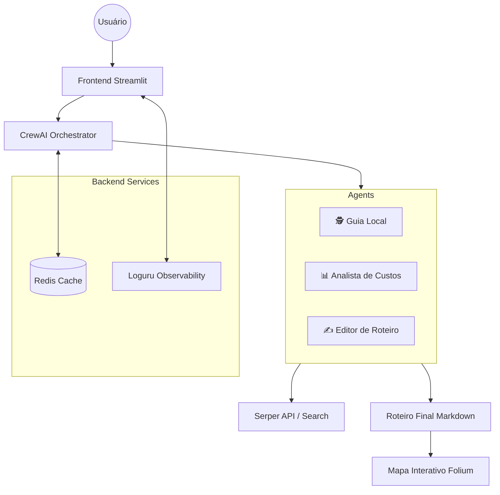

# ✈️ Agência de Viagens Multiagentes: Engenharia de IA em Produção

[](https://github.com/henriquebotelhogomes/agencia_viagens_ia/actions)
[](https://www.python.org/)
[](https://github.com/astral-sh/ruff)
[](https://render.com/)

> **Live Demo:** [agencia-viagens-ia.onrender.com](https://agencia-viagens-ia.onrender.com/)

---

## 🗺️ A Jornada: Por que este projeto existe?

Planejar uma viagem costuma ser um processo fragmentado: você pula de aba em aba no navegador, tenta conciliar preços de voos com atrações turísticas e, no fim, ainda se pergunta se o roteiro é logisticamente viável. As IAs genéricas (como o ChatGPT) ajudam, mas frequentemente alucinam sobre horários, locais que já fecharam ou preços desatualizados.

Minha meta aqui foi construir um **sistema autônomo e confiável**. Este projeto não é apenas um "wrapper" de API; é uma orquestração de agentes especializados que pesquisam em tempo real, validam dados geográficos e monitoram o custo da operação (FinOps).

## 🛠️ Arquitetura e Decisões de Engenharia

Em vez de uma única chamada longa para um modelo de linguagem, utilizei o **CrewAI** para dividir o problema em personas distintas. Isso reduz drasticamente as alucinações e permite que cada agente use ferramentas específicas.



### Onde foquei minha energia (Destaques Técnicos):

- **Orquestração Inteligente (CrewAI)**: Os agentes não trabalham isolados. O *Guia Local* descobre os pontos, o *Analista de Custos* valida se cabem no orçamento e o *Editor* garante que o Markdown final seja impecável.
- **Eficiência com Redis (FinOps)**: Consultas repetidas para o mesmo destino não precisam queimar créditos de API nem tempo de LLM. Implementei uma camada de cache com **Redis** que salva roteiros gerados, reduzindo drasticamente a latência e o custo operacional.
- **Geolocalização em Tempo Real**: Utilizo `Geopy` e `Folium` para extrair nomes de locais do texto gerado e plotá-los automaticamente em um mapa interativo. Se o agente menciona um restaurante, ele aparece no mapa.
- **Infraestrutura como Código (DevOps)**: O projeto é 100% dockerizado e utiliza o `uv` para gestão de dependências. O pipeline de **CI/CD** no GitHub Actions valida o linting (Ruff) e o build do Docker a cada push, garantindo deploys seguros no **Render**.

## ✨ Funcionalidades em Destaque

- **Roteiro Personalizado**: Geração de um itinerário dia a dia com base no destino, origem, duração e interesses específicos do usuário.
- **Pesquisa em Tempo Real**: Agentes conectados à internet via **Serper API** para buscar preços e atrações atualizadas.
- **Mapa Interativo**: Mapeamento automático (Pins) de todos os hotéis, restaurantes e pontos turísticos sugeridos no roteiro.
- **Exportação**: Opção de download do roteiro pronto em formato **Markdown (.md)**.
- **Logs em Tempo Real**: Observabilidade total do "raciocínio" da IA exibido diretamente na interface (Streaming do Console).

## 🚀 Stack Tecnológica

| Camada | Tecnologias |
| :--- | :--- |
| **IA & LLM** | CrewAI, Llama 3.3 (Groq), LangChain, Google Gemini |
| **Backend & Cache** | Python 3.12, Redis, Pydantic (Settings) |
| **Frontend** | Streamlit, Folium (Mapas), Geopy |
| **DevOps** | Docker, GitHub Actions, Ruff (Lint), render.yaml (IaC), uv |
| **Observabilidade** | Loguru (Logs Estruturados), FinOps (Custo/Token) |

## 💻 Como rodar na sua máquina

Diferente de outros projetos que levam minutos para configurar o ambiente, aqui eu uso o **uv** para garantir que tudo seja instantâneo e isolado.

### 1. Pré-requisitos (APIs)
Para o funcionamento pleno, você precisará de chaves para:
- **GROQ_API_KEY**: Processamento ultra-rápido dos agentes.
- **SERPER_API_KEY**: Busca de dados reais na web.
- **GOOGLE_API_KEY**: Extração e fallback de modelos Gemini.

### 2. Instalação
1.  **Clone o Repo:**
    ```bash
    git clone https://github.com/henriquebotelhogomes/agencia_viagens_ia
    cd agencia_viagens_ia
    ```

2.  **Configure o .env:**
    Crie um arquivo `.env` na raiz (baseado no `.env.example`) com suas chaves:
    ```env
    GROQ_API_KEY=sua_chave_aqui
    SERPER_API_KEY=sua_chave_aqui
    GOOGLE_API_KEY=sua_chave_aqui
    ```

3.  **Rode com um comando:**
    Se tiver o `uv` instalado:
    ```bash
    uv run streamlit run app.py
    ```
    Ou via Docker:
    ```bash
    docker-compose up
    ```

---
*Desenvolvido por [Henrique Botelho Gomes](https://github.com/henriquebotelhogomes) - Focado em Engenharia de IA e Sistemas Distribuídos.*