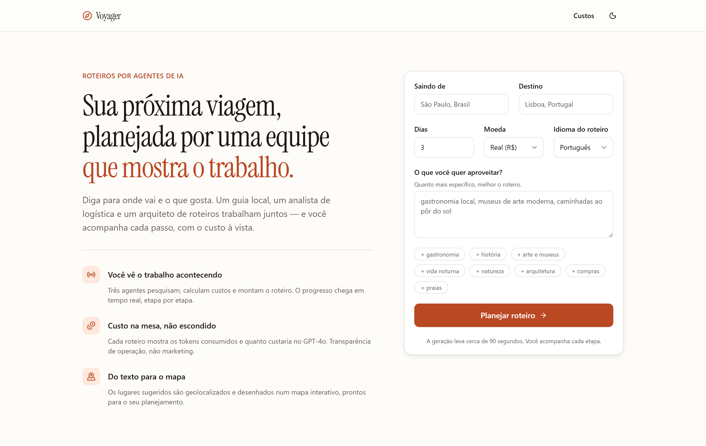
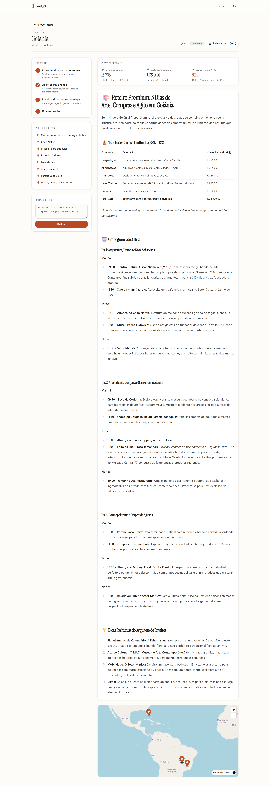
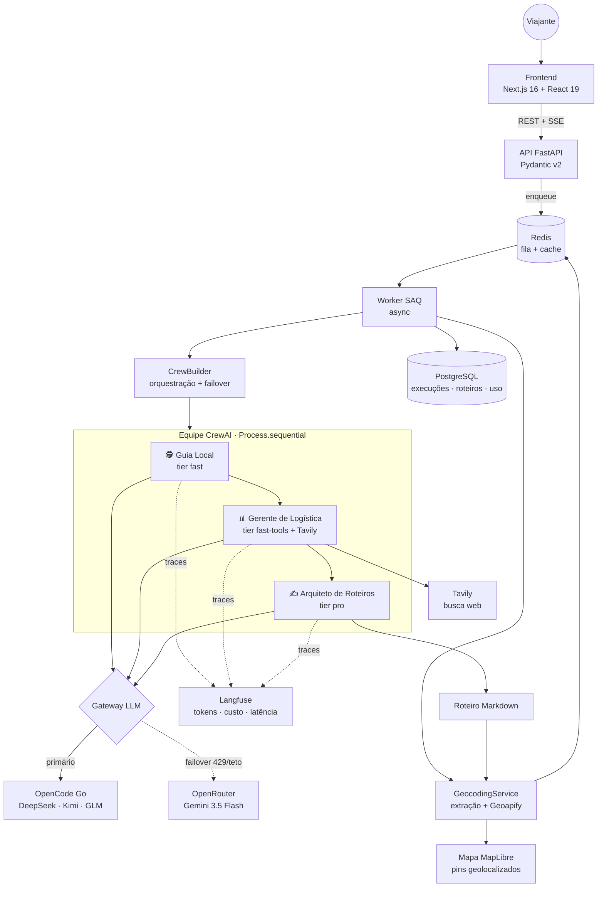
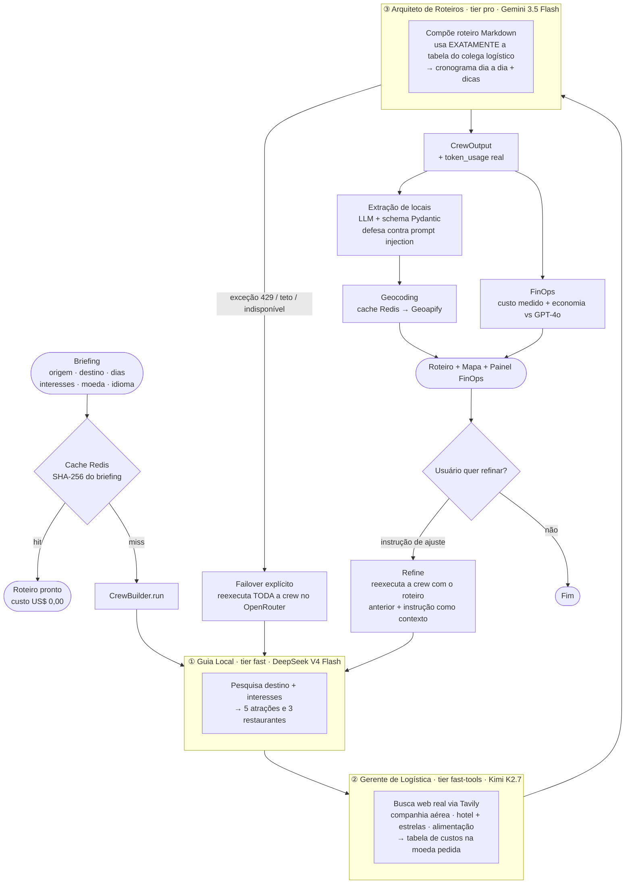
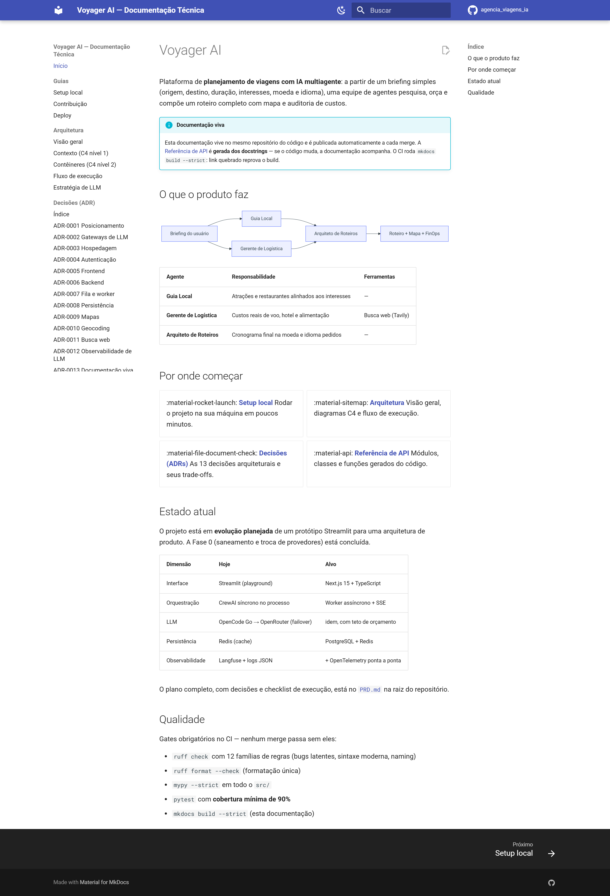

# ✈️ Voyager AI — Planejamento de Viagens com IA Multiagente em Produção

[](https://github.com/henriquebotelhogomes/agencia_viagens_ia/actions)
[](https://henriquebotelhogomes.github.io/agencia_viagens_ia/)
[](https://github.com/henriquebotelhogomes/agencia_viagens_ia/actions)
[](https://www.python.org/)
[](https://github.com/astral-sh/ruff)
[](https://mypy-lang.org/)
[](https://heroku.com/)

> **✨ Demo ao vivo:** [voyager-web-b2607fcece65.herokuapp.com](https://voyager-web-b2607fcece65.herokuapp.com)
> · **API:** [voyager-ia-d97e5ffe11f1.herokuapp.com/health](https://voyager-ia-d97e5ffe11f1.herokuapp.com/health)
> · **Documentação técnica:** [henriquebotelhogomes.github.io/agencia_viagens_ia](https://henriquebotelhogomes.github.io/agencia_viagens_ia/)

---

## 🎯 O que é

Um **sistema autônomo de planejamento de viagens** que orquestra três agentes de IA especializados — um guia local, um analista de logística e um arquiteto de roteiros — para produzir um itinerário completo: pesquisa atrações em tempo real, calcula custos reais na moeda escolhida, geolocaliza cada ponto no mapa e audita o próprio custo de operação (FinOps).

Diferente de um "wrapper" de API, cada decisão de engenharia foi tomada como se o sistema fosse para produção enterprise — porque foi.

### Por que não usar apenas o ChatGPT?

IAs genéricas **alucinam** sobre horários, preços e locais que já fecharam. Aqui, cada afirmação do roteiro passa por uma cadeia de validação: o agente de logística pesquisa companhias aéreas e hotéis reais via busca web, os locais são geocodificados contra uma base geográfica real (Geoapify) e o custo é medido em tokens — não estimado.

---

## 📊 Resultados em produção

| Métrica | Valor |
| :--- | :--- |
| **Custo por roteiro** | ~US$ 0,006 (vs US$ 0,111 no GPT-4o) — **94% de economia** |
| **Tokens por execução** | 8.430 (medidos, não estimados) |
| **Latência p95** | ~51s (SLO: < 90s) · cache hit em milissegundos |
| **Cobertura de testes** | ≥ 90% (backend e frontend, gate de CI) |
| **Decisões documentadas** | 17 ADRs com trade-offs explícitos |

---

## 🖼️ O sistema em ação

**Briefing** — o usuário informa origem, destino, dias, moeda, idioma e interesses; os chips aceleram o preenchimento.



**Execução concluída** — roteiro em Markdown, tabela de custos, painel FinOps (tokens reais + economia vs GPT-4o), mapa com os pontos geolocalizados e painel de refinamento.



---

## 🏗️ Arquitetura

O sistema segue sete princípios: **API-first** (a interface não conhece CrewAI), **assíncrono por padrão** (gerar roteiro é um job, não um request), **12-Factor**, **provider-agnostic de LLM**, **observability-first**, **custo como requisito** e **degradação graciosa** (a falta de um serviço opcional nunca derruba o fluxo).


```mermaid
graph TD
    User((Viajante)) --> FE[Frontend<br/>Next.js 16 + React 19]
    FE -->|REST + SSE| API[API FastAPI<br/>Pydantic v2]
    API -->|enqueue| Q[(Redis<br/>fila + cache)]
    Q --> WK[Worker SAQ<br/>async]
    WK --> Crew[CrewBuilder<br/>orquestração + failover]

    subgraph Agents["Equipe CrewAI · Process.sequential"]
        A1[🕵️ Guia Local<br/>tier fast]
        A2[📊 Gerente de Logística<br/>tier fast-tools + Tavily]
        A3[✍️ Arquiteto de Roteiros<br/>tier pro]
        A1 --> A2 --> A3
    end

    Crew --> Agents
    A1 & A2 & A3 --> GW{Gateway LLM}
    GW -->|primário| OCG[OpenCode Go<br/>DeepSeek · Kimi · GLM]
    GW -.->|failover 429/teto| ORT[OpenRouter<br/>Gemini 3.5 Flash]

    A2 --> TV[Tavily<br/>busca web]

    WK --> PG[(PostgreSQL<br/>execuções · roteiros · uso)]
    WK --> GS[GeocodingService<br/>extração + Geoapify]
    GS --> Q

    A1 & A2 & A3 -.traces.-> LF[Langfuse<br/>tokens · custo · latência]

    A3 --> MD[Roteiro Markdown]
    MD --> GS
    GS --> MAP[Mapa MapLibre<br/>pins geolocalizados]
```

**O núcleo de domínio (`src/`) não depende da apresentação.** Foi isso que permitiu trocar o Streamlit original pelo Next.js, e os provedores de LLM/busca/geocoding, sem tocar na lógica de agentes — e é o que torna o sistema evoluível.

---

## 🤖 Como os agentes trabalham

Em vez de uma única chamada longa (que alucina e estoura contexto), o problema é dividido em **três personas com ferramentas e modelos distintos**, executadas em pipeline sequencial — a saída de cada uma alimenta a próxima.


```mermaid
flowchart TD
    B([Briefing<br/>origem · destino · dias<br/>interesses · moeda · idioma]) --> CACHE{Cache Redis<br/>SHA-256 do briefing}

    CACHE -->|hit| HIT([Roteiro pronto<br/>custo US$ 0,00])

    CACHE -->|miss| RUN[CrewBuilder.run]

    RUN --> T1

    subgraph T1["① Guia Local · tier fast · DeepSeek V4 Flash"]
        R1[Pesquisa destino + interesses<br/>→ 5 atrações e 3 restaurantes]
    end

    T1 --> T2

    subgraph T2["② Gerente de Logística · tier fast-tools · Kimi K2.7"]
        R2[Busca web real via Tavily<br/>companhia aérea · hotel + estrelas · alimentação<br/>→ tabela de custos na moeda pedida]
    end

    T2 --> T3

    subgraph T3["③ Arquiteto de Roteiros · tier pro · Gemini 3.5 Flash"]
        R3[Compõe roteiro Markdown<br/>usa EXATAMENTE a tabela do colega logístico<br/>→ cronograma dia a dia + dicas]
    end

    T3 -->|exceção 429 / teto / indisponível| FO[Failover explícito<br/>reexecuta TODA a crew no OpenRouter]
    FO --> T1

    T3 --> OK[CrewOutput<br/>+ token_usage real]

    OK --> GEO[Extração de locais<br/>LLM + schema Pydantic<br/>defesa contra prompt injection]
    GEO --> GC[Geocoding<br/>cache Redis → Geoapify]
    OK --> FIN[FinOps<br/>custo medido + economia vs GPT-4o]

    GC & FIN --> OUT([Roteiro + Mapa + Painel FinOps])

    OUT --> REF{Usuário quer refinar?}
    REF -->|instrução de ajuste| RE[Refine<br/>reexecuta a crew com o roteiro<br/>anterior + instrução como contexto]
    RE --> T1
    REF -->|não| FIM([Fim])
```

### Por que essa divisão?

- **Modelos diferentes para tarefas diferentes.** Pesquisa e extração são tarefas baratas (`fast`); logística exige *function calling* confiável para usar o Tavily (`fast-tools`); a redação final precisa de qualidade consistente (`pro`). Pagar preço de modelo frontier para listar atrações seria desperdício.
- **Failover na camada de aplicação, não do litellm.** O CrewAI 1.x usa providers nativos para prefixos como `openai/`, que não aceitam o parâmetro `fallbacks` do litellm. O retry é explícito no `CrewBuilder.run()` — o ponto de decisão é nosso, testável sem rede.
- **Refinamento com linhagem de versões.** Um roteiro pode ser refinado por instrução ("troque o hotel por um mais central") ou revertido para qualquer versão anterior — sem reescrever histórico (append-only). Ver [ADR-0017](docs/adr/0017-versionamento-roteiro.md).

---

## 🔭 Observabilidade e documentação viva

**[Langfuse](https://langfuse.com)** — plataforma open-source de observabilidade de LLM. Usamos para rastrear **cada chamada de modelo**: prompt, resposta, tokens, custo e latência, agrupados por execução. É o que transforma "quanto custa esse roteiro?" em uma métrica real, não um chute — e permite detectar regressões de qualidade ou de custo entre versões. Ver [ADR-0012](docs/adr/0012-observabilidade-llm.md).

**[MkDocs Material](https://squidfunk.github.io/mkdocs-material/)** — documentação como código, versionada junto com o `src/` e publicada automaticamente pelo CI a cada merge. A referência de API é gerada dos docstrings (via mkdocstrings) e o build roda com `--strict`: link quebrado reprova o pipeline. Ver [ADR-0013](docs/adr/0013-documentacao-viva.md).



---

## 🛠️ Stack e o porquê de cada escolha

| Camada | Escolha | Por quê |
| :--- | :--- | :--- |
| **Orquestração de agentes** | CrewAI | Divide o problema em personas com ferramentas próprias, reduzindo alucinação vs. chamada única |
| **Gateway LLM** | OpenCode Go (primário) + OpenRouter (fallback/`pro`) | Go tem ~US$ 60/mês incluídos na assinatura (custo marginal ~$0); OpenRouter garante que a demo nunca bloqueia por cota e fornece o modelo pago do output final. Ver [ADR-0002](docs/adr/0002-gateways-llm.md) |
| **Abstração LLM** | litellm | Um único contrato (`openai/<model>` / `openrouter/<provider>/<model>`) — trocar de gateway é configuração, não código |
| **Busca web** | Tavily | Entrega conteúdo já extraído e otimizado para LLM (menos tokens, menos ruído) |
| **Backend** | FastAPI + Pydantic v2 | Async nativo, validação de contrato (RFC 9457 para erros), Settings com `SecretStr`. Ver [ADR-0006](docs/adr/0006-backend.md) |
| **Fila / worker** | SAQ (Redis) | Async de verdade, sem o `redis<6` do Arq nem o overhead síncrono do Celery. Ver [ADR-0014](docs/adr/0014-fila-saq.md) |
| **Persistência** | PostgreSQL + Redis | Postgres para estado durável (execuções, roteiros, uso); Redis para cache e fila. Ver [ADR-0008](docs/adr/0008-persistencia.md) |
| **Frontend** | Next.js 16 (App Router) + React 19 + TS | Substituiu o Streamlit: streaming SSE do "raciocínio" da IA, dark mode, i18n. Ver [ADR-0005](docs/adr/0005-frontend.md) |
| **Mapas** | MapLibre GL JS | Roda 100% no cliente, sem chave de API de tiles (coerente com a política de zero dependência paga). Ver [ADR-0009](docs/adr/0009-mapas.md) |
| **Geocoding** | Geoapify + cache Redis (30 dias) | 3.000 req/dia grátis; cache elimina chamadas repetidas. Ver [ADR-0010](docs/adr/0010-geocoding.md) |
| **Observabilidade de LLM** | Langfuse Cloud | Prompt, resposta, tokens, custo e latência de cada chamada — 50k observações/mês grátis. Ver [ADR-0012](docs/adr/0012-observabilidade-llm.md) |
| **DevOps** | Docker multi-stage non-root + GitHub Actions + uv | Build reproduzível, imagem enxuta, CI com gates de lint/tipagem/cobertura. Ver [ADR-0015](docs/adr/0015-hospedagem-heroku.md) |
| **Documentação** | MkDocs Material + ADRs | Docs-as-code publicado pelo CI; decisões com trade-offs versionadas. Ver [ADR-0013](docs/adr/0013-documentacao-viva.md) |

---

## ✨ Funcionalidades

- **Roteiro personalizado** — itinerário dia a dia (manhã/tarde/noite) a partir de destino, origem, duração e interesses.
- **Refinamento iterativo** — ajuste o roteiro por instrução livre ("inclua mais museus") e navegue pelo histórico de versões com diff lado a lado.
- **Rollback append-only** — reverta para qualquer versão anterior sem reescrever o histórico.
- **Moeda e idioma parametrizáveis** — BRL/USD/EUR/GBP · pt-BR/en-US/es-ES; o roteiro sai integralmente na combinação escolhida (e a chave de cache inclui ambas).
- **Pesquisa em tempo real** — agentes conectados à internet via Tavily.
- **Mapa interativo** — pins geolocalizados de hotéis, restaurantes e atrações, com destaque sincronizado com o roteiro.
- **Logs em tempo real (SSE)** — o "raciocínio" dos agentes transmitido ao vivo para a interface.
- **Auditoria FinOps** — tokens reais, custo medido e economia comparada ao GPT-4o, por execução.
- **Exportação** — download do roteiro em Markdown.

---

## 🔒 Segurança e confiabilidade

- **Defesa contra prompt injection** — o roteiro é tratado como *dado não confiável* na extração de locais: texto delimitado com instrução explícita de ignorar comandos embutidos, saída validada contra schema Pydantic e teto de locais aplicado em código (não só no prompt).
- **Segredos fora do código** — `SecretStr` do Pydantic em todas as chaves; validação de ambiente sem exibir segredos (`scripts/check_env.py`).
- **Rate limiting** — proteção da demo pública por IP (autenticação é non-goal deliberado nesta fase).
- **Imagem hardened** — usuário non-root, multi-stage build, superfície mínima.

---

## 💻 Como rodar

### 1. Pré-requisitos (chaves de API)

| Variável | Serviço | Free tier |
| :--- | :--- | :--- |
| `OPENCODE_API_KEY` | OpenCode Go — LLM primário | assinatura US$ 10/mês |
| `OPENROUTER_API_KEY` | OpenRouter — tier `pro` e fallback | 1.000 req/dia com créditos |
| `TAVILY_API_KEY` | Busca web dos agentes | 1.000 créditos/mês |
| `GEOAPIFY_API_KEY` | Geocoding dos locais | 3.000 req/dia |
| `LANGFUSE_PUBLIC_KEY` / `LANGFUSE_SECRET_KEY` | Tracing de LLM | 50k observações/mês |

O [guia de setup](docs/guides/setup.md) tem os links de cada serviço e a solução dos problemas mais comuns.

### 2. Instalação

```bash
git clone https://github.com/henriquebotelhogomes/agencia_viagens_ia
cd agencia_viagens_ia

cp .env.example .env          # PowerShell: Copy-Item .env.example .env
uv run python -m scripts.check_env   # valida cada integração contra a API real

docker compose up --build     # sobe Postgres, Redis, API, worker e frontend
```

A aplicação fica em **[http://localhost:3000](http://localhost:3000)** (API em [http://localhost:8000/docs](http://localhost:8000/docs)).

### 3. Documentação local

```bash
uv sync --group docs
uv run mkdocs serve           # http://localhost:8000
```

---

## 📚 Documentação

| Documento | Conteúdo |
| :--- | :--- |
| [**Documentação técnica**](https://henriquebotelhogomes.github.io/agencia_viagens_ia/) | Arquitetura, C4, referência de API, runbook |
| [**ADRs**](docs/adr/index.md) | 17 decisões arquiteturais com trade-offs |
| [**PRD.md**](PRD.md) | Escopo, decisões de produto e roadmap |
| [**specs/**](specs/README.md) | Especificações funcionais, técnicas e de UX |
| [**CONTRIBUTING.md**](CONTRIBUTING.md) | Padrões de código e fluxo de PR |

---

*Desenvolvido por **[Henrique Botelho Gomes](https://www.linkedin.com/in/henriquebotelhogomes/)** — focado em Engenharia de IA e Sistemas Distribuídos.*
