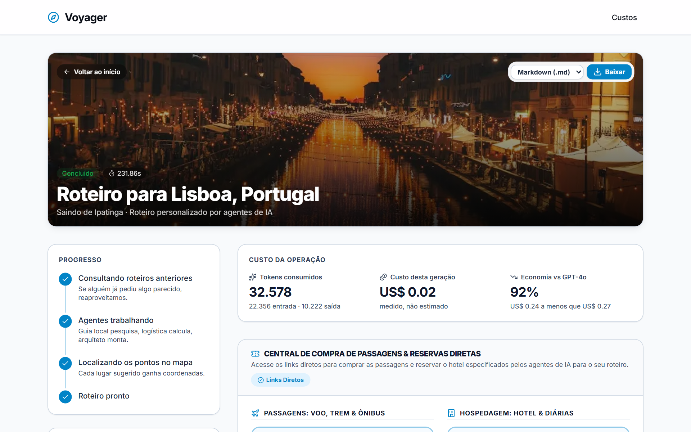
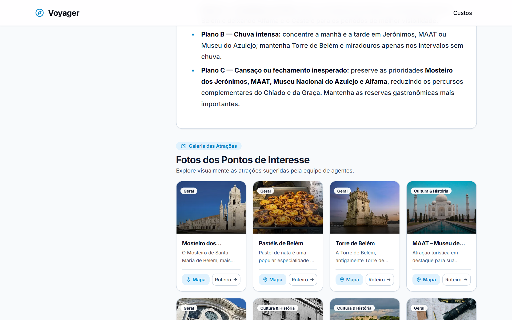
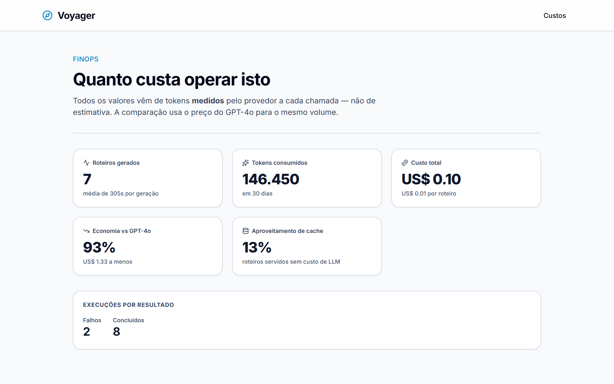
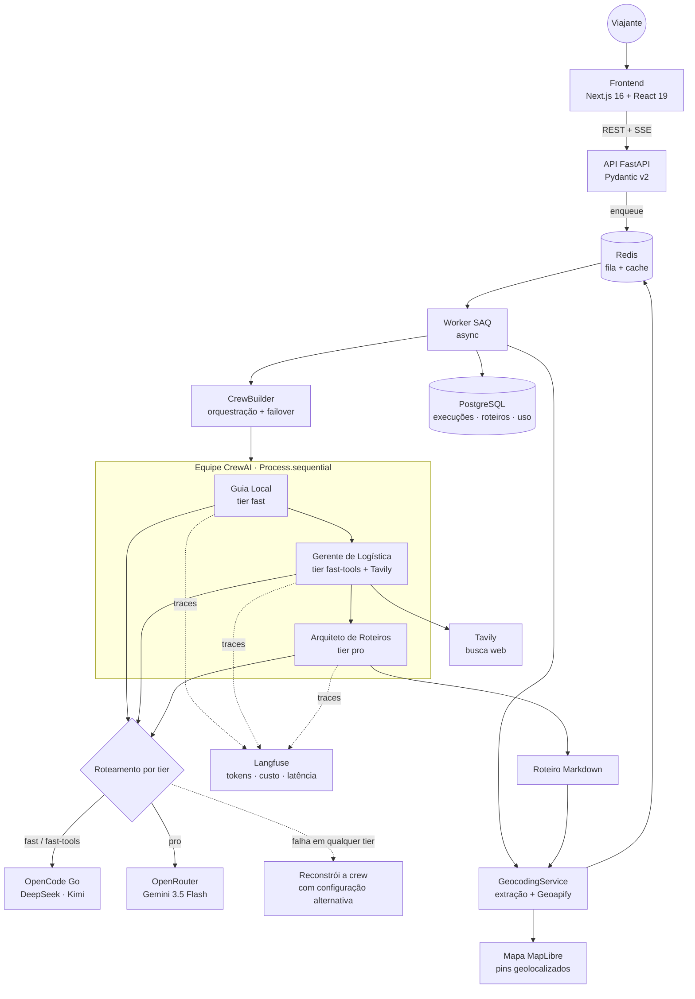
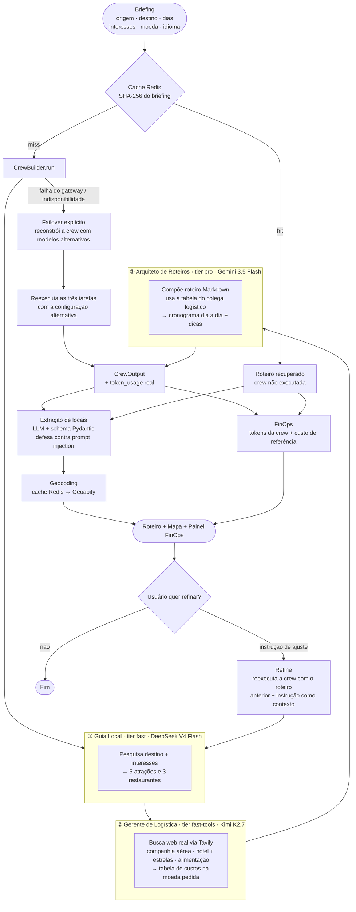
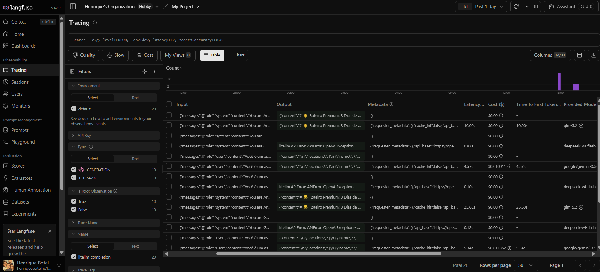

# ✈️ Voyager AI — Planejamento de Viagens com IA Multiagente

[](https://github.com/henriquebotelhogomes/agencia_viagens_ia/actions)
[](https://henriquebotelhogomes.github.io/agencia_viagens_ia/)
[](https://github.com/henriquebotelhogomes/agencia_viagens_ia/actions)
[](https://www.python.org/)
[](https://github.com/astral-sh/ruff)
[](https://mypy-lang.org/)
[](https://heroku.com/)

> **✨ Demo ao vivo:** [voyager-web-b2607fcece65.herokuapp.com](https://voyager-web-b2607fcece65.herokuapp.com)
> · **API:** [voyager-ia-d97e5ffe11f1.herokuapp.com/health](https://voyager-ia-d97e5ffe11f1.herokuapp.com/health)
> · **Documentação técnica:** [henriquebotelhogomes.github.io/agencia_viagens_ia](https://henriquebotelhogomes.github.io/agencia_viagens_ia/)

> **📌 Projeto de portfólio:** caso de estudo de Engenharia de IA construído com práticas de produção — não é um produto comercial. Ver [escopo e limitações](#escopo-e-limitacoes).

---

## 🎯 O que é

Uma **aplicação web full-stack de planejamento de viagens** que orquestra três agentes de IA especializados — guia local, gerente de logística e arquiteto de roteiros — para produzir um itinerário completo. O fluxo pesquisa referências na web, estima custos na moeda escolhida, geocodifica pontos do roteiro e registra o consumo de tokens da crew para análise FinOps.

Mais do que uma interface sobre uma API de LLM, o projeto demonstra a operação de um fluxo de IA assíncrono: API e worker separados, fila e cache em Redis, estado durável em PostgreSQL, progresso via SSE, failover de modelos, observabilidade e gates automatizados de qualidade.

### O que este projeto demonstra

| Competência | Evidência no repositório |
| :--- | :--- |
| **Engenharia de IA** | Roteamento por tier e ferramentas em [`src/agents.py`](src/agents.py); saída estruturada e defesa contra prompt injection em [`geocoding_service.py`](src/services/geocoding_service.py) |
| **Sistemas distribuídos** | FastAPI responde `202` em [`executions.py`](src/api/routers/executions.py); SAQ executa e persiste o estado fora do request em [`worker/tasks.py`](src/worker/tasks.py) |
| **Confiabilidade** | Idempotência, timeout, recuperação de jobs, rate limiting, cache e rollback cobertos em [`test_worker_tasks.py`](tests/test_worker_tasks.py), [`test_executions.py`](tests/api/test_executions.py) e nas [ADRs](docs/adr/index.md) |
| **Qualidade de software** | Python tipado em modo estrito, testes backend/frontend/E2E, cobertura mínima e validação do container no [`ci.yml`](.github/workflows/ci.yml) |

### Por que não usar apenas o ChatGPT?

Uma conversa genérica não oferece, por padrão, controle explícito sobre pesquisa, persistência, versionamento e custo. Na Voyager, o agente de logística consulta a web via Tavily, os locais extraídos são validados por schema e resolvidos por Geoapify/Nominatim, e o consumo agregado da crew vem de `CrewOutput.token_usage`. Esses controles **reduzem** respostas sem sustentação, mas não eliminam a natureza probabilística dos modelos: horários, preços e disponibilidade ainda devem ser confirmados nas fontes oficiais.

---

## 📊 Medição de referência e gates de qualidade

| Métrica | Valor |
| :--- | :--- |
| **Cenário medido** | Lisboa · 2 dias · EUR · pt-BR |
| **Tokens da crew** | 8.430 (`prompt` + `completion`, medidos pelo CrewAI) |
| **Reprecificação de referência** | ~US$ 0,006 no perfil econômico vs ~US$ 0,111 nas tarifas do GPT-4o — **94% menor** |
| **Duração observada** | ~51s em uma execução de referência · SLO definido: p95 < 90s |
| **Cobertura backend** | 92,61% na validação local completa · gate de CI ≥ 90% |
| **Cobertura frontend** | gates de CI: ≥ 90% linhas/funções e ≥ 85% branches |
| **Decisões documentadas** | 17 ADRs com trade-offs explícitos |

> **Metodologia:** os tokens são medidos. O comparativo reaplica duas tabelas de preço ao mesmo volume observado (1.511 tokens de prompt + 6.919 de completion); não é uma segunda execução no GPT-4o, uma fatura do provedor nem o custo total das ferramentas e da infraestrutura. A amostra é um benchmark funcional, não um teste de carga. Veja a [metodologia FinOps](docs/operations/finops.md) e o [fluxo de execução](docs/architecture/execution-flow.md).

---

## 🖼️ O sistema em ação

**1. Briefing** — o usuário informa origem, destino, dias, moeda, idioma e interesses; os chips aceleram o preenchimento.


**2. Execução concluída** — progresso etapa a etapa (cache → agentes → geocoding → pronto), painel FinOps com tokens medidos e baseline calculado, e o roteiro gerado.



**3. Estimativas na moeda pedida** — o gerente de logística pesquisa referências de voos, hotel e alimentação via busca web e monta a tabela que o arquiteto reutiliza no roteiro, reduzindo valores sem sustentação.


**4. Roteiro dia a dia** — cronograma manhã/tarde/noite, cada período com plano A (ideal), B (chuva) e C (ritmo leve).

| Dia 1 | Dia 2 |
| :---: | :---: |
|  |  |

**5. Dicas do arquiteto + mapa interativo** — recomendações práticas do arquiteto de roteiros e os pontos geolocalizados desenhados no MapLibre (100% no cliente, sem chave de tiles).


**6. Painel FinOps** — tokens agregados da crew, custo calculado, baseline comparativo e aproveitamento de cache, com visão por execução e agregação diária.



---

## 🏗️ Arquitetura

O sistema segue sete princípios: **API-first** (a interface não conhece CrewAI), **assíncrono por padrão** (gerar roteiro é um job, não um request), **12-Factor**, **modelos configuráveis**, **observability-first**, **custo como requisito** e **degradação graciosa para integrações opcionais**.


```mermaid
graph TD
    User((Viajante)) --> FE[Frontend<br/>Next.js 16 + React 19]
    FE -->|REST + SSE| API["API FastAPI<br/>Pydantic v2"]
    API -->|enqueue| Q[("Redis<br/>fila + cache")]
    Q --> WK["Worker SAQ<br/>async"]
    WK --> Crew["CrewBuilder<br/>orquestração + failover"]

    subgraph Agents["Equipe CrewAI · Process.sequential"]
        A1["Guia Local<br/>tier fast"]
        A2["Gerente de Logística<br/>tier fast-tools + Tavily"]
        A3["Arquiteto de Roteiros<br/>tier pro"]
        A1 --> A2 --> A3
    end

    Crew --> Agents
    A1 & A2 & A3 --> GW{Roteamento por tier}
    GW -->|fast / fast-tools| OCG["OpenCode Go<br/>DeepSeek · Kimi"]
    GW -->|pro| ORT["OpenRouter<br/>Gemini 3.5 Flash"]
    GW -.->|falha em qualquer tier| ALT["Reconstrói a crew<br/>com configuração alternativa"]

    A2 --> TV["Tavily<br/>busca web"]

    WK --> PG[("PostgreSQL<br/>execuções · roteiros · uso")]
    WK --> GS["GeocodingService<br/>extração + Geoapify"]
    GS --> Q

    A1 & A2 & A3 -.traces.-> LF["Langfuse<br/>tokens · custo · latência"]

    A3 --> MD["Roteiro Markdown"]
    MD --> GS
    GS --> MAP["Mapa MapLibre<br/>pins geolocalizados"]
```

**O núcleo de domínio (`src/`) não depende da apresentação.** Foi isso que permitiu trocar o Streamlit original pelo Next.js, e os provedores de LLM/busca/geocoding, sem tocar na lógica de agentes — e é o que torna o sistema evoluível.

---

## 🤖 Como os agentes trabalham

Em vez de concentrar pesquisa, orçamento e redação em uma única chamada, o problema é dividido em **três responsabilidades com ferramentas e modelos distintos**, executadas em pipeline sequencial — a saída de cada tarefa fica disponível para a seguinte.


```mermaid
flowchart TD
    B(["Briefing<br/>origem · destino · dias<br/>interesses · moeda · idioma"]) --> CACHE{"Cache Redis<br/>SHA-256 do briefing"}

    CACHE -->|hit| HIT["Roteiro recuperado<br/>crew não executada"]

    CACHE -->|miss| RUN["CrewBuilder.run"]

    RUN --> T1

    subgraph T1["① Guia Local · tier fast · DeepSeek V4 Flash"]
        R1["Pesquisa destino + interesses<br/>→ 5 atrações e 3 restaurantes"]
    end

    T1 --> T2

    subgraph T2["② Gerente de Logística · tier fast-tools · Kimi K2.7"]
        R2["Busca web real via Tavily<br/>companhia aérea · hotel + estrelas · alimentação<br/>→ tabela de custos na moeda pedida"]
    end

    T2 --> T3

    subgraph T3["③ Arquiteto de Roteiros · tier pro · Gemini 3.5 Flash"]
        R3["Compõe roteiro Markdown<br/>usa a tabela do colega logístico<br/>→ cronograma dia a dia + dicas"]
    end

    RUN -->|falha do gateway / indisponibilidade| FO["Failover explícito<br/>reconstrói a crew com modelos alternativos"]
    FO --> RETRY["Reexecuta as três tarefas<br/>com a configuração alternativa"]

    T3 --> OK["CrewOutput<br/>+ token_usage real"]
    RETRY --> OK

    OK --> GEO["Extração de locais<br/>LLM + schema Pydantic<br/>defesa contra prompt injection"]
    HIT --> GEO
    GEO --> GC["Geocoding<br/>cache Redis → Geoapify"]
    OK --> FIN["FinOps<br/>tokens da crew + custo de referência"]
    HIT --> FIN

    GC & FIN --> OUT(["Roteiro + Mapa + Painel FinOps"])

    OUT --> REF{"Usuário quer refinar?"}
    REF -->|instrução de ajuste| RE["Refine<br/>reexecuta a crew com o roteiro<br/>anterior + instrução como contexto"]
    RE --> T1
    REF -->|não| FIM([Fim])
```

### Por que essa divisão?

- **Modelos diferentes para tarefas diferentes.** Pesquisa e extração são tarefas baratas (`fast`); logística exige *function calling* confiável para usar o Tavily (`fast-tools`); a redação final precisa de qualidade consistente (`pro`). Pagar preço de modelo frontier para listar atrações seria desperdício.
- **Failover na camada de aplicação, não do litellm.** O retry é explícito no `CrewBuilder.run()`: qualquer exceção na primeira execução reconstrói a crew com a configuração alternativa e repete o pipeline uma vez; uma segunda falha é propagada. O ponto de decisão permanece no código da aplicação e é testável sem rede.
- **Refinamento com linhagem de versões.** Um roteiro pode ser refinado por instrução ("troque o hotel por um mais central") ou revertido para qualquer versão anterior — sem reescrever histórico (append-only). Ver [ADR-0017](docs/adr/0017-versionamento-roteiro.md).

---

## 🔭 Observabilidade e documentação viva

**[Langfuse](https://langfuse.com)** — plataforma open-source usada, quando configurada, como callback do LiteLLM para rastrear chamadas de modelo, prompts, respostas, tokens e latência. Em paralelo, o painel da aplicação persiste o uso agregado retornado pela crew e calcula o comparativo FinOps com tarifas de referência. Ver [ADR-0012](docs/adr/0012-observabilidade-llm.md).



**[MkDocs Material](https://squidfunk.github.io/mkdocs-material/)** — documentação como código, versionada junto com o `src/` e publicada automaticamente pelo CI a cada merge. A referência de API é gerada dos docstrings (via mkdocstrings) e o build roda com `--strict`: link quebrado reprova o pipeline. Ver [ADR-0013](docs/adr/0013-documentacao-viva.md).


---

## 🛠️ Stack e o porquê de cada escolha

| Camada | Escolha | Por quê |
| :--- | :--- | :--- |
| **Orquestração de agentes** | CrewAI | Separa pesquisa, logística e composição em responsabilidades com ferramentas e modelos próprios |
| **Gateway LLM** | OpenCode Go (tiers baratos) + OpenRouter (`pro` e alternativas) | Separa custo e qualidade por responsabilidade e permite reconstruir a crew com outra configuração após falha. Ver [ADR-0002](docs/adr/0002-gateways-llm.md) |
| **Abstração LLM** | CrewAI + litellm | Centraliza IDs, chaves e parâmetros em `Settings`; modelos podem ser trocados por configuração |
| **Busca web** | Tavily | Entrega conteúdo já extraído e otimizado para LLM (menos tokens, menos ruído) |
| **Backend** | FastAPI + Pydantic v2 | Async nativo, validação de contrato (RFC 9457 para erros), Settings com `SecretStr`. Ver [ADR-0006](docs/adr/0006-backend.md) |
| **Fila / worker** | SAQ (Redis) | Async de verdade, sem o `redis<6` do Arq nem o overhead síncrono do Celery. Ver [ADR-0014](docs/adr/0014-fila-saq.md) |
| **Persistência** | PostgreSQL + Redis | Postgres para estado durável (execuções, roteiros, uso); Redis para cache e fila. Ver [ADR-0008](docs/adr/0008-persistencia.md) |
| **Frontend** | Next.js 16 (App Router) + React 19 + TS | Substituiu o Streamlit: progresso via SSE, dark mode e conteúdo gerado em três idiomas (interface em PT-BR). Ver [ADR-0005](docs/adr/0005-frontend.md) |
| **Mapas** | MapLibre GL JS | Roda 100% no cliente, sem chave de API de tiles (coerente com a política de zero dependência paga). Ver [ADR-0009](docs/adr/0009-mapas.md) |
| **Geocoding** | Geoapify + cache Redis (30 dias) | 3.000 req/dia grátis; cache elimina chamadas repetidas. Ver [ADR-0010](docs/adr/0010-geocoding.md) |
| **Observabilidade de LLM** | Langfuse Cloud | Prompt, resposta, tokens, custo e latência de cada chamada — 50k observações/mês grátis. Ver [ADR-0012](docs/adr/0012-observabilidade-llm.md) |
| **DevOps** | Docker multi-stage non-root + GitHub Actions + uv | Build reproduzível, imagem enxuta, CI com gates de lint/tipagem/cobertura. Ver [ADR-0015](docs/adr/0015-hospedagem-heroku.md) |
| **Documentação** | MkDocs Material + ADRs | Docs-as-code publicado pelo CI; decisões com trade-offs versionadas. Ver [ADR-0013](docs/adr/0013-documentacao-viva.md) |

---

## ✨ Funcionalidades

- **Roteiro personalizado** — itinerário dia a dia (manhã/tarde/noite) a partir de destino, origem, duração e interesses.
- **Refinamento iterativo** — ajuste o roteiro por instrução livre ("inclua mais museus") e navegue pelo histórico de versões com diff lado a lado.
- **Rollback append-only** — reverta para qualquer versão anterior sem reescrever o histórico.
- **Moeda e idioma parametrizáveis** — BRL/USD/EUR/GBP · pt-BR/en-US/es-ES; o roteiro sai integralmente na combinação escolhida (e a chave de cache inclui ambas).
- **Pesquisa em tempo real** — agentes conectados à internet via Tavily.
- **Mapa interativo** — pins geolocalizados de hotéis, restaurantes e atrações, com destaque sincronizado com o roteiro.
- **Progresso em tempo real (SSE)** — eventos de estado (`queued`, `running` e terminal) e etapa atual transmitidos para a interface; prompts e raciocínio não são expostos ao navegador.
- **FinOps** — tokens agregados da crew, custo calculado e baseline comparativo com GPT-4o, por execução.
- **Exportação** — download do roteiro em Markdown.

---

## 🔒 Segurança e confiabilidade

- **Defesa em profundidade contra prompt injection** — na extração de locais, o roteiro é delimitado como dado não confiável, a resposta passa por schema Pydantic e o teto de 8 locais é aplicado em código. Essa camada reduz a superfície de ataque; não é uma garantia absoluta contra conteúdo adversarial.
- **Segredos fora do código** — `SecretStr` do Pydantic em todas as chaves; validação de ambiente sem exibir segredos (`scripts/check_env.py`).
- **Rate limiting** — janela Redis de uma hora, por hash do IP; o padrão da demo é 5 novas execuções/hora e pode ser configurado.
- **Idempotência** — `Idempotency-Key` evita jobs e custos duplicados em retries do cliente.
- **Recuperação operacional** — o timeout padrão do job é 600s; cancelamentos marcam a execução como falha e, no startup, o worker reconcilia registros `running` mais antigos que esse limite.
- **Container de produção** — build multi-stage, dependências travadas e processo executado sem privilégios de root.

---

## 💻 Como rodar

### 1. Pré-requisitos

- [Docker Desktop](https://www.docker.com/products/docker-desktop/) com Docker Compose
- [Python 3.12+](https://www.python.org/) e [uv](https://docs.astral.sh/uv/) para validar o ambiente e executar os gates locais

### 2. Configuração das integrações

| Variável | Papel | Necessidade |
| :--- | :--- | :--- |
| `OPENROUTER_API_KEY` | Tier `pro` e modelos alternativos | **Necessária** para a configuração padrão |
| `OPENCODE_API_KEY` | Gateway dos tiers `fast` e `fast-tools` | Recomendada; sem ela, o fluxo usa os modelos alternativos configurados |
| `TAVILY_API_KEY` | Busca web do agente de logística | Necessária para pesquisa de referências na web |
| `GEOAPIFY_API_KEY` | Geocoding primário | Opcional; sem ela, há fallback para Nominatim |
| `LANGFUSE_PUBLIC_KEY` / `LANGFUSE_SECRET_KEY` | Tracing de LLM | Opcional; sem elas, o tracing é desativado |

PostgreSQL e Redis são necessários para o fluxo assíncrono da API e já são provisionados pelo Compose. O [guia de setup](docs/guides/setup.md) tem os links de cada serviço e a solução dos problemas mais comuns.

### 3. Instalação

```bash
git clone https://github.com/henriquebotelhogomes/agencia_viagens_ia.git
cd agencia_viagens_ia

cp .env.example .env          # PowerShell: Copy-Item .env.example .env
uv sync
uv run python -m scripts.check_env   # valida as APIs; consome 1 crédito Tavily

docker compose up -d postgres redis
docker compose run --rm api alembic upgrade head
docker compose up --build -d api worker frontend
```

A aplicação fica em **[http://localhost:3000](http://localhost:3000)** (API em [http://localhost:8000/docs](http://localhost:8000/docs)).

> Deixe vazias no `.env` as integrações opcionais que não for usar. O diagnóstico reporta cada integração separadamente; uma opcional ausente não impede o uso das demais.

### 4. Gates de qualidade

```bash
uv sync --group dev
uv run ruff check src/ tests/ scripts/ alembic/
uv run ruff format src/ tests/ scripts/ alembic/ --check
uv run mypy src/ --strict
uv run pytest tests/ --cov=src

cd frontend
npm ci
npm run typecheck
npm run lint
npm run test:cov
npm run build
cd ..
```

O CI também executa Playwright e um cenário integrado determinístico cobrindo frontend → API → fila → worker → SSE, sem consumir APIs externas.

### 5. Documentação local

```bash
uv sync --group docs
uv run mkdocs serve --dev-addr=127.0.0.1:8001
```

---

## 📚 Documentação

| Documento | Conteúdo |
| :--- | :--- |
| [**Documentação técnica**](https://henriquebotelhogomes.github.io/agencia_viagens_ia/) | Arquitetura, C4, referência de API, runbook |
| [**ADRs**](docs/adr/index.md) | 17 decisões arquiteturais com trade-offs |
| [**PRD.md**](PRD.md) | Escopo, decisões de produto e roadmap |
| [**specs/**](specs/README.md) | Especificações funcionais, técnicas e de UX |
| [**CONTRIBUTING.md**](CONTRIBUTING.md) | Padrões de código e fluxo de PR |

---

<a id="escopo-e-limitacoes"></a>

## ⚠️ Escopo e limitações

- **Propósito demonstrativo** — concebido, construído e operado como caso de estudo de Engenharia de IA e Sistemas Distribuídos; não é um produto ou serviço comercial.
- **Demo pública sem garantias** — a demo está no ar para avaliação, sem SLA ou garantia de disponibilidade, e pode ser descontinuada.
- **Autenticação é non-goal deliberado** — a demo é protegida apenas por rate limiting de IP (ver [ADR-0004](docs/adr/0004-autenticacao.md)); não insira dados pessoais sensíveis.
- **Saídas de IA exigem verificação** — pesquisa web e geocoding reduzem erros, mas preços, horários, disponibilidade e recomendações podem mudar ou estar incorretos.
- **Benchmark não é teste de carga** — custo e duração publicados vêm de uma execução de referência; o SLO p95 é uma meta operacional, não uma distribuição estatística já comprovada.
- **Interface em português** — o conteúdo do roteiro pode ser gerado em pt-BR, en-US ou es-ES, mas a interface permanece em PT-BR por decisão de escopo ([ADR-0016](docs/adr/0016-i18n.md)).
- **Manutenção em ritmo pessoal** — evolução e correções acontecem no tempo do autor; issues e sugestões são bem-vindas.

---

*Desenvolvido por **[Henrique Botelho Gomes](https://www.linkedin.com/in/henriquebotelhogomes/)** — focado em Engenharia de IA e Sistemas Distribuídos.*
