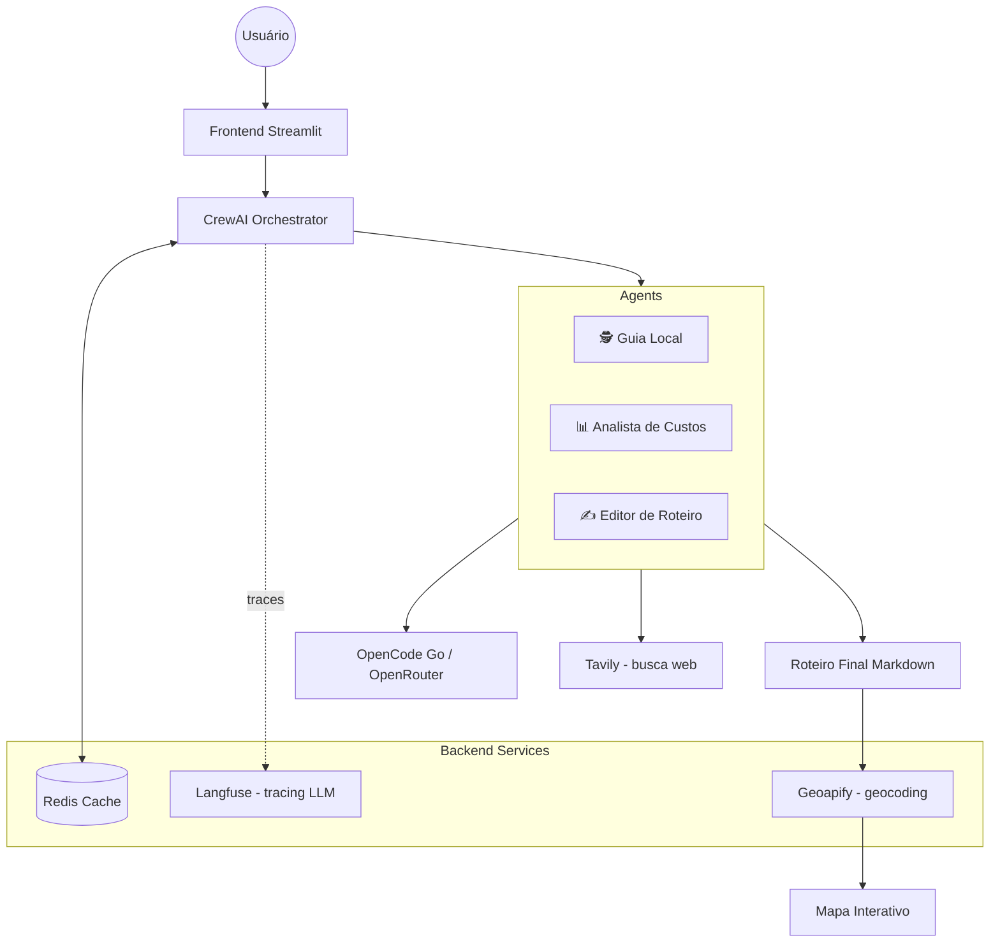

# ✈️ Agência de Viagens Multiagentes: Engenharia de IA em Produção

[](https://github.com/henriquebotelhogomes/agencia_viagens_ia/actions)
[](https://henriquebotelhogomes.github.io/agencia_viagens_ia/)
[](https://github.com/henriquebotelhogomes/agencia_viagens_ia/actions)
[](https://www.python.org/)
[](https://github.com/astral-sh/ruff)
[](https://mypy-lang.org/)
[](https://heroku.com/)

> **Documentação técnica:** [henriquebotelhogomes.github.io/agencia_viagens_ia](https://henriquebotelhogomes.github.io/agencia_viagens_ia/)

---

## 📚 Documentação

| Documento | Conteúdo |
| :--- | :--- |
| [**Documentação técnica**](https://henriquebotelhogomes.github.io/agencia_viagens_ia/) | Arquitetura, C4, referência de API, runbook |
| [**ADRs**](docs/adr/index.md) | 13 decisões arquiteturais com trade-offs |
| [**PRD.md**](PRD.md) | Escopo, decisões de produto e roadmap |
| [**CONTRIBUTING.md**](CONTRIBUTING.md) | Padrões de código e fluxo de PR |

## 🗺️ A Jornada: Por que este projeto existe?

Planejar uma viagem costuma ser um processo fragmentado: você pula de aba em aba no navegador, tenta conciliar preços de voos com atrações turísticas e, no fim, ainda se pergunta se o roteiro é logisticamente viável. As IAs genéricas (como o ChatGPT) ajudam, mas frequentemente alucinam sobre horários, locais que já fecharam ou preços desatualizados.

Minha meta aqui foi construir um **sistema autônomo e confiável**. Este projeto não é apenas um "wrapper" de API; é uma orquestração de agentes especializados que pesquisam em tempo real, validam dados geográficos e monitoram o custo da operação (FinOps).

## 🛠️ Arquitetura e Decisões de Engenharia

Em vez de uma única chamada longa para um modelo de linguagem, utilizei o **CrewAI** para dividir o problema em personas distintas. Isso reduz drasticamente as alucinações e permite que cada agente use ferramentas específicas.


```mermaid
graph TD
    User((Usuário)) --> Streamlit[Frontend Streamlit]
    Streamlit --> Crew[CrewAI Orchestrator]

    subgraph Agents
        A1[🕵️ Guia Local]
        A2[📊 Analista de Custos]
        A3[✍️ Editor de Roteiro]
    end

    Crew --> Agents
    Agents --> LLM[OpenCode Go / OpenRouter]
    Agents --> Tools[Tavily - busca web]

    subgraph Backend Services
        Redis[(Redis Cache)]
        Geo[Geoapify - geocoding]
        LF[Langfuse - tracing LLM]
    end

    Crew <--> Redis
    Crew -.traces.-> LF

    Agents --> Output[Roteiro Final Markdown]
    Output --> Geo
    Geo --> Map[Mapa Interativo]
```

### Onde foquei minha energia (Destaques Técnicos):

- **Orquestração Inteligente (CrewAI)**: Os agentes não trabalham isolados. O *Guia Local* descobre os pontos, o *Analista de Custos* valida se cabem no orçamento e o *Editor* garante que o Markdown final seja impecável.
- **Estratégia de LLM com failover**: Tiers por tipo de tarefa (`fast`, `fast-tools`, `pro`) com **OpenCode Go como gateway primário** e **OpenRouter como rede de segurança**. Modelos vivem em configuração, nunca no código. Ver [ADR-0002](docs/adr/0002-gateways-llm.md).
- **FinOps com dados reais**: O custo vem dos **tokens medidos** (`CrewOutput.token_usage`), não de estimativa. Medição real: 8.430 tokens por roteiro → **94% de economia** vs GPT-4o.
- **Eficiência com Redis**: Cache de roteiros (24h) e de geocoding (30 dias) — consulta repetida não queima crédito nem tempo de LLM.
- **Geolocalização com structured output**: Locais são extraídos do roteiro com **schema Pydantic** (defesa contra prompt injection) e geocodificados via **Geoapify** com cache.
- **Observabilidade de LLM**: **Langfuse** registra prompt, resposta, tokens e latência de cada chamada; logs JSON em stdout (12-factor) em produção.
- **Infraestrutura como Código (DevOps)**: Docker **multi-stage** com usuário non-root, `uv` como única fonte de dependências e CI com gates de lint, tipagem estrita, cobertura ≥ 90% e build da documentação.

## ✨ Funcionalidades em Destaque

- **Roteiro Personalizado**: Geração de um itinerário dia a dia com base no destino, origem, duração e interesses específicos do usuário.
- **Moeda e idioma parametrizáveis**: BRL, USD, EUR ou GBP · pt-BR, en-US ou es-ES — o roteiro sai integralmente na combinação escolhida.
- **Pesquisa em Tempo Real**: Agentes conectados à internet via **Tavily**, que entrega conteúdo já extraído e otimizado para LLM.
- **Mapa Interativo**: Mapeamento automático (pins) de hotéis, restaurantes e pontos turísticos sugeridos.
- **Exportação**: Download do roteiro em **Markdown (.md)**.
- **Logs em Tempo Real**: Observabilidade do "raciocínio" da IA exibido na interface.
- **Auditoria FinOps**: Tokens reais e economia comparada ao GPT-4o por execução.

## 🚀 Stack Tecnológica

| Camada | Tecnologias |
| :--- | :--- |
| **IA & LLM** | CrewAI, litellm, OpenCode Go (DeepSeek/Kimi), OpenRouter (Gemini) |
| **Ferramentas dos agentes** | Tavily (busca web), Geoapify (geocoding) |
| **Backend & Cache** | Python 3.12, Redis, Pydantic v2 (Settings + SecretStr) |
| **Frontend** | Streamlit (playground) — Next.js 15 planejado |
| **DevOps** | Docker multi-stage non-root, GitHub Actions, Ruff, mypy strict, heroku.yml (IaC), uv |
| **Observabilidade** | Langfuse (tracing de LLM), Loguru (JSON em stdout), FinOps por tokens reais |
| **Documentação** | MkDocs Material + mkdocstrings, ADRs versionados |

## 💻 Como rodar na sua máquina

Diferente de outros projetos que levam minutos para configurar o ambiente, aqui eu uso o **uv** para garantir que tudo seja instantâneo e isolado.

### 1. Pré-requisitos (APIs)
Para o funcionamento pleno, você precisará de chaves para:

| Variável | Serviço | Free tier |
| :--- | :--- | :--- |
| `OPENCODE_API_KEY` | OpenCode Go — LLM primário | assinatura US$ 10/mês |
| `OPENROUTER_API_KEY` | OpenRouter — tier `pro` e fallback | 1.000 req/dia com créditos |
| `TAVILY_API_KEY` | Busca web dos agentes | 1.000 créditos/mês |
| `GEOAPIFY_API_KEY` | Geocoding dos locais | 3.000 req/dia |
| `LANGFUSE_PUBLIC_KEY` / `LANGFUSE_SECRET_KEY` | Tracing de LLM | 50k observações/mês |

O [guia de setup](docs/guides/setup.md) tem os links de cada serviço e a solução dos problemas mais comuns.

### 2. Instalação
1.  **Clone o Repo:**
    ```bash
    git clone https://github.com/henriquebotelhogomes/agencia_viagens_ia
    cd agencia_viagens_ia
    ```

2.  **Configure o .env:**
    ```bash
    cp .env.example .env    # PowerShell: Copy-Item .env.example .env
    ```
    Preencha as chaves e **valide tudo de uma vez**:
    ```bash
    uv run python -m scripts.check_env
    ```
    O script testa cada integração contra a API real — sem exibir segredos.

3.  **Rode com um comando:**
    Se tiver o `uv` instalado:
    ```bash
    uv run streamlit run app.py
    ```
    Ou via Docker:
    ```bash
    docker compose up app
    ```

A aplicação estará disponível em seu navegador no endereço: **[http://localhost:8501](http://localhost:8501)**

### 3. Documentação local

```bash
uv sync --group docs
uv run mkdocs serve   # http://localhost:8000
```

---
*Desenvolvido por **[Henrique Botelho Gomes](https://www.linkedin.com/in/henriquebotelhogomes/)** - Focado em Engenharia de IA e Sistemas Distribuídos.*