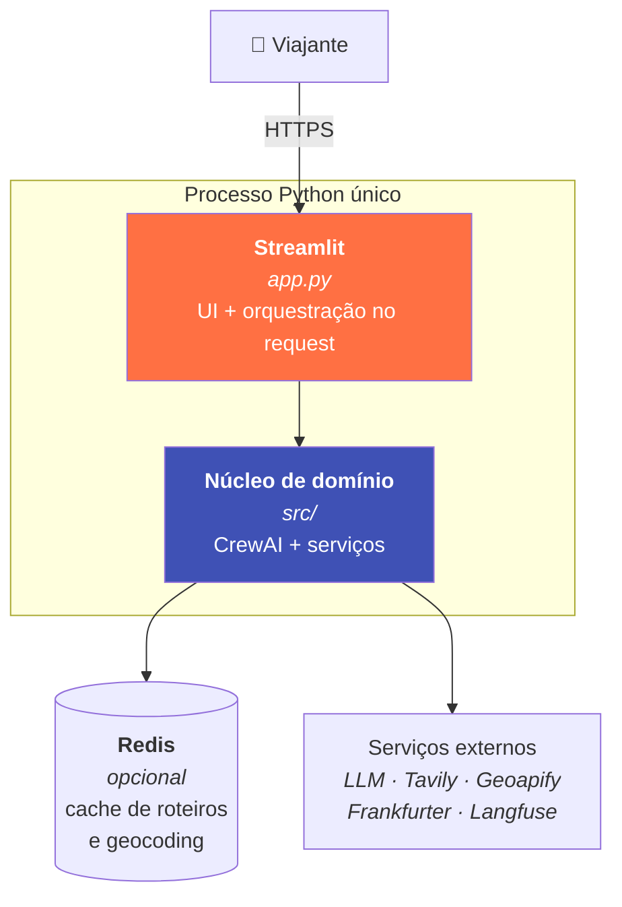
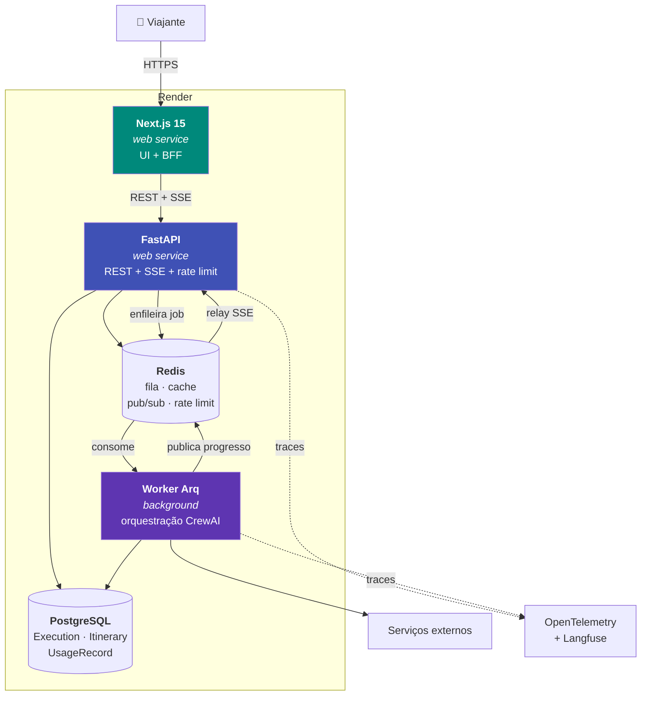

# C4 nível 2 — Contêineres

## Estado atual (Fase 0 concluída)

**Limitação conhecida**: a orquestração roda **dentro do request** do Streamlit
(50-90s de espera bloqueante), e os roteiros só existem em cache efêmero. É
exatamente o que a Fase 1 resolve.

## Alvo (Fase 1 + Fase 2)

## Contêineres

| Contêiner | Tecnologia | Responsabilidade | Estado |
| --------- | ---------- | ---------------- | ------ |
| **Streamlit** | Streamlit | UI atual (playground) | ✅ ativo |
| **Núcleo de domínio** | Python 3.12, CrewAI, litellm | Agentes, tarefas, serviços | ✅ ativo |
| **Redis** | Render Key Value | Cache; futuro: fila, pub/sub, rate limit | ✅ opcional |
| **FastAPI** | FastAPI, Pydantic v2 | Contratos REST/OpenAPI, SSE, rate limit | ⏳ Fase 1 |
| **Worker** | Arq | Execução assíncrona da crew | ⏳ Fase 1 |
| **PostgreSQL** | Render Postgres, SQLAlchemy 2.0 async | Persistência de execuções e roteiros | ⏳ Fase 1 |
| **Next.js** | Next.js 15, TypeScript, Tailwind | UI de produto, streaming, mapa | ⏳ Fase 2 |

## Por que essa separação

| Decisão | Motivo |
| ------- | ------ |
| Worker separado da API | Isola carga de LLM (minutos) do tráfego HTTP (ms); permite escalar por profundidade de fila |
| SSE em vez de WebSocket | Progresso é unidirecional; SSE é mais simples e sobrevive a proxies |
| Redis como pub/sub | O worker publica progresso; a API faz relay para o cliente sem acoplamento direto |
| PostgreSQL além do Redis | Roteiro é ativo do usuário, não cache — precisa de durabilidade e histórico |

Ver [ADR-0006](../adr/0006-backend.md), [ADR-0007](../adr/0007-fila-worker.md) e
[ADR-0008](../adr/0008-persistencia.md) para os trade-offs completos.
