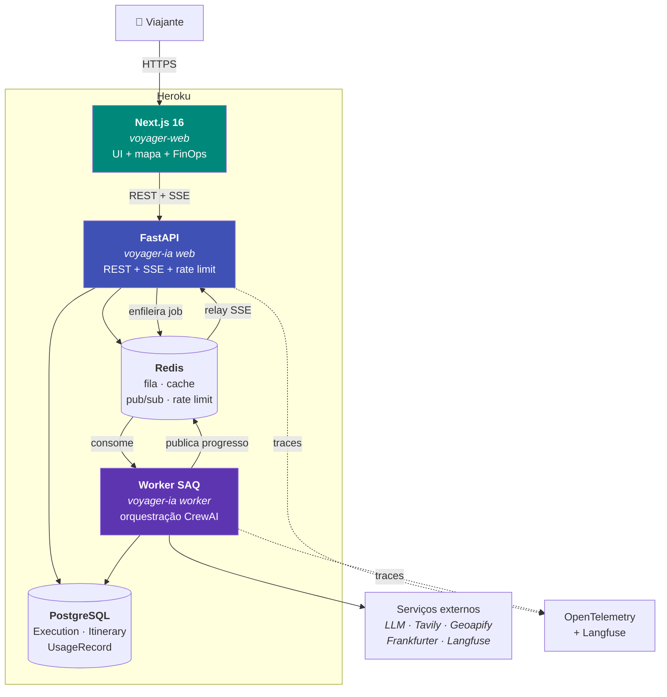

# C4 nível 2 — Contêineres

## Estado atual (Fases 1 e 2 em produção)

## Contêineres

| Contêiner | Tecnologia | Responsabilidade | Estado |
| --------- | ---------- | ---------------- | ------ |
| **Next.js** | Next.js 16, TypeScript, Tailwind 4 | UI de produto, streaming, mapa, FinOps | ✅ produção |
| **FastAPI** | FastAPI, Pydantic v2 | Contratos REST/OpenAPI, SSE, rate limit | ✅ produção |
| **Worker** | SAQ | Execução assíncrona da crew | ✅ produção |
| **Núcleo de domínio** | Python 3.12, CrewAI, litellm | Agentes, tarefas, serviços | ✅ produção |
| **PostgreSQL** | Heroku Postgres, SQLAlchemy 2.0 async | Persistência de execuções e roteiros | ✅ produção |
| **Redis** | Heroku Key-Value Store | Fila, cache, pub/sub, rate limit | ✅ produção |

## Origem (aposentada)

O projeto nasceu como um **monólito Streamlit** (`app.py`): UI e orquestração
CrewAI no mesmo processo, com o roteiro gerado **dentro do request** (50-90s de
espera bloqueante) e persistência apenas em cache efêmero. A Fase 1 extraiu a
API + worker; a Fase 2 entregou o frontend Next.js; o playground Streamlit foi
então removido do repositório (ADR-0005).

## Por que essa separação

| Decisão | Motivo |
| ------- | ------ |
| Worker separado da API | Isola carga de LLM (minutos) do tráfego HTTP (ms); permite escalar por profundidade de fila |
| SSE em vez de WebSocket | Progresso é unidirecional; SSE é mais simples e sobrevive a proxies |
| Redis como pub/sub | O worker publica progresso; a API faz relay para o cliente sem acoplamento direto |
| PostgreSQL além do Redis | Roteiro é ativo do usuário, não cache — precisa de durabilidade e histórico |

Ver [ADR-0006](../adr/0006-backend.md), [ADR-0014](../adr/0014-fila-saq.md) e
[ADR-0008](../adr/0008-persistencia.md) para os trade-offs completos.
