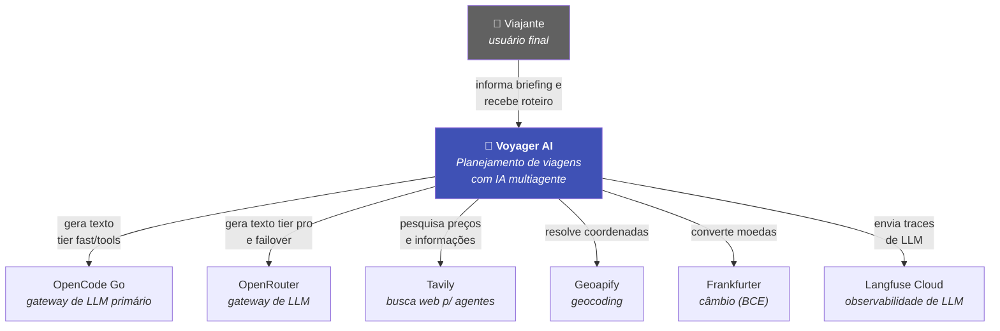

# C4 nível 1 — Contexto

Quem usa o sistema e de quais serviços externos ele depende.

## Atores

| Ator | Descrição |
| ---- | --------- |
| **Viajante** | Informa origem, destino, duração, interesses, moeda e idioma; recebe roteiro, mapa e auditoria de custos. Sem autenticação no MVP ([ADR-0004](../adr/0004-autenticacao.md)). |

## Dependências externas

| Serviço | Papel | Se ficar indisponível |
| ------- | ----- | --------------------- |
| **OpenCode Go** | LLM primário dos tiers baratos | Failover automático para OpenRouter |
| **OpenRouter** | LLM do tier `pro` e rede de segurança | Execução falha (propagada ao usuário) |
| **Tavily** | Busca web do agente de Logística | Agente perde a ferramenta; roteiro fica genérico |
| **Geoapify** | Coordenadas dos locais | Fallback para Nominatim (OSM público) |
| **Frankfurter** | Taxas de câmbio | Retorna `None`, com log; fluxo continua |
| **Langfuse** | Traces, tokens e custo | Tracing desativado; aplicação segue |
| **Redis** *(opcional)* | Cache de roteiros e geocoding | Cache desativado; tudo recalculado |

!!! success "Nenhuma dependência externa é ponto único de falha crítico"
    Todo serviço externo tem fallback ou degradação graciosa documentada. A
    única exceção consciente é o par de gateways de LLM — se **ambos** caírem,
    não há roteiro a gerar.

## Fronteira de dados

O briefing do usuário (origem, destino, datas implícitas, interesses) é
**dado pessoal** sob LGPD/GDPR quando associado a um indivíduo. No MVP:

- Não há autenticação, portanto nenhum briefing é vinculado a identidade.
- Prompts trafegam para os gateways de LLM (EUA/UE/Singapura). O OpenCode Go
  opera com **zero-retention** — providers não treinam com os dados.
- Retenção de cache: 24h para roteiros, 30 dias para coordenadas.
