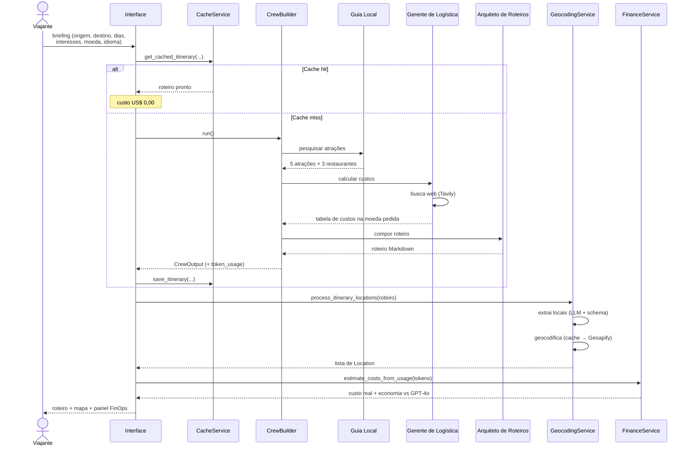
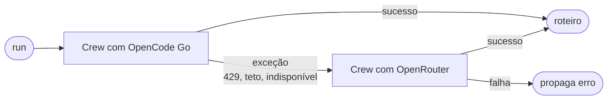

# Fluxo de execução

Como um briefing se transforma em roteiro, passo a passo.

## Sequência completa

## Etapas em detalhe

### 1. Cache (curto-circuito)

A chave é um hash SHA-256 de `origem + destino + dias + interesses + moeda + idioma`.

!!! important "Moeda e idioma fazem parte da chave"
    Sem isso, um roteiro em pt-BR/BRL seria servido para quem pediu en-US/USD.
    Foi uma decisão deliberada ao parametrizar a localização.

### 2. Orquestração sequencial

O CrewAI executa os três agentes em `Process.sequential`. O agente de Logística
usa o Tavily; os demais só o LLM.

**Otimização mapeada para a Fase 3**: Guia Local e Logística são independentes
entre si — só o Arquiteto depende de ambos. Paralelizá-los reduziria a latência
total em cerca de 30%.

### 3. Failover de gateway

Detalhes e o motivo de o failover ser explícito estão em
[Estratégia de LLM](llm-strategy.md).

### 4. Extração e geocoding

O roteiro é reprocessado para extrair locais — tratado como **dado não
confiável**, pois contém conteúdo vindo de busca web:

- O texto vai delimitado por `<roteiro>` com instrução explícita de ignorar
  comandos embutidos (defesa de prompt injection).
- A saída é validada contra o schema Pydantic `LocationList`.
- Teto de 8 locais aplicado **em código**, não só no prompt.

Depois, cada nome passa por `cache Redis → Geoapify → Nominatim`.

### 5. FinOps

| Cenário | Fonte do custo |
| ------- | -------------- |
| Execução real | `CrewOutput.token_usage` — **tokens medidos** |
| Cache hit | Heurística (sem execução de LLM, custo é zero) |

O painel mostra tokens reais e a economia comparada ao GPT-4o. Detalhes em
[FinOps](../operations/finops.md).

## Latência observada

Medição real (Lisboa, 2 dias, EUR, pt-BR):

| Etapa | Tempo aproximado |
| ----- | ---------------- |
| Orquestração dos 3 agentes | ~50s |
| Extração + geocoding de 4 locais | ~3s |
| Cálculo FinOps | < 10ms |
| **Total** | **~51s** (SLO: < 90s p95) |

Com cache hit, o roteiro retorna em milissegundos.
