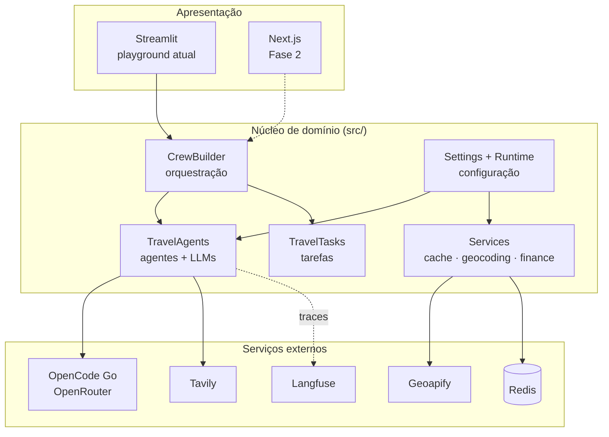

# Visão geral da arquitetura

## Princípios

1. **API-first e desacoplamento** — a interface não conhece CrewAI.
2. **Assíncrono por padrão** — geração de roteiro é um job, não um request.
3. **12-Factor** — configuração por ambiente, logs como stream, sem estado local.
4. **Provider-agnostic de LLM** — abstração com failover entre gateways.
5. **Observability-first** — instrumentação é critério de "pronto".
6. **Custo é requisito** — cada chamada de LLM é medida e atribuível.
7. **Degradação graciosa** — a falta de um serviço opcional nunca derruba o fluxo.

## Camadas



O **núcleo de domínio não depende da apresentação** — foi o que permitiu trocar
provedores de LLM, busca e geocoding sem tocar na interface, e é o que
viabilizará substituir o Streamlit pelo Next.js.

## Estrutura de diretórios

```text
src/
├── config.py          # Settings (Pydantic) — fonte única de configuração
├── runtime.py         # Inicialização explícita (LiteLLM, chaves, Redis)
├── agents.py          # TravelAgents — tiers de LLM e ferramentas
├── tasks.py           # TravelTasks — prompts parametrizados
├── crew_builder.py    # Orquestração + failover de gateway
├── models/            # Schemas Pydantic do domínio
├── services/          # cache · geocoding · finance
└── utils/             # logger · localization
```

## Decisões estruturais que sustentam o desenho

| Padrão | Onde | Por quê |
| ------ | ---- | ------- |
| **Injeção de dependência** | `Settings` como parâmetro em todos os serviços | Testabilidade; sem singleton global |
| **Inicialização lazy** | LLMs, `SerperDevTool`/Tavily, Nominatim | Importar não exige chave nem faz rede |
| **Runtime explícito** | `configure_llm_runtime()` | Zero efeito colateral em `import` |
| **Configuração externalizada** | Modelos, moeda, idioma, TTLs | Trocar modelo não é mudança de código |
| **Degradação graciosa** | Cache, geocoding, Langfuse | Serviço opcional ausente = no-op com log |

!!! note "Por que isso importa"
    Um teste do repositório roda em subprocesso limpo e **falha se importar o
    domínio alterar `os.environ`**. Esse tipo de invariante é o que permite
    evoluir a arquitetura sem medo.

## Próximos passos arquiteturais

Ver [`PRD.md` §15](https://github.com/henriquebotelhogomes/agencia_viagens_ia/blob/master/PRD.md)
para o checklist completo.

- **Fase 1**: FastAPI + worker Arq + PostgreSQL + SSE de progresso
- **Fase 2**: frontend Next.js, mapa MapLibre, i18n
- **Fase 3**: cache semântico (pgvector), paralelização de agentes, LLM evals
