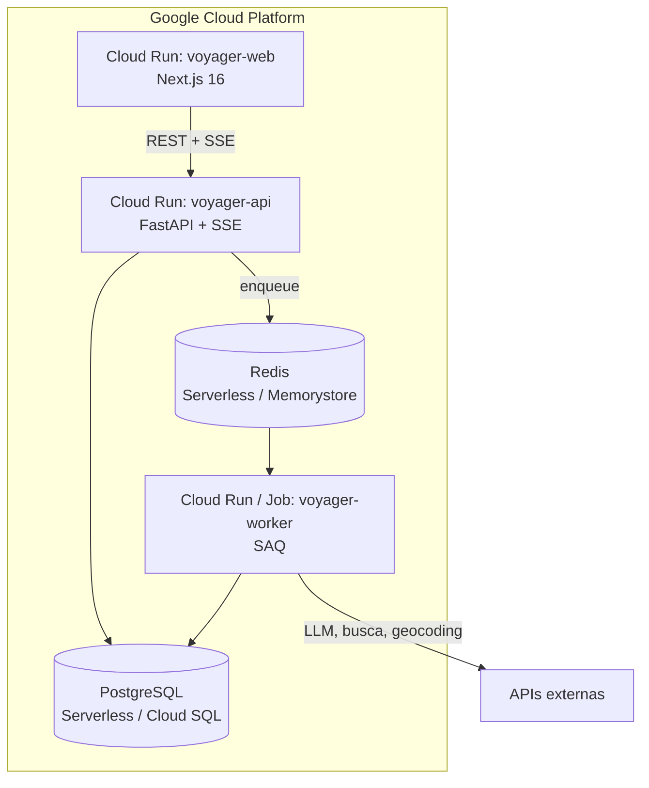

# Deploy

Toda a stack roda no **Google Cloud Platform (Cloud Run)** ([ADR-0018](../adr/0018-hospedagem-gcp-cloud-run.md)),
com política de **Scale-to-Zero ($0/mês)** e imagens compiladas via **Cloud Build** / **Artifact Registry**.
São dois serviços principais:

| Serviço | Conteúdo | Plataforma | Custo Ocioso |
| ------- | -------- | ---------- | ------------ |
| `voyager-api` | API (FastAPI) + worker (SAQ) | Cloud Run | **US$ 0** (`--min-instances=0`) |
| `voyager-web` | Frontend Next.js 16 | Cloud Run | **US$ 0** (`--min-instances=0`) |

O passo a passo completo de automação está em `scripts/deploy_gcp.ps1` e `cloudbuild.yaml`.

## Imagem Docker

O `Dockerfile` é **multi-stage**: três estágios de base e três de deploy.

| Estágio | Uso | Conteúdo |
| ------- | --- | -------- |
| `builder` | base dos demais | dependências de produção (`--no-dev`), COPY seletivo |
| `test` | CI | dev deps + `tests/`; `CMD` roda pytest |
| `runtime` | base de produção | imagem enxuta, **usuário non-root** (`USER app`) |
| `web` | deploy | `uvicorn` escutando em `$PORT` injetada pelo Cloud Run |
| `worker` | deploy | `saq src.worker.settings.settings` |
| `release` | migrations | `alembic upgrade head` |

```bash
# Rodar a suíte dentro do container (o que o CI faz)
docker build --target test -t voyager-ai:test .
docker run --rm voyager-ai:test
```

!!! tip "Verificar o usuário non-root"
    ```bash
    docker build --target runtime -t voyager-ai .
    docker run --rm voyager-ai whoami   # deve imprimir: app
    ```

O estágio `runtime` define `APP_ENV=production`, o que ativa
[logs JSON em stdout](../operations/observability.md#logs) — nunca arquivos.

## Como publicar

### Deploy Automatizado no Google Cloud Run

```powershell
pwsh scripts/deploy_gcp.ps1 -ProjectId SEU_PROJECT_ID -Region us-central1
```

O script autentica via Google Cloud SDK (`gcloud`), ativa as APIs (`run.googleapis.com`, `cloudbuild.googleapis.com`), compila os containers via Cloud Build e publica no Cloud Run com `--min-instances=0` e `--max-instances=2`.

## Arquitetura provisionada



Segredos **não** vão em arquivo: são config vars do Heroku
(`heroku config:set`). As variáveis necessárias são as mesmas do
[setup local](setup.md#2-configurar-as-chaves), com `APP_ENV=production` e
`DATABASE_URL`/`REDIS_URL` injetados pelos add-ons. Duas peculiaridades da
plataforma já tratadas em código:

- `DATABASE_URL` chega como `postgres://` — um validator em `Settings`
  normaliza para `postgresql+asyncpg://`.
- `REDIS_URL` chega como `rediss://` com certificado **self-signed** — a
  fábrica em `src/services/redis_client.py` desativa apenas a verificação da
  cadeia, preservando a cifra.

## Pipeline de CI/CD

O workflow `.github/workflows/ci.yml` tem quatro jobs:

1. **quality** — `ruff check`, `ruff format --check`, `mypy --strict` e
   `pytest` com cobertura (gate de 90%, core `sysmon`)
2. **frontend** — `typecheck`, ESLint, testes Vitest com cobertura, build e
   E2E com Playwright
3. **docs** — `mkdocs build --strict` e publicação no GitHub Pages (só em
   `master`)
4. **docker-check** — build das imagens `test` e `runtime`, suíte no
   container e duas simulações do Heroku: import com UID arbitrário e API
   escutando em `$PORT` injetada ([ADR-0015](../adr/0015-hospedagem-heroku.md))

!!! info "Testes não usam chaves reais"
    Nenhum secret de provedor é exposto ao pipeline: os testes são 100%
    mockados. Isso protege contra PRs de fork e evita custo de LLM no CI.

## Documentação (GitHub Pages)

Publicada automaticamente a cada merge em `master`. Para publicar manualmente:

```bash
uv run mkdocs gh-deploy --force
```

Habilite o GitHub Pages no repositório apontando para o branch `gh-pages`.
