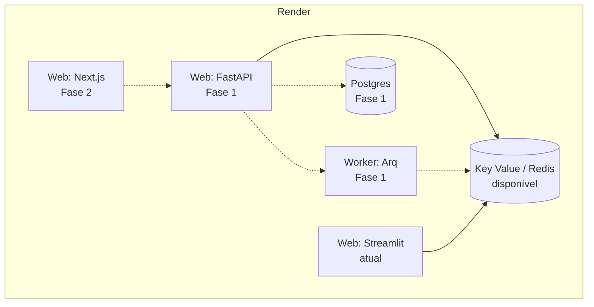

# Deploy

Toda a stack roda no **Render** ([ADR-0003](../adr/0003-hospedagem.md)),
declarada como código em `render.yaml` (Blueprint).

## Imagem Docker

O `Dockerfile` é **multi-stage** com três alvos:

| Estágio | Uso | Conteúdo |
| ------- | --- | -------- |
| `builder` | base dos demais | dependências de produção (`--no-dev`), COPY seletivo |
| `test` | CI | dev deps + `tests/`; `CMD` roda pytest |
| `runtime` | produção | imagem final, **usuário non-root** (`USER app`) |

```bash
# Build de produção
docker build --target runtime -t voyager-ai .

# Rodar a suíte dentro do container (o que o CI faz)
docker build --target test -t voyager-ai:test .
docker run --rm voyager-ai:test
```

!!! tip "Verificar o usuário non-root"
    ```bash
    docker run --rm voyager-ai whoami   # deve imprimir: app
    ```

O estágio `runtime` define `APP_ENV=production`, o que ativa
[logs JSON em stdout](../operations/observability.md#logs) — nunca arquivos.

## Configuração no Render

Segredos **não** vão em arquivo: use um **Env Group** no dashboard do Render e
referencie-o no serviço. As variáveis necessárias são as mesmas do
[setup local](setup.md#2-configurar-as-chaves), com duas diferenças:

| Variável | Valor em produção |
| -------- | ----------------- |
| `APP_ENV` | `production` |
| `REDIS_URL` | injetado pelo Render (`fromService`) |

## Serviços planejados

Estado atual e alvo da Fase 1:



Linhas pontilhadas indicam componentes ainda não implementados.

## Pipeline de CI/CD

O workflow `.github/workflows/ci.yml` executa, em ordem:

1. `ruff check` e `ruff format --check`
2. `mypy --strict`
3. `pytest` com cobertura (gate de 90%)
4. `mkdocs build --strict`
5. Build da imagem `test` → roda a suíte no container
6. Build da imagem `runtime`
7. Publicação da documentação no GitHub Pages (apenas em `master`)

!!! info "Testes não usam chaves reais"
    Nenhum secret de provedor é exposto ao pipeline: os testes são 100%
    mockados. Isso protege contra PRs de fork e evita custo de LLM no CI.

## Documentação (GitHub Pages)

Publicada automaticamente a cada merge em `master`. Para publicar manualmente:

```bash
uv run mkdocs gh-deploy --force
```

Habilite o GitHub Pages no repositório apontando para o branch `gh-pages`.
