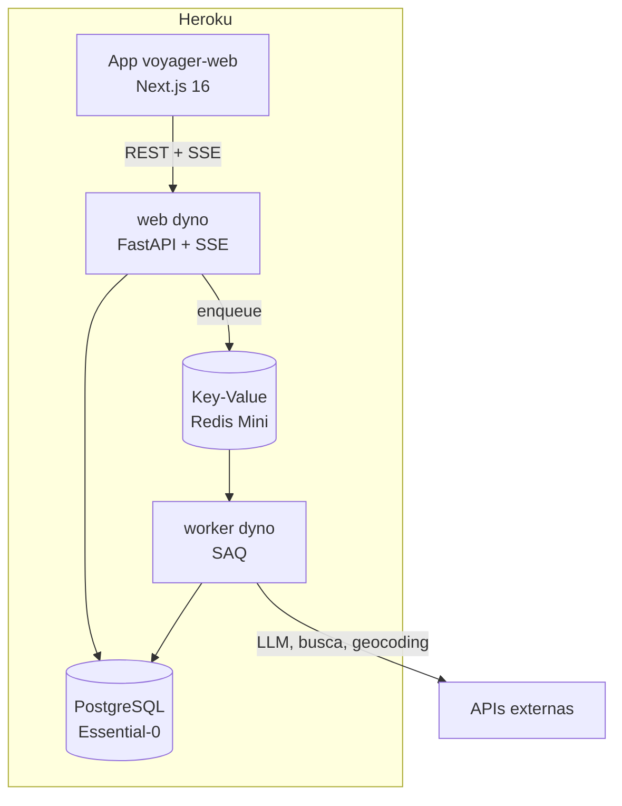

# Deploy

Toda a stack roda no **Heroku** ([ADR-0015](../adr/0015-hospedagem-heroku.md)),
publicada pelo **Container Registry** — imagens construídas localmente com
cache, não por `git push heroku`. São dois apps:

| App | Conteúdo | Plano |
| --- | -------- | ----- |
| `voyager-ia` | API (FastAPI) + worker (SAQ) + release phase (migrations) | Eco |
| `voyager-web` | Frontend Next.js | Eco |

Add-ons no `voyager-ia`: PostgreSQL Essential-0 e Key-Value (Redis) Mini.
O passo a passo completo de provisionamento está no
[runbook de deploy](../operations/deploy.md).

## Imagem Docker

O `Dockerfile` é **multi-stage**: três estágios de base e três de deploy.

| Estágio | Uso | Conteúdo |
| ------- | --- | -------- |
| `builder` | base dos demais | dependências de produção (`--no-dev`), COPY seletivo |
| `test` | CI | dev deps + `tests/`; `CMD` roda pytest |
| `runtime` | base de produção | imagem enxuta, **usuário non-root** (`USER app`) |
| `web` | deploy | `uvicorn` escutando em `$PORT` |
| `worker` | deploy | `saq src.worker.settings.settings` |
| `release` | release phase | `alembic upgrade head` — se falhar, o Heroku **aborta o deploy e mantém a versão anterior** |

```bash
# Rodar a suíte dentro do container (o que o CI faz)
docker build --target test -t voyager-ai:test .
docker run --rm voyager-ai:test
```

!!! tip "Verificar o usuário non-root"
    ```bash
    docker build --target runtime -t voyager-ai .
    docker run --rm voyager-ai whoami   # deve imprimir: app
    ```

O estágio `runtime` define `APP_ENV=production`, o que ativa
[logs JSON em stdout](../operations/observability.md#logs) — nunca arquivos.

## Como publicar

### Backend (`voyager-ia`)

```powershell
pwsh scripts/deploy_heroku.ps1
```

O script autentica no registry, constrói as três imagens (`web`, `worker`,
`release`), envia e libera. A ordem é: build → push → **release phase**
(migrations) → troca dos dynos.

!!! warning "`oci-mediatypes=false` não é opcional"
    O Docker Desktop com containerd image store grava manifests em OCI, e o
    registry do Heroku aceita apenas Docker manifest v2. Sem a flag no
    `--output`, o push falha com `error from registry: unsupported`. O script
    já aplica.

### Frontend (`voyager-web`)

A URL da API entra no bundle em **build time** (`NEXT_PUBLIC_`), não em
runtime — o `--build-arg` é obrigatório:

```powershell
cd frontend
docker buildx build `
  --build-arg NEXT_PUBLIC_API_URL=https://voyager-ia-d97e5ffe11f1.herokuapp.com `
  --target runtime --provenance=false --sbom=false `
  --output "type=registry,name=registry.heroku.com/voyager-web/web,oci-mediatypes=false,push=true" .
heroku container:release web --app voyager-web
```

## Arquitetura provisionada



Segredos **não** vão em arquivo: são config vars do Heroku
(`heroku config:set`). As variáveis necessárias são as mesmas do
[setup local](setup.md#2-configurar-as-chaves), com `APP_ENV=production` e
`DATABASE_URL`/`REDIS_URL` injetados pelos add-ons. Duas peculiaridades da
plataforma já tratadas em código:

- `DATABASE_URL` chega como `postgres://` — um validator em `Settings`
  normaliza para `postgresql+asyncpg://`.
- `REDIS_URL` chega como `rediss://` com certificado **self-signed** — a
  fábrica em `src/services/redis_client.py` desativa apenas a verificação da
  cadeia, preservando a cifra.

## Pipeline de CI/CD

O workflow `.github/workflows/ci.yml` tem quatro jobs:

1. **quality** — `ruff check`, `ruff format --check`, `mypy --strict` e
   `pytest` com cobertura (gate de 90%, core `sysmon`)
2. **frontend** — `typecheck`, ESLint, testes Vitest com cobertura, build e
   E2E com Playwright
3. **docs** — `mkdocs build --strict` e publicação no GitHub Pages (só em
   `master`)
4. **docker-check** — build das imagens `test` e `runtime`, suíte no
   container e duas simulações do Heroku: import com UID arbitrário e API
   escutando em `$PORT` injetada ([ADR-0015](../adr/0015-hospedagem-heroku.md))

!!! info "Testes não usam chaves reais"
    Nenhum secret de provedor é exposto ao pipeline: os testes são 100%
    mockados. Isso protege contra PRs de fork e evita custo de LLM no CI.

## Documentação (GitHub Pages)

Publicada automaticamente a cada merge em `master`. Para publicar manualmente:

```bash
uv run mkdocs gh-deploy --force
```

Habilite o GitHub Pages no repositório apontando para o branch `gh-pages`.
