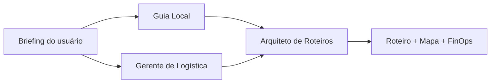

# Voyager AI

Plataforma de **planejamento de viagens com IA multiagente**: a partir de um
briefing simples (origem, destino, duração, interesses, moeda e idioma), uma
equipe de agentes pesquisa, orça e compõe um roteiro completo com mapa e
auditoria de custos.

!!! info "Documentação viva"
    Esta documentação vive no mesmo repositório do código e é publicada
    automaticamente a cada merge. A [Referência de API](reference/config.md) é
    **gerada dos docstrings** — se o código muda, a documentação acompanha.
    O CI roda `mkdocs build --strict`: link quebrado reprova o build.

## O que o produto faz

| Agente | Responsabilidade | Ferramentas |
| ------ | ---------------- | ----------- |
| **Guia Local** | Atrações e restaurantes alinhados aos interesses | — |
| **Gerente de Logística** | Custos reais de voo, hotel e alimentação | Busca web (Tavily) |
| **Arquiteto de Roteiros** | Cronograma final na moeda e idioma pedidos | — |

## Por onde começar

- :material-rocket-launch: **[Setup local](guides/setup.md)**
  Rodar o projeto na sua máquina em poucos minutos.

- :material-sitemap: **[Arquitetura](architecture/overview.md)**
  Visão geral, diagramas C4 e fluxo de execução.

- :material-file-document-check: **[Decisões (ADRs)](adr/index.md)**
  As 13 decisões arquiteturais e seus trade-offs.

- :material-api: **[Referência de API](reference/config.md)**
  Módulos, classes e funções gerados do código.

## Estado atual

O projeto está em **evolução planejada** de um protótipo Streamlit para uma
arquitetura de produto. A Fase 0 (saneamento e troca de provedores) está
concluída.

| Dimensão | Hoje | Alvo |
| -------- | ---- | ---- |
| Interface | Streamlit (playground) | Next.js 15 + TypeScript |
| Orquestração | CrewAI síncrono no processo | Worker assíncrono + SSE |
| LLM | OpenCode Go → OpenRouter (failover) | idem, com teto de orçamento |
| Persistência | Redis (cache) | PostgreSQL + Redis |
| Observabilidade | Langfuse + logs JSON | + OpenTelemetry ponta a ponta |

O plano completo, com decisões e checklist de execução, está no
[`PRD.md`](https://github.com/henriquebotelhogomes/agencia_viagens_ia/blob/master/PRD.md)
na raiz do repositório.

## Qualidade

Gates obrigatórios no CI — nenhum merge passa sem eles:

- `ruff check` com 12 famílias de regras (bugs latentes, sintaxe moderna, naming)
- `ruff format --check` (formatação única)
- `mypy --strict` em todo o `src/`
- `pytest` com **cobertura mínima de 90%**
- `mkdocs build --strict` (esta documentação)
