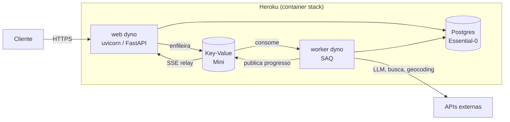

# Deploy no Heroku

Procedimento completo para colocar a API e o worker em produção, conforme
[ADR-0015](../adr/0015-hospedagem-heroku.md).

## Arquitetura provisionada



Uma imagem por process type (`web`, `worker`, `release`), todas herdando do
estágio `runtime` do Dockerfile — compartilham camadas, então cada uma custa
apenas a camada do comando.

!!! info "Publicação pelo Container Registry, não por `git push`"
    O `git push heroku` trava no Windows: o Git Credential Manager abre uma
    janela de autenticação e o comando fica pendurado. Além disso, o build
    remoto do container stack **não tem cache** — publicar imagens construídas
    localmente é mais rápido. Ver [ADR-0015](../adr/0015-hospedagem-heroku.md).

## Pré-requisitos

| Item | Como obter |
| ---- | ---------- |
| Heroku CLI | `npm install -g heroku`, depois `heroku login` |
| Docker | Necessário para construir as imagens localmente |
| Conta com cartão verificado | Exigido para add-ons, mesmo com crédito disponível |
| Crédito de estudante | [heroku.com/github-students/signup](https://heroku.com/github-students/signup) — a inscrição é no site do Heroku, não na página do GitHub |
| Plano Eco assinado | Dashboard → Billing → *Subscribe to Eco* (US$ 5/mês) |

!!! warning "Resgate o crédito antes de provisionar"
    O crédito de US$ 13/mês só cobre faturas emitidas **depois** do resgate.
    Provisionar antes gera cobrança no cartão.

## 1. Criar a aplicação

```bash
heroku login
heroku create voyager-ia --stack container
```

O `--stack container` instrui o Heroku a servir imagens Docker em vez de
detectar um buildpack.

## 2. Provisionar os add-ons

```bash
heroku addons:create heroku-postgresql:essential-0 --app voyager-ia
heroku addons:create heroku-redis:mini --app voyager-ia
```

Isso define `DATABASE_URL` e `REDIS_URL` automaticamente. Duas armadilhas já
tratadas no código:

- `DATABASE_URL` chega como `postgres://`, que o driver async não aceita — o
  validator em `Settings` normaliza para `postgresql+asyncpg://`.
- `REDIS_URL` chega como `rediss://` com **certificado self-signed** — a fábrica
  em `src/services/redis_client.py` desativa apenas a verificação da cadeia.

## 3. Configurar o ambiente

### Limite de conexões do banco

O Essential-0 aceita **20 conexões simultâneas**. O padrão do projeto (pool 5 +
overflow 10) daria 30 com dois dynos e produziria `FATAL: too many connections`:

```bash
heroku config:set --app voyager-ia \
  DB_POOL_SIZE=2 \
  DB_MAX_OVERFLOW=3 \
  WORKER_CONCURRENCY=2
```

### Segredos

```bash
heroku config:set --app voyager-ia \
  APP_ENV=production \
  LOG_LEVEL=INFO \
  OPENCODE_API_KEY=... \
  OPENCODE_API_BASE=https://opencode.ai/zen/go/v1 \
  OPENROUTER_API_KEY=... \
  TAVILY_API_KEY=... \
  GEOAPIFY_API_KEY=... \
  LANGFUSE_PUBLIC_KEY=... \
  LANGFUSE_SECRET_KEY=... \
  LANGFUSE_HOST=https://us.cloud.langfuse.com
```

`APP_ENV=production` tem dois efeitos: logs em JSON e `/docs` desabilitado.

Sem o `CREWAI_TESTING=true` abaixo, o worker fica sujeito ao prompt interativo
de tracing do CrewAI a cada cold start (ver
[problemas conhecidos](#worker-lento-no-primeiro-job-apos-restart-crewai)):

```bash
heroku config:set CREWAI_TESTING=true --app voyager-ia
```

### Telemetria (opcional)

Para ativar os traces de infraestrutura ([OpenTelemetry](observability.md#traces-de-infraestrutura-opentelemetry)),
aponte um backend OTLP — sem essas variáveis a telemetria fica desligada:

```bash
heroku config:set --app voyager-ia \
  OTEL_EXPORTER_OTLP_ENDPOINT=https://otlp.exemplo.com \
  OTEL_EXPORTER_OTLP_HEADERS="Authorization=Bearer <token>"
```

## 4. Publicar

```powershell
pwsh scripts/deploy_heroku.ps1
```

O script constrói as três imagens, envia ao registry e libera. A ordem é: build
→ push → **release phase** (`alembic upgrade head`) → troca dos dynos. Se a
migration falhar, o release é abortado e a versão anterior **permanece no ar**.

Equivalente manual, se preciso publicar um process type isolado:

```powershell
heroku container:login
docker buildx build --target web --provenance=false --sbom=false `
  --output "type=registry,name=registry.heroku.com/voyager-ia/web,oci-mediatypes=false,push=true" .
heroku container:release web --app voyager-ia
```

!!! warning "`oci-mediatypes=false` não é opcional"
    O Docker Desktop com containerd image store grava manifests em OCI, e o
    registry do Heroku aceita apenas Docker manifest v2. Sem a flag, o push
    falha com `error from registry: unsupported`.

## 5. Ligar os dynos

```bash
heroku ps:scale web=1 worker=1 --app voyager-ia
# Dynos sobem como Basic (US$ 7 cada); trocar para Eco mantém o custo no crédito
heroku ps:type web=eco worker=eco --app voyager-ia
```

!!! note "Sobre o adormecimento no Eco"
    Sem tráfego por 30 minutos, o web dyno dorme — e o worker dorme com ele. Uma
    visita acorda ambos. É o comportamento esperado: o pool de 1.000 horas rende
    ~500 horas de atividade real por mês.

## 6. Verificar

```bash
# Dependências reportadas pela própria aplicação
curl https://voyager-ia-d97e5ffe11f1.herokuapp.com/health

# Fluxo completo (enfileira, acompanha e busca o resultado)
uv run python -m scripts.e2e_smoke --base-url https://voyager-ia-d97e5ffe11f1.herokuapp.com
```

`deploy_heroku.ps1` executa automaticamente o healthcheck após o release e só
termina com sucesso quando a API reporta `status: ok` e `database`/`queue` estão
disponíveis. O smoke test permanece manual porque consome LLM e serviços
externos reais.

## 7. Frontend (app `voyager-web`)

O frontend é um **segundo app** no Heroku (cada app tem um único processo
`web`), no mesmo plano Eco — custo adicional zero.

```powershell
heroku create voyager-web --stack container

# A URL da API entra no bundle em BUILD time (NEXT_PUBLIC_), nao em runtime
cd frontend
docker buildx build `
  --build-arg NEXT_PUBLIC_API_URL=https://voyager-ia-d97e5ffe11f1.herokuapp.com `
  --target runtime --provenance=false --sbom=false `
  --output "type=registry,name=registry.heroku.com/voyager-web/web,oci-mediatypes=false,push=true" .

heroku container:release web --app voyager-web
heroku ps:scale web=1 --app voyager-web
heroku ps:type web=eco --app voyager-web
```

**Não esqueça o CORS**: a API só aceita origens listadas.

```bash
heroku config:set "CORS_ALLOWED_ORIGINS=https://voyager-web-b2607fcece65.herokuapp.com,http://localhost:3000" --app voyager-ia
```

### Lighthouse em produção

Medido em 2026-07-31 (mobile, média de 3 execuções): **Performance 96-98,
Acessibilidade 100, Boas Práticas 100, SEO 100**.

Duas armadilhas de medição descobertas na prática:

1. **Acorde o dyno antes** — um Eco dormindo adiciona ~10 s de cold start e
   destrói a nota de Performance.
2. **Máquina ociosa** — o throttle de CPU do Lighthouse é relativo à máquina
   que mede: rodar durante um build Docker derrubou a nota de 96 para 36.

```powershell
# Sem Chrome instalado, o Edge serve (é Chromium)
$env:CHROME_PATH = "C:\Program Files (x86)\Microsoft\Edge\Application\msedge.exe"
npx lighthouse https://voyager-web-b2607fcece65.herokuapp.com --chrome-flags="--headless=new"
```

Checklist de aceitação:

- [ ] `/health` retorna `database` e `redis` como `ok`
- [ ] `POST /v1/executions` responde **202** com `Location`
- [ ] O stream SSE emite eventos de progresso
- [ ] O roteiro fica disponível e `usage` traz tokens medidos
- [ ] `heroku pg:info` mostra conexões abaixo de 20

## Operação

| Necessidade | Comando |
| ----------- | ------- |
| Logs em tempo real | `heroku logs --tail --app voyager-ia` |
| Só o worker | `heroku logs --tail --dyno worker --app voyager-ia` |
| Horas Eco restantes | `heroku ps --app voyager-ia` |
| Estado do banco | `heroku pg:info --app voyager-ia` |
| Console SQL | `heroku pg:psql --app voyager-ia` |
| Reverter release | `heroku releases:rollback --app voyager-ia` |
| Migration manual | `heroku run alembic upgrade head --app voyager-ia` |

## Problemas conhecidos

### `FATAL: too many connections`

Pool acima do limite do plano. Confira `heroku config:get DB_POOL_SIZE` — deve
ser 2 em produção.

### Worker não consome jobs

1. Está escalado? `heroku ps` deve listar `worker.1`.
2. Dormindo? Acesse a aplicação para acordar os dynos.
3. Dyno "up" mas sem logs de processamento? A rede da plataforma pode derrubar
   a conexão Redis do polling silenciosamente. Os clientes do projeto usam
   `socket_keepalive` + `health_check_interval` para reconectar sozinhos
   (`src/services/redis_client.py`); se ainda assim ocorrer, a medida paliativa é
   `heroku ps:restart worker --app voyager-ia` — os jobs ficam na fila e são
   processados após o restart.

### `CERTIFICATE_VERIFY_FAILED` durante a geração

Sintoma enganoso: `/health` reporta `redis: ok` e o cache conecta, mas todo job
falha em ~1 s.

Causa: alguma biblioteca conectou no Redis **fora** da fábrica em
`src/services/redis_client.py`. O CrewAI faz isso lendo `REDIS_URL` no import
(ver [ADR-0015](../adr/0015-hospedagem-heroku.md)).

Diagnóstico: `heroku logs --dyno worker` e procure o traceback — a linha que
cria a conexão aponta a biblioteca culpada. Confirme que
`isolate_redis_from_third_parties()` roda **acima** dos imports de domínio no
entrypoint.

### `error from registry: unsupported` no push

O manifest está em formato OCI. Use `oci-mediatypes=false` no `--output` do
`docker buildx build` (o script de deploy já faz isso).

### `git push heroku` trava sem saída

O Git Credential Manager abriu uma janela de autenticação aguardando interação.
Use `scripts/deploy_heroku.ps1` — o Container Registry autentica por token.

### Worker lento no primeiro job após restart (CrewAI)

Sintoma: após `config:set` ou redeploy, o primeiro job fica ~3 min "na fila"
antes de processar; os seguintes levam os ~70-90 s normais.

Causa: o CrewAI >= 1.12 exibe um prompt interativo ("view execution traces?
[y/N]", auto-timeout de 20 s) na **primeira execução de cada processo**, e o
consentimento fica em `.crewai_user.json` — arquivo que se perde no filesystem
efêmero do Heroku, então o prompt volta a cada cold start.

Correção: `heroku config:set CREWAI_TESTING=true --app voyager-ia` (já presente
no `docker-compose.yml` e no `.env.example`). O tracing de LLM não é afetado —
segue no Langfuse (D12); só o fluxo interativo do CrewAI é pulado.

### `Error R10 (Boot timeout)`

O processo web não abriu a porta em 60 s. Verifique se o comando usa `$PORT` —
o `EXPOSE` do Dockerfile é ignorado pela plataforma.

### Release falhou na migration

O deploy foi abortado e a versão antiga segue ativa. Veja o erro com
`heroku releases:output <versão>`, corrija e publique de novo.
