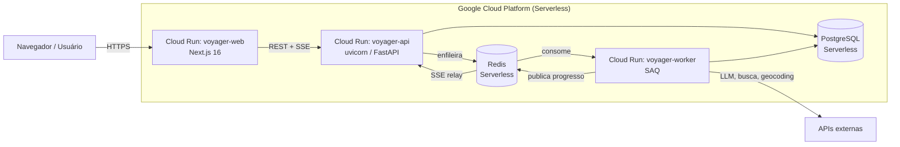

# Deploy no Google Cloud Platform (Cloud Run)

Procedimento completo para colocar a aplicação em produção no **Google Cloud Run** com política de **Scale-to-Zero ($0/mês)**, conforme o [ADR-0018](../adr/0018-hospedagem-gcp-cloud-run.md) (que substitui o [ADR-0015](../adr/0015-hospedagem-heroku.md)).

## Arquitetura provisionada



Todas as imagens herdam do estágio `runtime` do Dockerfile multi-stage — compartilham camadas e aproveitam o cache nativo do Google Cloud Build e Artifact Registry.

## Pré-requisitos

| Item | Como obter |
| ---- | ---------- |
| **Google Cloud SDK (`gcloud`)** | Já instalado e configurado na máquina local (`gcloud auth list`) |
| **Docker Desktop** | Necessário para execução local e validação de containers |
| **Projeto GCP ativo** | Um projeto configurado com faturamento ativo para usufruir do Free Tier perpétuo |

## Princípios de Custo Zero (Scale-to-Zero)

O Google Cloud Run oferece uma cota gratuita perpétua generosa:
- **2.000.000 de requisições por mês grátis**
- **360.000 GB-segundos de memória grátis**
- **180.000 vCPU-segundos grátis**

Parâmetros mandatórios configurados nos scripts:
1. `--min-instances 0`: Garante que, sem tráfego, nenhuma VM ou container permanece ativo ou tarifando.
2. `--max-instances 2`: Protege o orçamento contra sobrecargas acidentais.
3. `--memory 1Gi` e `--cpu 1`: Dimensionamento ideal para o free tier.

## Procedimento de Deploy Automatizado

Execute o script de automação:

```powershell
pwsh scripts/deploy_gcp.ps1 -ProjectId SEU_PROJECT_ID -Region us-central1
```

O script realiza as seguintes etapas de forma autônoma:
1. Habilita as APIs `run.googleapis.com`, `cloudbuild.googleapis.com` e `artifactregistry.googleapis.com`.
2. Compila a imagem da API via Cloud Build e publica o serviço `voyager-api` no Cloud Run.
3. Configura o worker assíncrono `voyager-worker` para processamento de filas SAQ.
4. Compila e publica o frontend Next.js `voyager-web` injetando a URL da API em build-time.
5. Testa o endpoint de integridade `/health` da API.

## Variáveis de Ambiente em Produção

As variáveis são definidas no Cloud Run através de `--set-env-vars` ou Google Secret Manager:

```bash
gcloud run services update voyager-api \
  --set-env-vars "APP_ENV=production,OPENCODE_API_KEY=...,TAVILY_API_KEY=...,GEOAPIFY_API_KEY=..."
```

## Monitoramento e Logs

Os logs estruturados JSON emitidos pela aplicação são capturados nativamente pelo Google Cloud Logging:

```bash
# Visualizar logs em tempo real
gcloud logging tail "resource.type=cloud_run_revision AND resource.labels.service_name=voyager-api"
```
