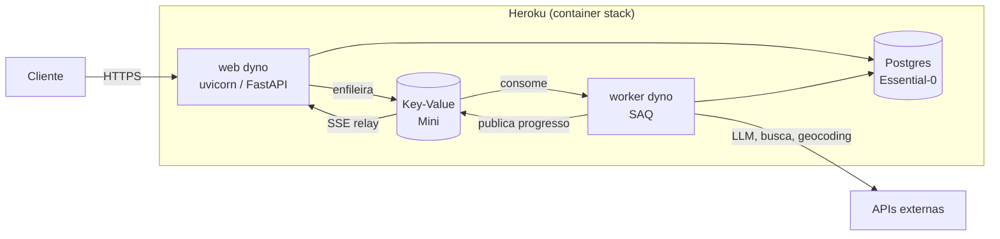

# Deploy no Heroku

Procedimento completo para colocar a API e o worker em produção, conforme
[ADR-0015](../adr/0015-hospedagem-heroku.md).

## Arquitetura provisionada



Uma imagem única serve os três papéis (`web`, `worker`, `release`), porque o
container stack **não faz cache de layers** — cada imagem extra custaria um build
completo.

## Pré-requisitos

| Item | Como obter |
| ---- | ---------- |
| Heroku CLI | `npm install -g heroku` |
| Conta com cartão verificado | Exigido para add-ons, mesmo com crédito disponível |
| Crédito de estudante | [education.github.com/pack](https://education.github.com/pack) → Heroku → *Get access* |
| Plano Eco assinado | Dashboard → Billing → *Subscribe to Eco* (US$ 5/mês) |

!!! warning "Resgate o crédito antes de provisionar"
    O crédito de US$ 13/mês só cobre faturas emitidas **depois** do resgate.
    Provisionar antes gera cobrança no cartão.

## 1. Criar a aplicação

```bash
heroku login
heroku create voyager-ia --stack container
```

O `--stack container` instrui o Heroku a ler o [`heroku.yml`](https://github.com/henriquebotelhogomes/agencia_viagens_ia/blob/master/heroku.yml)
em vez de detectar um buildpack.

## 2. Provisionar os add-ons

```bash
heroku addons:create heroku-postgresql:essential-0 --app voyager-ia
heroku addons:create heroku-redis:mini --app voyager-ia
```

Isso define `DATABASE_URL` e `REDIS_URL` automaticamente. Duas armadilhas já
tratadas no código:

- `DATABASE_URL` chega como `postgres://`, que o driver async não aceita — o
  validator em `Settings` normaliza para `postgresql+asyncpg://`.
- `REDIS_URL` chega como `rediss://` com **certificado self-signed** — a fábrica
  em `src/services/redis_client.py` desativa apenas a verificação da cadeia.

## 3. Configurar o ambiente

### Limite de conexões do banco

O Essential-0 aceita **20 conexões simultâneas**. O padrão do projeto (pool 5 +
overflow 10) daria 30 com dois dynos e produziria `FATAL: too many connections`:

```bash
heroku config:set --app voyager-ia \
  DB_POOL_SIZE=2 \
  DB_MAX_OVERFLOW=3 \
  WORKER_CONCURRENCY=2
```

### Segredos

```bash
heroku config:set --app voyager-ia \
  APP_ENV=production \
  LOG_LEVEL=INFO \
  OPENCODE_API_KEY=... \
  OPENCODE_API_BASE=https://opencode.ai/zen/go/v1 \
  OPENROUTER_API_KEY=... \
  TAVILY_API_KEY=... \
  GEOAPIFY_API_KEY=... \
  LANGFUSE_PUBLIC_KEY=... \
  LANGFUSE_SECRET_KEY=... \
  LANGFUSE_HOST=https://us.cloud.langfuse.com
```

`APP_ENV=production` tem dois efeitos: logs em JSON e `/docs` desabilitado.

### Telemetria (opcional)

Para ativar os traces de infraestrutura ([OpenTelemetry](observability.md#traces-de-infraestrutura-opentelemetry)),
aponte um backend OTLP — sem essas variáveis a telemetria fica desligada:

```bash
heroku config:set --app voyager-ia \
  OTEL_EXPORTER_OTLP_ENDPOINT=https://otlp.exemplo.com \
  OTEL_EXPORTER_OTLP_HEADERS="Authorization=Bearer <token>"
```

## 4. Publicar

```bash
heroku git:remote --app voyager-ia
git push heroku master
```

O deploy executa, nesta ordem: build da imagem → **release phase**
(`alembic upgrade head`) → troca dos dynos. Se a migration falhar, o release é
abortado e a versão anterior **permanece no ar**.

## 5. Ligar o worker

```bash
heroku ps:scale web=1 worker=1 --app voyager-ia
```

!!! note "Sobre o adormecimento no Eco"
    Sem tráfego por 30 minutos, o web dyno dorme — e o worker dorme com ele. Uma
    visita acorda ambos. É o comportamento esperado: o pool de 1.000 horas rende
    ~500 horas de atividade real por mês.

## 6. Verificar

```bash
# Dependências reportadas pela própria aplicação
curl https://voyager-ia-<hash>.herokuapp.com/health

# Fluxo completo (enfileira, acompanha e busca o resultado)
uv run python -m scripts.e2e_smoke --base-url https://voyager-ia-<hash>.herokuapp.com
```

Checklist de aceitação:

- [ ] `/health` retorna `database` e `redis` como `ok`
- [ ] `POST /v1/executions` responde **202** com `Location`
- [ ] O stream SSE emite eventos de progresso
- [ ] O roteiro fica disponível e `usage` traz tokens medidos
- [ ] `heroku pg:info` mostra conexões abaixo de 20

## Operação

| Necessidade | Comando |
| ----------- | ------- |
| Logs em tempo real | `heroku logs --tail --app voyager-ia` |
| Só o worker | `heroku logs --tail --dyno worker --app voyager-ia` |
| Horas Eco restantes | `heroku ps --app voyager-ia` |
| Estado do banco | `heroku pg:info --app voyager-ia` |
| Console SQL | `heroku pg:psql --app voyager-ia` |
| Reverter release | `heroku releases:rollback --app voyager-ia` |
| Migration manual | `heroku run alembic upgrade head --app voyager-ia` |

## Problemas conhecidos

### `FATAL: too many connections`

Pool acima do limite do plano. Confira `heroku config:get DB_POOL_SIZE` — deve
ser 2 em produção.

### Worker não consome jobs

1. Está escalado? `heroku ps` deve listar `worker.1`.
2. Dormindo? Acesse a aplicação para acordar os dynos.
3. Erro de TLS no Redis indica que a conexão não passou pela fábrica de clientes.

### `Error R10 (Boot timeout)`

O processo web não abriu a porta em 60 s. Verifique se o comando usa `$PORT` —
o `EXPOSE` do Dockerfile é ignorado pela plataforma.

### Release falhou na migration

O deploy foi abortado e a versão antiga segue ativa. Veja o erro com
`heroku releases:output <versão>`, corrija e publique de novo.
