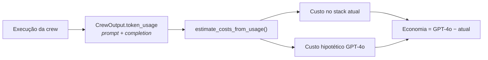

# FinOps

Custo de LLM tratado como **requisito**, não como surpresa no fim do mês.

## Metodologia

O custo vem de **tokens medidos**, nunca estimados:

!!! danger "O que existia antes"
    O painel original estimava custo pelo **comprimento dos logs**
    (`len(logs) * 0.55` tokens). Era um número inventado que transmitia falsa
    confiança — pior que não ter métrica. Substituído por medição real.

## Preços de referência

Configuráveis em `Settings` (USD por 1M de tokens):

| Modelo | Input | Output |
| ------ | ----- | ------ |
| GPT-4o (baseline de comparação) | US$ 5,00 | US$ 15,00 |
| Stack atual (referência) | US$ 0,59 | US$ 0,79 |

## Medição real

Execução de referência (Lisboa, 2 dias, EUR, pt-BR):

| Métrica | Valor |
| ------- | ----- |
| Tokens de prompt | 1.511 |
| Tokens de completion | 6.919 |
| **Total** | **8.430** |
| Custo hipotético no GPT-4o | ~US$ 0,111 |
| Custo no stack atual | ~US$ 0,006 |
| **Economia** | **~US$ 0,105 (94%)** |

Como os tiers `fast` e `fast-tools` rodam no OpenCode Go (assinatura já paga), o
**gasto marginal por roteiro fica abaixo de US$ 0,01** — apenas o tier `pro`
consome créditos do OpenRouter.

## Alavancas de redução de custo

| Alavanca | Estado | Efeito |
| -------- | ------ | ------ |
| Cache exato de roteiros | ✅ ativo | Roteiro repetido custa zero |
| Cache de geocoding (30 dias) | ✅ ativo | Elimina chamadas repetidas |
| Tiers baratos como default | ✅ ativo | Só o output final usa modelo pago |
| `max_iter=3` por agente | ✅ ativo | Limita loops de raciocínio |
| Teto de 8 locais na extração | ✅ ativo | Controla custo de geocoding |
| Cache de resultados de busca | ⏳ pendente | Reduz consumo de créditos Tavily |
| Teto de requests no Go | ⏳ pendente | Protege a cota pessoal de coding |
| Cache semântico (pgvector) | ⏳ Fase 3 | Reaproveita roteiros "parecidos" |
| Paralelizar agentes | ⏳ Fase 3 | Reduz latência (não o custo) |

## Orçamentos e limites

| Recurso | Limite | Ao esgotar |
| ------- | ------ | ---------- |
| OpenCode Go | US$ 12/5h · US$ 30/semana · US$ 60/mês | Failover para OpenRouter |
| OpenRouter `:free` | 1.000 req/dia | Cai para modelo pago |
| OpenRouter créditos | pré-pago | Execução falha |
| Tavily | 1.000 créditos/mês | Agente perde a ferramenta de busca |
| Geoapify | 3.000 req/dia | Fallback para Nominatim |
| Langfuse | 50k observações/mês | Tracing para de registrar |

!!! warning "Orçamento compartilhado do OpenCode Go"
    A cota do Go é a **mesma** usada para desenvolvimento pessoal. O teto de
    requests da aplicação (`LLM_GO_MAX_REQUESTS_PER_DAY`) existe na configuração
    mas **ainda não é aplicado** — exige um contador persistente, planejado junto
    com o rate limiting da Fase 1. Até então, monitore o consumo no console do
    OpenCode.

## SLO de custo

| Indicador | Alvo |
| --------- | ---- |
| Gasto novo por roteiro | < US$ 0,01 |
| Cache hit ratio (roteiros) | > 30% |
| Cache hit ratio (geocoding) | > 80% |
