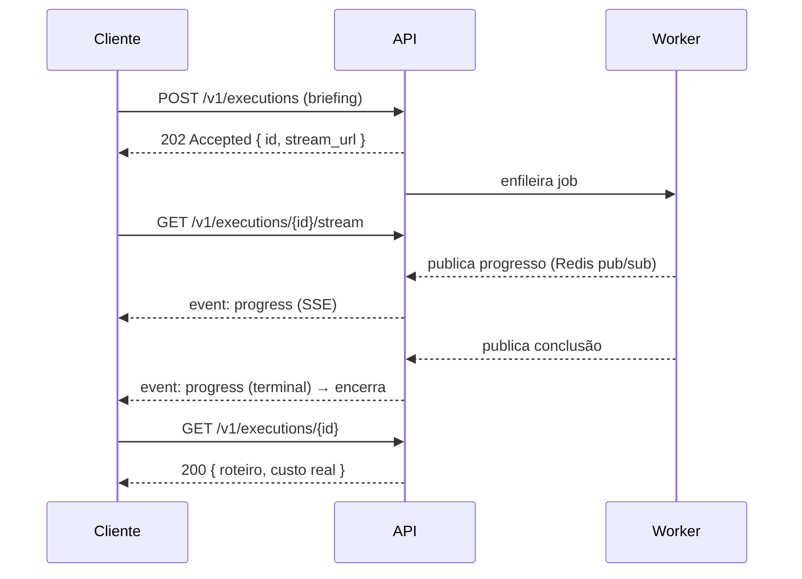

# API HTTP

Contratos REST da API de execuções (PRD D6 / [ADR-0006](../adr/0006-backend.md)).
A OpenAPI interativa fica em `/docs` (desabilitada em produção).

## Fluxo de uso



## Rotas

| Método | Rota | Descrição |
| ------ | ---- | --------- |
| `GET` | `/health` | Saúde da API e das dependências |
| `GET` | `/v1/localization` | Moedas e idiomas suportados |
| `POST` | `/v1/executions` | Cria execução (`202`, idempotente) |
| `GET` | `/v1/executions/{id}` | Estado, roteiro e custo |
| `GET` | `/v1/executions/{id}/stream` | Progresso em tempo real (SSE) |
| `GET` | `/v1/executions/{id}/geojson` | Locais para o mapa |
| `POST` | `/v1/executions/{id}/cancel` | Cancela execução pendente |

### Idempotência

Envie o header `Idempotency-Key` no `POST`: repetir a mesma chave devolve a
execução original, sem gerar novo custo de LLM.

```bash
curl -X POST http://localhost:8000/v1/executions \
  -H "Content-Type: application/json" \
  -H "Idempotency-Key: pedido-123" \
  -d '{"origem":"São Paulo, Brasil","destino":"Lisboa, Portugal",
       "dias":2,"interesses":"gastronomia","moeda":"EUR","idioma":"pt-BR"}'
```

### Erros (RFC 9457)

Toda falha usa `application/problem+json`:

```json
{
  "type": "https://voyager.ai/problems/rate-limit-exceeded",
  "title": "Limite de requisições excedido",
  "status": 429,
  "detail": "Limite de 5 execuções por hora atingido...",
  "instance": "/v1/executions",
  "limit": 5,
  "retry_after": 1800
}
```

O campo `type` é estável e serve para tratamento programático; `detail` é para
humanos.

::: src.api.errors
    options:
      show_root_heading: false
      members:
        - ProblemDetail
        - ExecutionNotFound
        - RateLimitExceeded
        - ServiceUnavailable

## Schemas

::: src.api.schemas
    options:
      show_root_heading: false

## Aplicação e dependências

::: src.api.main
    options:
      show_root_heading: false
      members:
        - create_app
        - lifespan

::: src.api.deps
    options:
      show_root_heading: false
