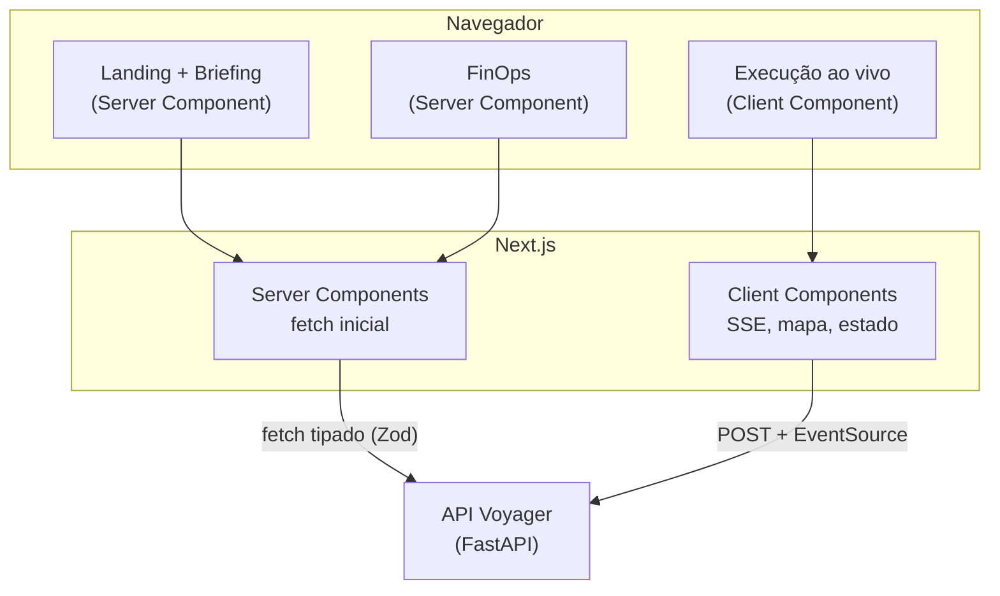

# Frontend

Interface de produto em **Next.js 16 (App Router) + React 19 + TypeScript**,
consumindo a API da Fase 1 ([ADR-0005](../adr/0005-frontend.md)).

## Arquitetura



A fronteira é deliberada: **Server Components** fazem o fetch inicial (primeira
pintura sem tela vazia, bom para SEO da landing); **Client Components** cuidam do
que é interativo — o stream SSE, o mapa WebGL e o estado de UI.

## Decisões de implementação

| Tema | Escolha | Porquê |
| ---- | ------- | ------ |
| Contrato da API | Schemas **Zod** espelhando o Pydantic | Valida a resposta em runtime; mudança de contrato falha explícita, não vira `undefined` na tela |
| Estado de servidor | TanStack Query | Só refaz fetch quando o SSE indica término — sem polling durante a geração |
| Progresso | `EventSource` (SSE) | O navegador reconecta sozinho; o hook só fecha em estado terminal |
| Mapa | MapLibre + tiles OSM | Sem chave de API paga ([ADR-0009](../adr/0009-mapas.md)) |
| Tema | Classe `dark` + script inline | Aplicado antes da hidratação — sem flash; sem estado React (evita render em cascata) |
| Idempotência | SHA-256 do briefing como `Idempotency-Key` | Reenviar o formulário não gera custo duplicado |

## Telas

- **Landing + briefing** (`/`) — proposta de valor e formulário validado com
  React Hook Form + Zod, chips de interesse, seletores de moeda e idioma.
- **Execução** (`/executions/[id]`) — timeline dos agentes em tempo real,
  skeleton do roteiro, roteiro em Markdown, mapa sincronizado com a lista de
  pontos, painel de custo real.
- **FinOps** (`/finops`) — custo agregado, economia vs GPT-4o, cache hit ratio
  e série temporal de consumo.

## Acessibilidade (specs/09 §7)

- Foco visível global; link "pular para o conteúdo" no primeiro Tab.
- Erros de formulário associados ao campo via `aria-describedby` + `role="alert"`.
- Estado da geração anunciado por região `aria-live`.
- Alvos de toque ≥ 44px; `select` nativo (leitor de tela e roda do mobile de graça).
- `prefers-reduced-motion` respeitado no CSS.

Os testes E2E ([Playwright](testing.md)) exercitam navegação por teclado e os
rótulos ARIA em perfis desktop e mobile.

## Rodando

```bash
cd frontend
npm install
# Aponte para a API (local ou produção)
echo "NEXT_PUBLIC_API_URL=http://localhost:8000" > .env.local
npm run dev        # http://localhost:3000
```

Pela stack completa: `docker compose up` sobe API, worker, banco, Redis e o
frontend em `http://localhost:3000`.

## Qualidade

| Gate | Comando |
| ---- | ------- |
| Tipos | `npm run typecheck` |
| Lint | `npm run lint` |
| Unidade/componente (cobertura ≥ 90%) | `npm run test:cov` |
| E2E (desktop + mobile) | `npm run e2e` |
| Build de produção | `npm run build` |

Todos rodam no CI a cada push ([workflow](https://github.com/henriquebotelhogomes/agencia_viagens_ia/blob/master/.github/workflows/ci.yml)).
