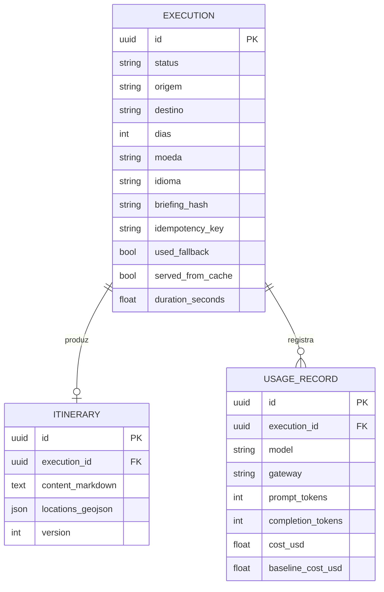
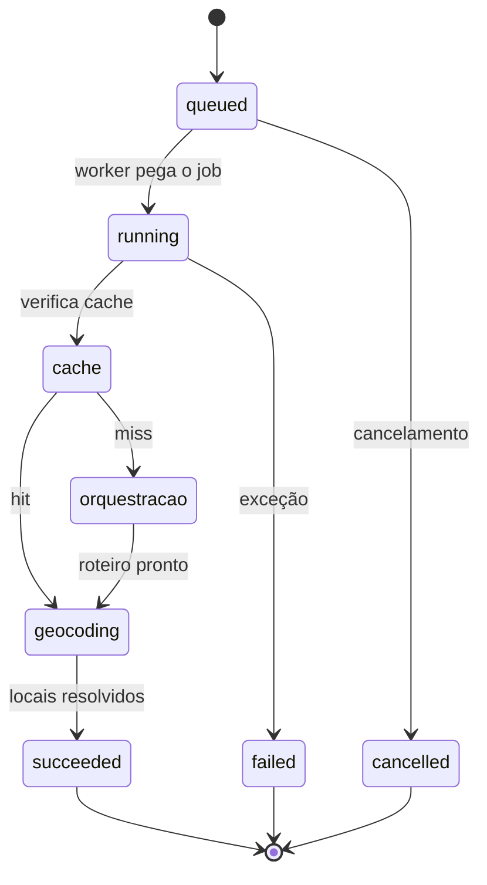

# Persistência e worker

## Modelos

Entidades persistidas em PostgreSQL ([ADR-0008](../adr/0008-persistencia.md)).



!!! tip "Tipos portáveis"
    `JSONB` e `UUID` são nativos no PostgreSQL, mas o SQLite (usado nos testes)
    não os conhece. Os modelos usam `JSON().with_variant(JSONB(), "postgresql")`
    — o mesmo schema sobe nos dois bancos.

::: src.db.models
    options:
      show_root_heading: false

## Sessão e engine

::: src.db.base
    options:
      show_root_heading: false
      members:
        - build_engine
        - get_engine
        - get_session
        - dispose_engine

## Migrations

```bash
# Gerar migration a partir dos modelos
uv run alembic revision --autogenerate -m "descrição da mudança"

# Aplicar
uv run alembic upgrade head

# Reverter a última
uv run alembic downgrade -1
```

A URL vem sempre de `Settings.DATABASE_URL`, nunca do `alembic.ini` — a migration
usa exatamente a mesma configuração da aplicação.

## Worker

O worker consome a fila e executa a orquestração
([ADR-0014](../adr/0014-fila-saq.md)):

```bash
saq src.worker.settings.settings
```

Etapas de um job, com progresso publicado a cada transição:



::: src.worker.tasks
    options:
      show_root_heading: false
      members:
        - generate_itinerary
        - find_stale_executions

## Fila e progresso

::: src.services.queue_service
    options:
      show_root_heading: false

::: src.services.progress_bus
    options:
      show_root_heading: false

## Rate limiting

::: src.services.rate_limiter
    options:
      show_root_heading: false
