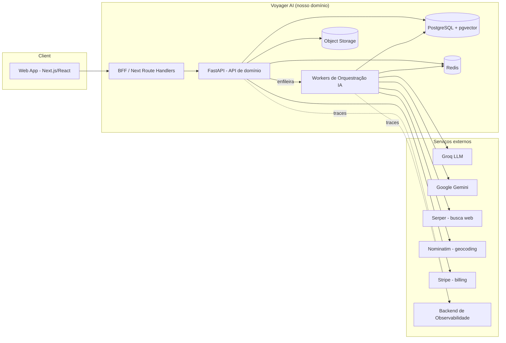

# 03 — Especificação Técnica de Alto Nível

Descreve a stack, os limites de sistema e as decisões técnicas macro. Os detalhes de
componentes e fluxos estão em [`04-architecture.md`](./04-architecture.md).

## 1. Princípios técnicos

1. **API-first e desacoplamento** — o frontend não conhece CrewAI; fala apenas com a API.
2. **Assíncrono por padrão** — geração de roteiro é um job; UI recebe streaming.
3. **12-Factor App** — config por ambiente, statelessness onde possível, logs como streams.
4. **Provider-agnostic de LLM** — abstração sobre Groq/Gemini/OpenAI com fallback.
5. **Observability-first** — instrumentação não é opcional; é critério de "pronto".
6. **Custo é um requisito** — cada chamada de LLM é medida e atribuível (FinOps).
7. **Segurança e tenancy desde o design** — nada de "adicionar auth depois".

## 2. Stack proposta (e o porquê)

| Camada | Tecnologia | Justificativa (trade-off) |
|--------|------------|---------------------------|
| **Frontend** | React 18 + **Next.js 14 (App Router)**, TypeScript | SSR/streaming, SEO para páginas públicas, DX madura. |
| **UI/Design** | Tailwind CSS + **shadcn/ui** + Radix + Framer Motion | Design system consistente, acessível e rápido de construir. |
| **Estado/Dados** | TanStack Query + Zustand | Cache de servidor + estado de UI mínimo e previsível. |
| **API Gateway/BFF** | Next.js Route Handlers (BFF leve) | Esconde a API interna, agrega chamadas, lida com auth de sessão. |
| **Backend API** | **FastAPI** (Python 3.12), Pydantic v2 | Async nativo, tipagem forte, OpenAPI automático, reaproveita o `src/` atual. |
| **Orquestração IA** | **CrewAI** + **LiteLLM** (abstração de provider) | Já é o núcleo do projeto; LiteLLM dá fallback/roteamento multi-provider. |
| **Workers/Fila** | **Celery** ou **Arq** + Redis/RabbitMQ | Geração assíncrona, retries, isolamento de carga LLM. |
| **Streaming** | **SSE** (Server-Sent Events) | Simples, unidirecional, ideal para progresso de execução. |
| **Cache** | **Redis** (cache + pub/sub + rate limit) | Já presente; evolui para cache semântico. |
| **Banco** | **PostgreSQL** (+ `pgvector` para cache semântico/embeddings) | Relacional confiável + busca vetorial sem novo serviço. |
| **Object storage** | S3-compatível (ex.: Cloudflare R2 / MinIO) | PDFs e artefatos exportados. |
| **Auth** | **OIDC/OAuth2** (Auth.js no front; JWT validado na API) | Padrão de mercado, federável. |
| **Observabilidade** | **OpenTelemetry** + Grafana/Tempo/Loki/Prometheus (ou Grafana Cloud) | Padrão aberto, evita lock-in. |
| **LLM tracing/eval** | **Langfuse** (ou OpenLLMetry) | Tracing específico de LLM: tokens, custo, prompts, avaliação. |
| **IaC/Deploy** | Docker + **Terraform** (ou Render/Fly Blueprints) | Reprodutível; mantém o `render.yaml` como caminho de baixo custo. |
| **CI/CD** | GitHub Actions | Já em uso; expandir para testes, scan e deploy por ambiente. |
| **Gestão de deps** | `uv` (Python), `pnpm` (JS) | Velocidade e reprodutibilidade. |

> **Nota de pragmatismo:** a stack é *aspiracional e faseada*. O [`10-roadmap.md`](./10-roadmap.md)
> mostra como chegar lá sem big-bang. O ponto de partida real pode rodar em Render +
> Postgres + Redis gerenciados.

## 3. Limites de sistema (system context)

## 4. Modelo de domínio (conceitual)

Entidades principais (detalhadas em [`04`](./04-architecture.md)):

- **User**, **Workspace**, **Membership** (RBAC, tenancy).
- **TripBriefing** — entrada do usuário.
- **Execution** — uma rodada de orquestração (estado, custo, latência, traces).
- **Itinerary** + **ItineraryVersion** — saída versionada.
- **ItineraryItem** — dia/atividade com **proveniência** (fonte) e geolocalização.
- **CostBreakdown** — itens de custo da viagem (FinOps de viagem).
- **UsageRecord** — consumo de LLM (tokens/custo) para billing/FinOps.
- **Feedback** — sinal de qualidade.

## 5. Contratos de API (alto nível)

REST + OpenAPI (gerado por FastAPI). Exemplos de recursos:

| Método | Rota | Descrição |
|--------|------|-----------|
| `POST` | `/v1/executions` | Cria execução a partir de um briefing (retorna `id`, `status`). |
| `GET` | `/v1/executions/{id}/stream` | SSE de progresso da execução. |
| `GET` | `/v1/executions/{id}` | Estado e resultado da execução. |
| `POST` | `/v1/executions/{id}/cancel` | Cancela execução. |
| `GET` | `/v1/itineraries` | Lista roteiros do workspace. |
| `GET` | `/v1/itineraries/{id}` | Detalhe + versões. |
| `POST` | `/v1/itineraries/{id}/refine` | Cria nova versão a partir de instrução. |
| `POST` | `/v1/itineraries/{id}/export` | Gera PDF/Markdown/.ics. |
| `POST` | `/v1/feedback` | Registra feedback. |
| `GET` | `/v1/admin/finops` | Métricas de custo (RBAC admin). |

Princípios de API: **versionada** (`/v1`), **idempotente** onde aplicável
(`Idempotency-Key` em `POST /executions`), **paginada**, **erros padronizados**
(RFC 7807 `application/problem+json`).

## 6. Estratégia de roteamento de LLM (multi-provider)

- **Tiering**: `fast` (default, barato — Groq 8B) vs `pro` (qualidade — Groq 70B / Gemini).
- **Fallback chain** declarativa por tier (já presente em `src/agents.py`, será
  externalizada para config).
- **Roteamento por política**: plano do usuário, custo acumulado, disponibilidade do provider.
- **Circuit breaker** por provider para evitar cascata de timeouts.

## 7. Estratégia de cache (evolução)

1. **Exato (hoje):** hash determinístico → reuso de roteiro idêntico.
2. **Semântico (evolução):** embedding do briefing + busca por similaridade em `pgvector`
   para reaproveitar roteiros "parecidos o suficiente".
3. **Fragmentado:** cache de resultados de ferramentas (busca web, geocoding) com TTL próprio.

## 8. Compatibilidade com o código atual

O `src/` existente é reaproveitável como **núcleo de domínio**:

- `src/agents.py`, `src/tasks.py`, `src/crew_builder.py` → camada de orquestração do worker.
- `src/services/*` → serviços de domínio (cache, geocoding, finance) por trás da API.
- `src/config.py` (Pydantic Settings) → base da configuração 12-factor.
- `app.py` (Streamlit) → **descontinuado** como produto, mantido como **playground interno**.

## 9. Ambientes

`local` → `dev` → `staging` → `production`, com **configuração por ambiente**, segredos em
**secret manager** (não em `.env` versionado) e dados isolados.

## 10. Definição de "Pronto" (técnica)

Uma feature está pronta quando: testada (unit/integração), instrumentada (traces/métricas/
logs), com tratamento de erro/degradação, documentada na OpenAPI e com custo/limites
considerados.

