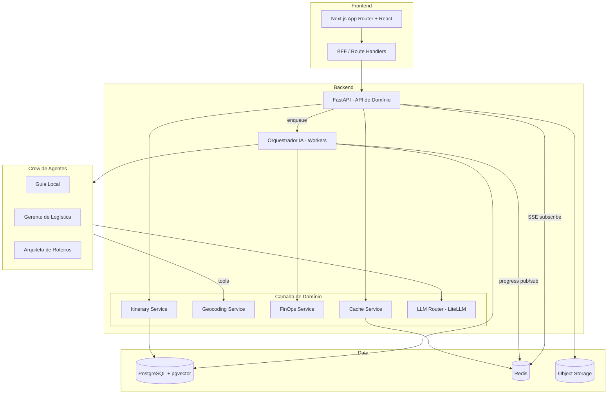
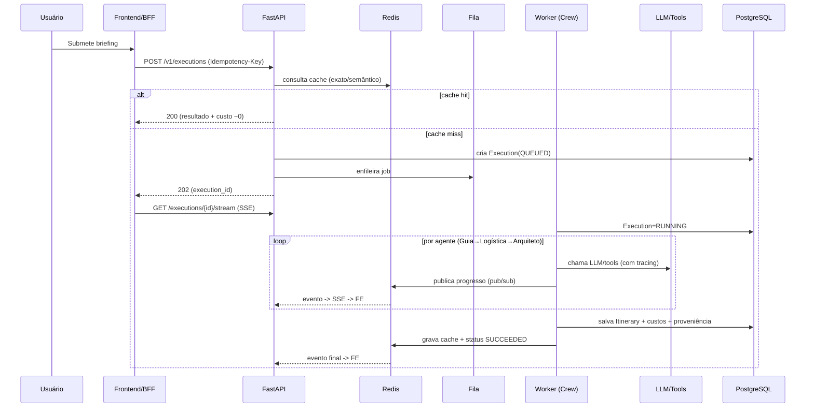
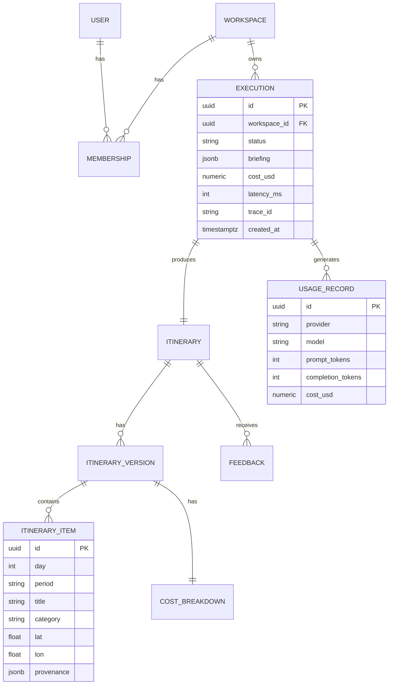
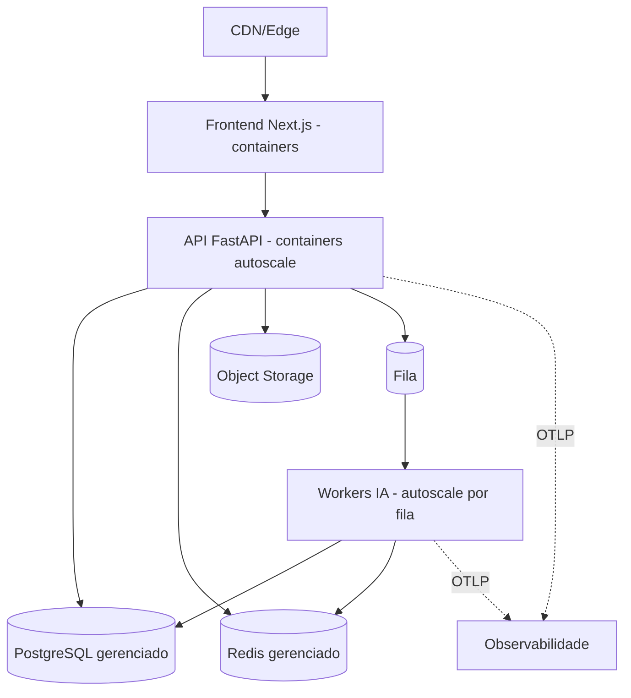

# 04 — Proposta de Arquitetura

Detalha componentes, fluxos, dados e padrões. Complementa
[`03-technical-spec.md`](./03-technical-spec.md).

## 1. Estilo arquitetural

**Modular Monolith desacoplado, evoluindo para serviços** quando (e se) a carga justificar.

- **Por que não microsserviços desde o dia 1?** Complexidade operacional desproporcional
  para um produto novo. Começamos com fronteiras de módulo bem definidas (API, Orquestração,
  Domínio) que podem ser extraídas depois.
- **Por que separar Worker da API desde cedo?** Geração com LLM é lenta e cara; isolá-la
  protege a API de latência e permite escalar de forma independente.

## 2. Componentes (visão lógica)

## 3. Responsabilidades por componente

| Componente | Responsabilidade | Notas |
|------------|------------------|-------|
| **Next.js App + BFF** | UI, SSR/streaming, sessão, agregação de chamadas | Não acessa banco diretamente. |
| **FastAPI (API de domínio)** | Contratos REST, autorização, orquestra casos de uso | Stateless; valida JWT; aplica RBAC e limites. |
| **Orquestrador (Workers)** | Executa a Crew, gerencia estado da `Execution`, publica progresso | Escala horizontal; idempotente por `Execution.id`. |
| **LLM Router (LiteLLM)** | Seleção de modelo, fallback, circuit breaker, contabilização de tokens | Config externalizada por tier. |
| **Cache Service** | Cache exato e semântico; degrada se Redis cair | Já existe (`src/services/cache_service.py`). |
| **Geocoding Service** | Extrai locais + coordenadas; rate-limit Nominatim | Já existe; mover I/O para cache. |
| **FinOps Service** | Custo por execução (tokens reais), agregações por tenant | Evoluir de heurística para custo real do provider. |
| **Itinerary Service** | Persistência, versionamento e proveniência dos roteiros | Novo, sobre PostgreSQL. |

## 4. Fluxo detalhado: geração de roteiro (assíncrona + streaming)

## 5. Modelo de dados (relacional, simplificado)

Decisões de dados:
- **`jsonb` para `briefing`/`provenance`**: flexibilidade sem explosão de tabelas.
- **`pgvector`** em coluna de embedding do briefing → cache semântico.
- **`trace_id` em `Execution`** → liga dado de negócio a traces de observabilidade.
- **`UsageRecord` separado** → base de FinOps e billing por uso.

## 6. Padrões de resiliência

| Padrão | Onde | Benefício |
|--------|------|-----------|
| **Retry com backoff + jitter** | chamadas a LLM/tools | absorve falhas transitórias |
| **Circuit breaker** | por provider de LLM | evita cascata de timeouts |
| **Fallback chain** | LLM Router | continuidade entre provedores |
| **Bulkhead** | pool de workers isolado da API | latência de IA não derruba a API |
| **Timeout + cancelamento** | execução | resultado parcial controlado |
| **Idempotência** | `POST /executions` | evita execução duplicada/custo dobrado |
| **Graceful degradation** | cache/geocoding | feature continua sem subcomponente |

## 7. Multi-tenancy

- **Modelo:** banco compartilhado, isolamento por `workspace_id` em **todas** as queries
  (row-level), reforçado por **Row-Level Security (RLS)** no PostgreSQL.
- **Limites e cotas** por workspace (plano) aplicados na API e na fila (prioridade).
- Caminho de evolução: schema-per-tenant ou DB-per-tenant para clientes enterprise.

## 8. Configuração (12-Factor)

- Toda config via ambiente, tipada por **Pydantic Settings** (já existe em `src/config.py`).
- Segredos em **secret manager**; `.env` apenas local.
- Flags de runtime (roteamento de modelo, limites) em store dinâmico (DB/Redis) para
  ajuste sem deploy.

## 9. Decomposição evolutiva (quando extrair serviços)

Extrair o **Orquestrador IA** como serviço próprio quando: (a) o custo/latência exigir
escala independente forte, ou (b) for preciso poliglota (ex.: pipeline de avaliação).
Até lá, fronteira de módulo + fila já entregam o desacoplamento necessário.

## 10. Diagrama de implantação (alvo)

