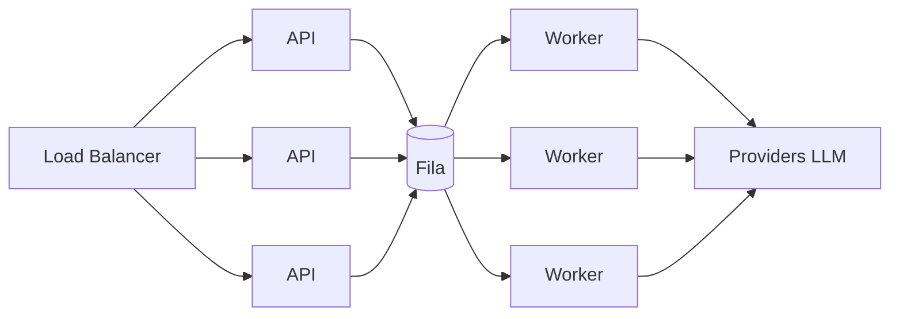

# 07 — Performance e Escalabilidade

Como atingir os SLOs de [`05`](./05-non-functional-requirements.md) e escalar com custo
sob controle.

## 1. Modelo de carga

Há **dois perfis de carga** muito diferentes — e tratá-los separadamente é a decisão
central de performance:

| Perfil | Característica | Estratégia |
|--------|---------------|-----------|
| **Interativo (API CRUD)** | rápido, alto volume, baixa latência | API stateless + cache + índices |
| **Geração (LLM)** | lento (segundos), caro, variável | assíncrono + fila + workers autoescaláveis |

> Misturar os dois no mesmo caminho síncrono (como o Streamlit atual faz) é o principal
> gargalo. A separação API ⇄ Worker resolve isso.

## 2. Gargalo dominante: latência de LLM

Geração de roteiro é dominada por chamadas de LLM e ferramentas. Táticas:

1. **Modelos rápidos por padrão** (Groq — alta taxa de tokens/s); 70B/premium só quando
   a qualidade justificar (roteamento por política).
2. **Paralelizar onde possível** — pesquisa do Guia Local e cotação de logística podem
   rodar **em paralelo** antes da compilação final (hoje é totalmente sequencial).
3. **Streaming de progresso (SSE)** — reduz **latência percebida**: o usuário vê etapas
   acontecendo em < 3s, mesmo que o total leve ~40s.
4. **Prompt engineering enxuto** — prompts/saídas concisas reduzem tokens, custo e tempo.
5. **Limites de iteração** (já há `max_iter=3`) — evita loops caros.

## 3. Estratégia de cache (camadas)

| Camada | Conteúdo | Benefício |
|--------|----------|-----------|
| **CDN/Edge** | assets e páginas públicas (links de roteiro) | latência global mínima |
| **Cache exato (Redis)** | roteiro por hash de briefing (já existe) | resposta < 500ms, custo ~0 |
| **Cache semântico (pgvector)** | roteiros "parecidos o suficiente" | aumenta hit ratio |
| **Cache de ferramentas** | resultados de busca web / geocoding | menos chamadas externas |
| **Cache de aplicação (HTTP)** | listas/leituras com `ETag`/`Cache-Control` | menos carga no banco |

Meta: **cache hit ratio ≥ 30%** maduro → impacto direto em latência **e** custo (FinOps).

## 4. Escalabilidade horizontal

- **API e Workers stateless** → réplicas atrás de load balancer / autoscaler.
- **Workers autoescalam por profundidade de fila** (ex.: KEDA / scaler por métrica),
  não por CPU — porque o gargalo é I/O de LLM, não CPU.
- **Estado** vive em PostgreSQL/Redis/Object Storage, nunca no processo.

## 5. Backpressure e proteção de carga

- **Fila** absorve picos; a API responde `202` rápido e o trabalho é drenado conforme
  capacidade.
- **Rate limiting** por usuário/workspace/plano (token bucket no Redis).
- **Limites de concorrência** por provider de LLM (respeitar quotas; evitar `429`).
- **Circuit breaker** por provider → falha rápido e usa fallback em vez de empilhar timeouts.
- **Cotas por plano** evitam que um tenant degrade os demais (fairness).

## 6. Banco de dados

- **Índices** em `workspace_id`, `status`, `created_at`, e índice vetorial (`pgvector`)
  para cache semântico.
- **Réplicas de leitura** para biblioteca/relatórios/FinOps (separar OLTP de leitura pesada).
- **Connection pooling** (ex.: PgBouncer) — protege contra exaustão de conexões sob escala
  de workers.
- **Paginação keyset** em listagens grandes (evita `OFFSET` caro).
- Particionamento futuro de `USAGE_RECORD`/`EXECUTION` por tempo, se o volume exigir.

## 7. Performance de frontend

(Complementa [`09-frontend-ux.md`](./09-frontend-ux.md).)

- **SSR/streaming (Next.js App Router)** + **React Server Components** → HTML útil cedo.
- **Code splitting** e lazy-load de componentes pesados (mapa, editor).
- **TanStack Query** para cache de dados e evitar refetch desnecessário.
- **Otimização de assets** (next/image, fontes, prefetch de rotas).
- **Mapa** (Mapbox GL / MapLibre) com clustering de marcadores e carregamento sob demanda.
- Metas: **LCP < 2.5s, INP < 200ms, CLS < 0.1** (ver [`05`](./05-non-functional-requirements.md)).

## 8. Testes de performance

- **Load testing** (k6/Locust) nos caminhos críticos: criação de execução, leitura de
  biblioteca, SSE concorrente.
- **Teste de soak** para detectar vazamentos sob carga sustentada.
- **Benchmark de custo/latência por modelo** alimentando o roteamento de LLM.
- Gates de performance no CI para regressões de Web Vitals (Lighthouse CI).

## 9. Eficiência de custo (liga FinOps a performance)

| Alavanca | Efeito |
|----------|--------|
| Cache (exato + semântico) | menos chamadas de LLM |
| Roteamento modelo barato → caro sob demanda | menor custo médio |
| Prompts enxutos | menos tokens |
| Paralelização | menor latência (não reduz custo, melhora UX) |
| Limites por plano | protege margem |

> Cada otimização de performance aqui é **mensurável** pelos painéis de
> [`06-observability.md`](./06-observability.md) — o que fecha o ciclo de melhoria contínua.

## 10. Roadmap de escala (resumo)

1. **MVP:** API+Worker separados, cache exato, autoscale básico.
2. **Beta:** cache semântico, réplicas de leitura, rate limiting, load tests.
3. **GA:** autoscale por fila, particionamento, otimização contínua guiada por dados.

