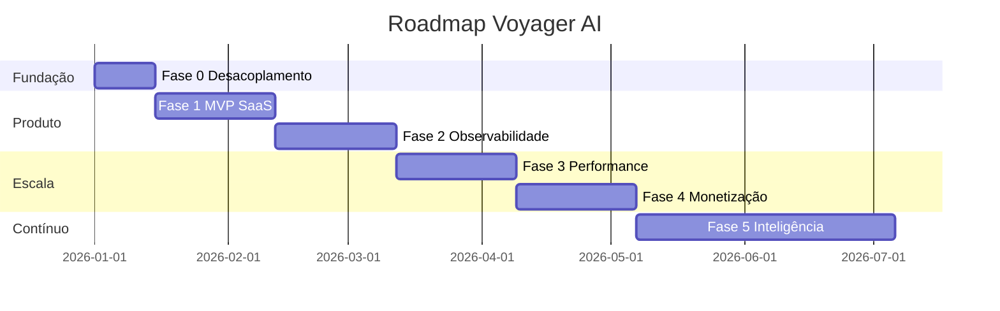

# 10 — Roadmap de Evolução

Mostra como sair de **repositório técnico** para **SaaS sólido** de forma incremental,
sem reescrita big-bang. Cada fase entrega valor e reduz risco.

## Princípio: evolução, não revolução

Reaproveitamos o núcleo atual (`src/agents.py`, `tasks.py`, `crew_builder.py`,
`services/*`, `config.py`) e o envolvemos progressivamente com API, frontend, dados e
operação.

---

## Fase 0 — Fundação e desacoplamento (semanas 1–2)

**Objetivo:** separar domínio de UI; preparar o terreno.

- Extrair a lógica de orquestração do `app.py` (Streamlit) para uma **camada de serviço**
  reutilizável.
- Externalizar config de modelos/fallback (hoje em `agents.py`) para `config`/store.
- Introduzir **FastAPI** com endpoint síncrono mínimo de geração (reuso do `CrewBuilder`).
- Instrumentação base: logs estruturados (já há Loguru) + `request_id`/`trace_id`.
- Manter Streamlit como **playground interno**.

**Entregável demonstrável:** API `POST /v1/executions` funcionando; OpenAPI publicada.

---

## Fase 1 — MVP SaaS (semanas 3–6)

**Objetivo:** primeiro produto utilizável por terceiros.

- **Auth** (OIDC Google + e-mail) e **workspaces** com RBAC básico.
- **PostgreSQL**: modelo de `Execution`, `Itinerary`, `ItineraryVersion`, `Feedback`.
- **Geração assíncrona**: fila + worker; **SSE** de progresso.
- **Frontend Next.js**: briefing → execução ao vivo → roteiro → mapa → export Markdown.
- **Cache exato** já existente integrado à API.
- **CI** expandido: testes, lint, type-check, scan de deps.

**FRs cobertas:** FR-01..04, FR-10..13, FR-20..24, FR-30..33, FR-50..51, FR-60..61.
**Entregável demonstrável:** SaaS multi-tenant gerando e salvando roteiros com streaming.

---

## Fase 2 — Confiabilidade e observabilidade (semanas 7–10)

**Objetivo:** maturidade operacional (o que impressiona recrutadores).

- **OpenTelemetry** ponta a ponta + **Langfuse** (tracing de LLM).
- **FinOps real**: `UsageRecord` com tokens reais; **painel FinOps**.
- **Resiliência**: circuit breaker por provider, retries com backoff, idempotência em
  `POST /executions`, cancelamento.
- **Dashboards e alertas** baseados em SLO; runbook.
- ~~**Refinamento** de roteiro + **versionamento** (FR-40..41).~~ ✅ Entregue (v1.26)
- **Export PDF/.ics** + link público (FR-51..52).

**Entregável demonstrável:** trace completo de uma geração + painel de custo + SLOs.

---

## Fase 3 — Escala e performance (semanas 11–14)

**Objetivo:** suportar carga real com custo controlado.

- **Cache semântico** (pgvector) → aumenta hit ratio.
- **Paralelização** de agentes (Guia Local ∥ Logística).
- **Autoscaling por profundidade de fila**; réplicas de leitura; pooling de conexões.
- **Rate limiting** e cotas por plano; backpressure.
- **Load/soak tests** (k6) e gates de Web Vitals (Lighthouse CI).

**Entregável demonstrável:** relatório de carga + redução medida de latência/custo.

---

## Fase 4 — Monetização e go-to-market (semanas 15–18)

**Objetivo:** transformar em negócio.

- **Billing** (Stripe): planos Free/Pro/Business; medição por uso.
- **White-label** básico (tema/marca por workspace) para Business.
- **API pública** versionada + chaves de API + docs.
- **Landing** com SEO, demo interativa e onboarding.
- i18n PT-BR/EN completo.

**Entregável demonstrável:** fluxo de assinatura + API pública documentada.

---

## Fase 5 — Inteligência e diferenciação (contínuo)

**Objetivo:** ampliar o fosso competitivo.

- **LLM evaluation** automatizado (offline + online) no CI; combate a "prompt drift".
- **Proveniência avançada** (citação por item) e detecção de alucinação.
- Integrações reais (preços de voos/hotéis via parceiros) — caminho para OTA.
- Novos agentes (clima, eventos locais, acessibilidade da viagem).
- Personalização por histórico do usuário.

---

## Linha do tempo (visão)

## Critérios de saída por fase (Definition of Done)

| Fase | Pronto quando |
|------|---------------|
| 0 | API mínima + OpenAPI + logs correlacionados |
| 1 | Auth + multi-tenant + geração assíncrona + frontend MVP em produção |
| 2 | Tracing ponta a ponta + FinOps real + SLOs/alertas |
| 3 | Autoscale + cache semântico + testes de carga aprovados |
| 4 | Billing + API pública + landing |
| 5 | Pipeline de avaliação de IA rodando continuamente |

## Quick wins de portfólio (alto impacto, baixo custo)

1. **README + diagramas C4** e link para estes `specs/`.
2. **Painel FinOps** visível na demo (narrativa de economia com dados reais).
3. **Streaming de agentes** no frontend (efeito "uau" imediato).
4. **Storybook público** do design system.
5. **Badge de cobertura, scan de segurança e SLO** no README.

